# Agriculture

[Import](https://apps.sentinel-hub.com/eo-browser/?sharedPinsListId=b73662ed-28a3-4be3-ac04-4ba06a340a74){:target="_blank"} pins directly into EO Browser or [download](Agriculture.json){:target="_blank"} the json for a later import into [EO Browser](https://apps.sentinel-hub.com/eo-browser/?zoom=10&lat=41.9&lng=12.5&themeId=DEFAULT-THEME){:target="_blank"}.

Following is a set of pins which are all connected to the topic "wildfires". Each pin contains a brief description of what is displayed by the pin and a preview image linked to a high-resolution print on Flickr.  

## Included pins 

### Agriculture in Saudi Arabia (Moisture Index)

[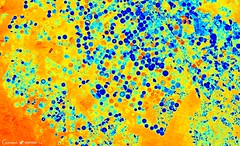](https://www.flickr.com/photos/sentinelhub/49657834951/)
The desert country of Saudi Arabia highly relies on irrigation farming for growing crops, due to its arid and warm climate. The circular shape of the fields is a result of the irrigation system (center-pivot irrigation), which uses water from a huge fossil aquifer. The size of the field ranges from a few hundred meters up to almost one kilometer, limited by the size of the irrigation system. What started more than 40 years ago as a huge success story, ensuring domestic food security for the kingdom, is becoming more and more problematic as the once rich water reserves are depleting. As a result, Saudi Arabia is buying more and more fields abroad to satisfy domestic demand. [More...](https://www.nationalgeographic.de/photography/2018/04/wasser-nahrung-energie-die-wuesten-werden-gruen?image=61750)

### Agriculture in the Veneto Region, Italy (Barren Soil)

[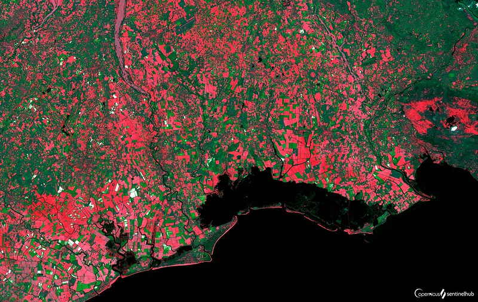](https://www.flickr.com/photos/sentinelhub/50303823113/)
[Veneto agriculture](https://www.recare-hub.eu/news/45-06-bioforsk) is one of the most productive in Italy, producing mainly cereals, fruits, and wine. Small, hand farmed fields present a contrast to the growing industrialization of the sector, which suffers from soil degradation. The Barren Soil visualization shows that in the middle of spring still a lot of fields lie fallow indicated by the red color. 

### Agriculture in California, USA (NDVI)

[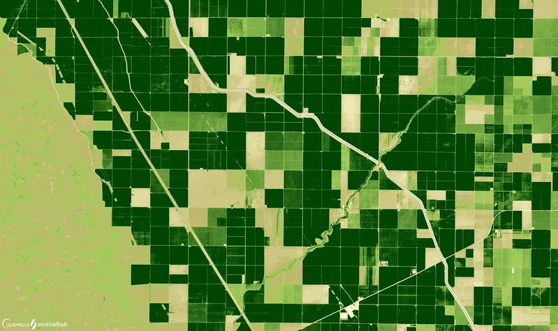](https://www.flickr.com/photos/sentinelhub/50303832418/)
The [Central Valley](https://ca.water.usgs.gov/projects/central-valley/about-central-valley.html), located west of California’s famous Sierra Nevada, is home to the states biggest and most important agricultural region. The fields are irrigated from the two major rivers of the valley (Sacramento and San Joaquin Rivers) on the one hand, and with groundwater on the other. Despite using less than 1% of the nation’s total farmland, the valley produces 25% of U.S. food. In total more than 250 different crops are grown, the most important being cereal grains, hay, cotton, different fruits and vegetable, and nuts.

### Agriculture in Ethiopia (False Color)

[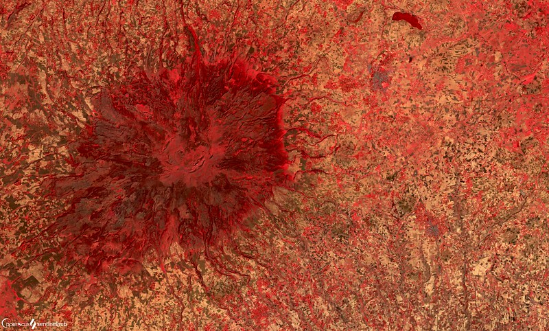](https://www.flickr.com/photos/sentinelhub/50304463236/)
The area around Meraro in the Arsi zone, which is part of the Ethiopian Highlands, plays an important role in food security in Ethiopia. The agriculture in the region (and the country) was for a long time an [intensive subsistence farming zone](https://reliefweb.int/report/ethiopia/cluster-farming-improving-farmers-productivity-food-security-arsi-zone), with 12 million smallholder farming households producing 95% of the country’s agricultural products. To become less dependent on foreign food imports and foster the countries development, the agricultural sector was subject to big changes in the past years. [More](http://www.fao.org/ethiopia/fao-in-ethiopia/ethiopia-at-a-glance/en/)

### Agriculture in West Bengal, India (False Color)

The state of West Bengal, where Belda is located, is the most important rice and vegetable producer in the whole India. Taking only 2.7% of the countries area, it provides food for almost 8% of the population. The state is dominated by small and marginal farms, accounting for 96% of all farms. [More](https://wb.gov.in/departments-details.aspx?id=D170907140022669&page=Agriculture)

### Agriculture in Vietnam (False Color)

[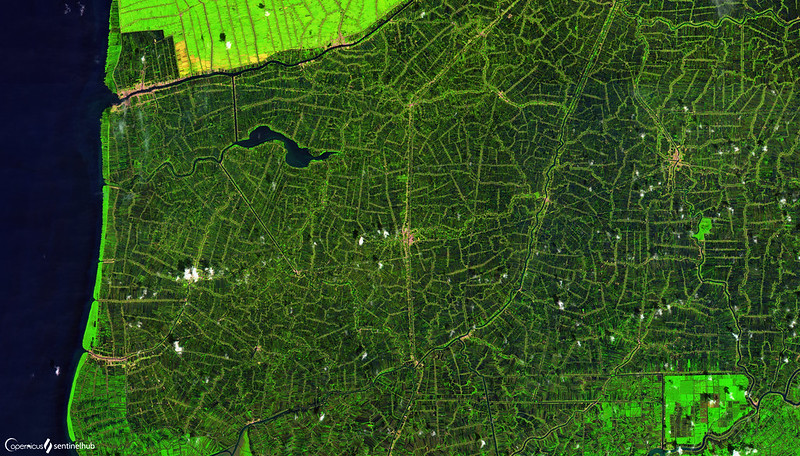](https://www.flickr.com/photos/sentinelhub/50304600057/)
Agriculture in the Ca Mau district, located in the Mekong Delta in Vietnam, consist mainly of aquacultures (shrimps, mud crabs), rice, and wood. The whole area is highly drained either by small streams or by channels derived from the streams. Ca Mau district is Vietnam’s largest shrimp producer, covering 280.000 ha with shrimp farms, which in 2019, exported around 1.2 billion dollars worth of shrimps. [More]( https://vietnamnews.vn/society/523132/ca-mau-amends-list-of-key-agricultural-products.html)

### Agriculture in Poland (Moisture Stress)

[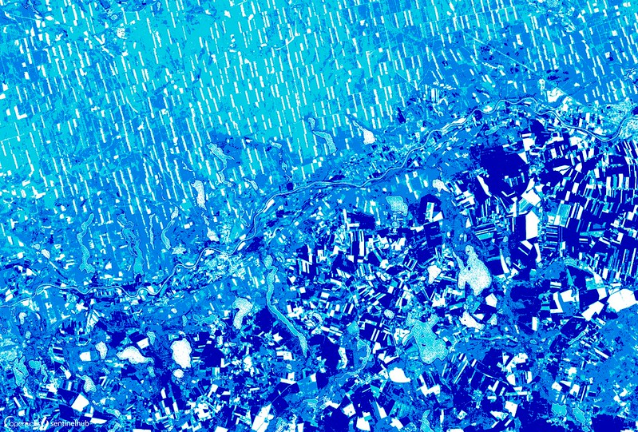](https://www.flickr.com/photos/sentinelhub/50304534206/)
Located next to the banks of the Warta river, this pin shows different moisture stress and field arrangements on the opposite banks of the river. On the northern bank, the fields are more regularly distributed and show a lower moisture content, while on the southern shore, the fields are more diverse, both in size and alignment, and show a higher level of moisture. As the region has, in general, a quite low annual precipitation (~500 mm/yr), one explanation for the difference in moisture could be the higher prominence of lakes south of the river, but different field management techniques could also play a role. Crops grown in the region are mainly cereals, to a smaller extend also rape, sugar beet, and potatoes. [More]( http://www.agribenchmark.org/fileadmin/Dateiablage/B-Cash-Crop/Countries/Poland/Poland_crop_production.pdf)

### Agriculture along the Nile river (EVI)

[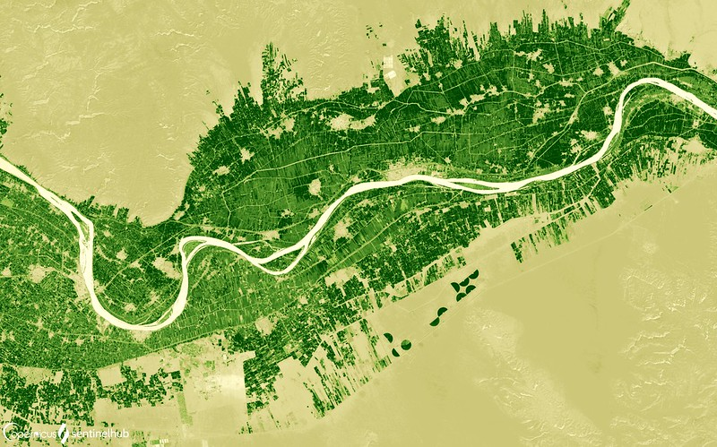](https://www.flickr.com/photos/sentinelhub/50304448147/)
Due to fertile soil and regular flooding, the Nile river basin has supported agriculture for thousands of years. Close to 90 percent of the land currently used for agriculture is under rainfed farming systems (farming systems, that rely on rainfall). These systems are characterized by subsistence-level production and low yields of crops and livestock. There are about 5.6 million hectares of land under irrigation or equipped with irrigation facilities in the Nile Basin. A large proportion – 97 percent – of the land is located in Egypt and Sudan. Three countries – Egypt, Tanzania, and Uganda – produce large quantities of fish, but the freshwater fisheries resources of the basin are showing signs of being overfished. The top three crops grown in the basin are wheat, fodder, and maize. Livestock farming is also thriving, Ethiopia leading with more than 50 million heads of cattle. [Learn more.](http://nileis.nilebasin.org/system/files/Nile%20SoB%20Report%20Chapter%205%20-%20Agriculture.pdf)

### Agriculture in Zambia (Enhance True Color)

[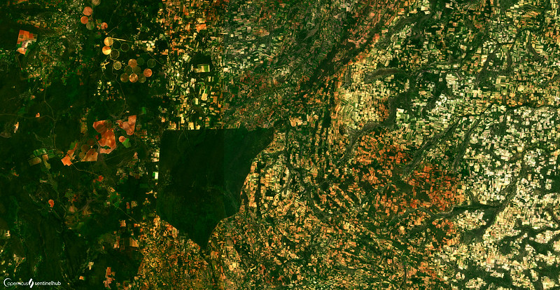](https://www.flickr.com/photos/sentinelhub/50304660791/)
The agriculture north-east of the city [Mumbwa](https://www.investincentralzambia.com/wordpress/mumbwa-district-profile/), located in Zambia’s Central Province, is blessed by good climatic conditions, as well as fertile soils. The main crops in the region are maize, cotton, soy beans, and sunflowers. Next to growing vegetables, the region hosts favorable conditions for livestock farming. The main species are cattle, sheep, and goats. In the western part of the pin, several round structures can be observed; a result of center-pivot irrigation using groundwater.

### Agriculture in Kansas, USA (False Color)

[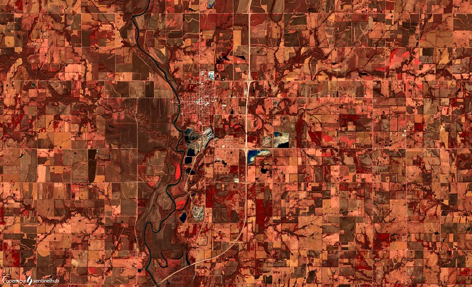](https://www.flickr.com/photos/sentinelhub/50303877388/)
The soils in Allen County, located in the state of Kansas, are deep and fertile, providing the county and the state good conditions for a strong agriculture economy. It thus isn't surprising, that agriculture accounts for more than 40% of the state’s total income. The main crops are wheat, corn, sorghum, and soybeans, as well as sunflowers. Livestock raised is mainly cattle and calves. [More]( https://www.farmflavor.com/kansas-agriculture/)

### Agriculture in Limpopo, South Africa (Enhanced True Color)

[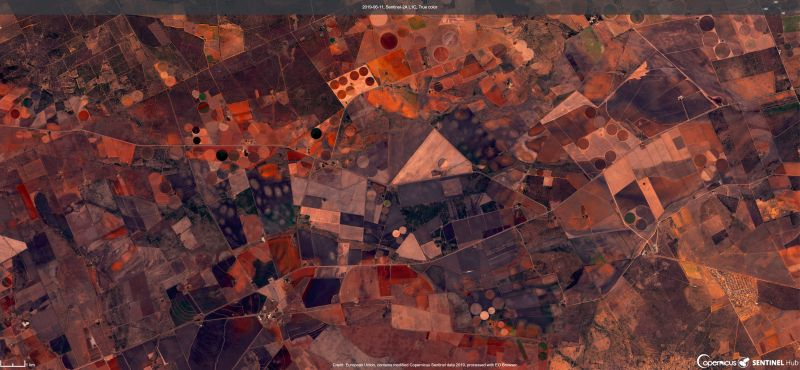](https://www.flickr.com/photos/sentinelhub/49101283122/in/dateposted/)
South African agriculture's biggest challenge is the absence of water since rainfall doesn't come regularly. Hence, [most agricultural fields are irrigated](http://www.limpopo.riverawarenesskit.org/LIMPOPORAK_COM/EN/MANAGEMENT/WATER_INFRASTRUCTURE/IRRIGATION_INFRASTRUCTURE/SOUTH_AFRICA.HTM), helping make Limpopo an important part of the country's agriculture. [Learn more](https://www.globalafricanetwork.com/company-news/a-2020-vision-of-the-agricultural-sector-in-limpopo/).

### Agriculture in Cambodia (False Color)

[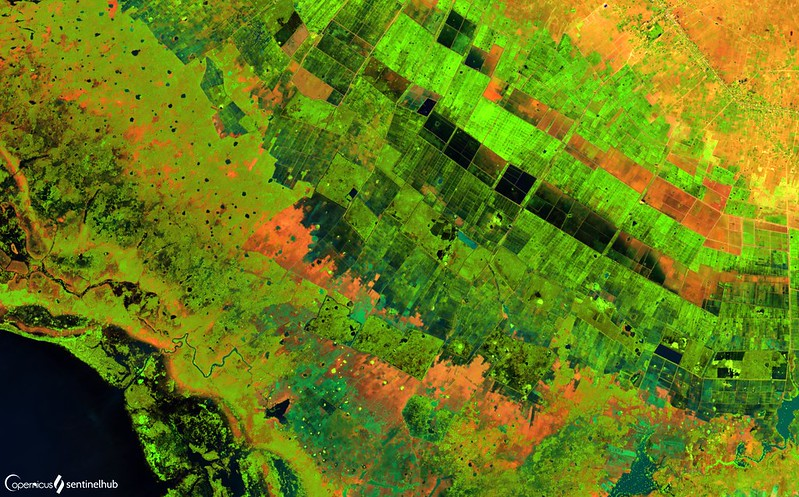](https://www.flickr.com/photos/sentinelhub/50303681538/)
[Tonle Sap Lake](http://hdr.undp.org/sites/default/files/olli_varis_tonlesap_study.pdf) with its surroundings is one of the most productive large wetland ecosystems in the world. People in the area are highly dependent on the natural resources the ecosystem provides and live mainly from farming and fishery. In total, 70% of Cambodians work in agriculture. In the wet season, which is mainly influenced by the monsoon, predominantly rice is cultivated. In the dry season, also other vegetables and fruits. Due to the poor infrastructure in the region and no industrial management, the productivity was traditionally quite low. In recent years the region experienced rapid development. More and more irrigation structures have been built and the access to the lake's floodplains has been improved, leading to more bountiful harvests. [More](https://tel.archives-ouvertes.fr/tel-02275089/document)

### Agriculture in the Burdekin River Delta, Australia (False Color)

[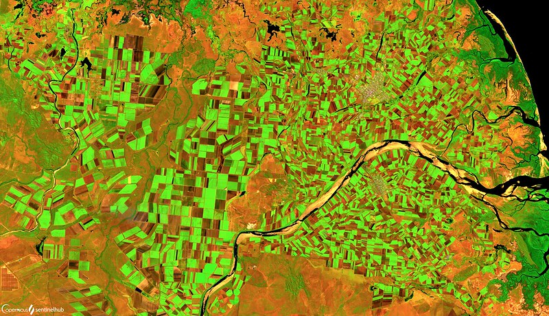](https://www.flickr.com/photos/sentinelhub/50304703137/)
Burdekin Shire, situated in the Burdekin River delta, is one of Queensland's biggest sugar cane producing shires, accounting for [20% of the state’s total sugar cane production](https://economy.id.com.au/burdekin/value-of-agriculture). On shire level, sugar cane accounts for more than 75% of the agricultural output (in value terms), making it the most important agricultural plant in the region. On the pin, agricultural fields are found on both sides of the Burdekin river and are displayed either in a bright green (vegetated), or in a dark brown (harvested/bare fields).

### Agriculture in Ontario, Canada (Barren Soil)

Agriculture is the dominant land use in southern Ontario, even though only a small percentage of the total population is employed in this sector. Still, the whole province has around 50.000 farms (2016) and the average number of farms has been increasing over the last years. The main crops cultivated are oilseeds and different grains, and the main livestock is cattle. Next to the crops mentioned, Ontario is the country’s main leader in growing greenhouse vegetables. [More](https://www150.statcan.gc.ca/n1/daily-quotidien/170510/dq170510a-eng.htm?indid=10441-1&indgeo=6)

### Agriculture at the Israel-Jordan border

[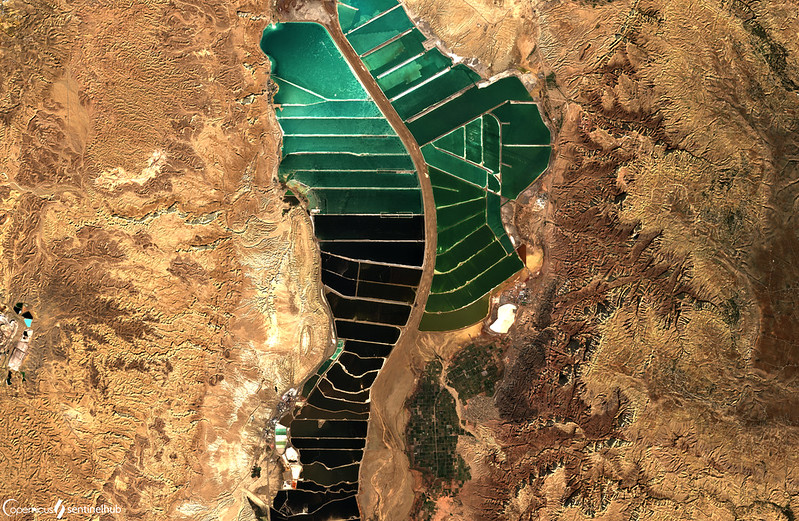](https://www.flickr.com/photos/sentinelhub/50304339556/)
Agriculture in the southern part of the dead sea region, is dominated by [salt ponds](https://gizmodo.com/salt-ponds-at-the-dead-sea-1560507635). Several fields are located next to both sides of the Jordan Valley Highway. Due to rising global demand for sodium chloride and potassium salts, both found in the dead sea’s salt ponds, the ponds have grown rapidly in number towards the end of the last century. Since then, their number stayed at a stable amount of around 50 ponds. The main crop grown on the field is dates, while among other, tomatoes, eggplants, or olives are being cultivated as well. [More]( https://www.deadsea.com/articles-tips/interesting-facts/desert-wonders-dead-sea-production/)
