# Atmosphere and Air Pollution

[Import](https://apps.sentinel-hub.com/eo-browser/?sharedPinsListId=b3962d6d-ef8c-467f-bba3-e8e2afcab616){:target="_blank"} pins directly into EO Browser or [download](Atmosphere_and_Air_Pollution.json){:target="_blank"} the json for a later import into [EO Browser](https://apps.sentinel-hub.com/eo-browser/?zoom=10&lat=41.9&lng=12.5&themeId=DEFAULT-THEME){:target="_blank"}.

Following is a set of pins which are all connected to the topic "Atmosphere and Air Pollution". Each Sentinel 5P product has its own description and example pins with images, that correspond to EO Browser theme highlights. 

## Included pins 

### Carbon Monoxide - CO

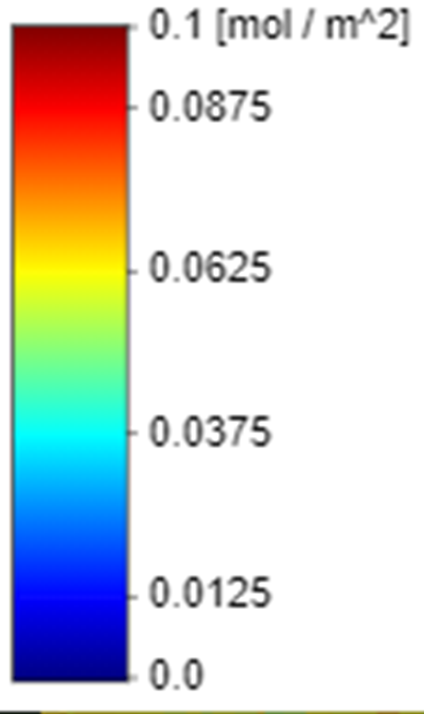 Carbon monoxide (CO) is an important atmospheric trace gas for our understanding of tropospheric chemistry. In certain urban areas, it is a major atmospheric pollutant. Main sources of CO are combustion of fossil fuels, biomass burning, and atmospheric oxidation of methane and other hydrocarbons. Whereas fossil fuel combustion is the main source of CO at Northern mid-latitudes, the oxidation of isoprene and biomass burning play an important role in the tropics. TROPOMI on the Sentinel 5 Precursor (S5P) satellite observes the CO global abundance exploiting clear-sky and cloudy-sky Earth radiance measurements in the 2.3 µm spectral range of the shortwave infrared (SWIR) part of the solar spectrum. [More...](http://www.tropomi.eu/data-products/carbon-monoxide)

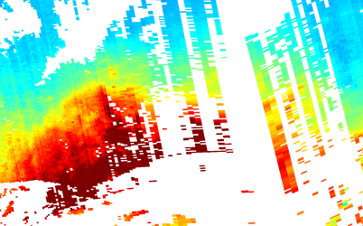
***High CO concentrations, Ghana***

***High CO concentrations, Thailand***

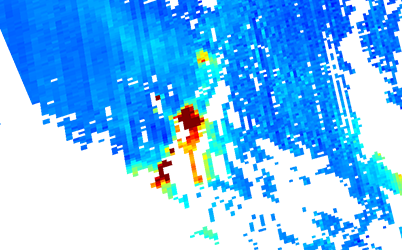
***High CO concentrations, Australia***

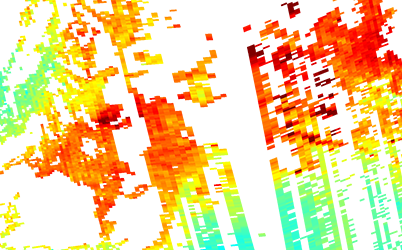
***High CO concentrations, Angola, DR Kongo***

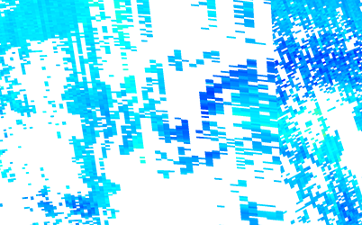
***Low CO concentrations, Switzerland***

### Nitrogen Dioxide - NO2

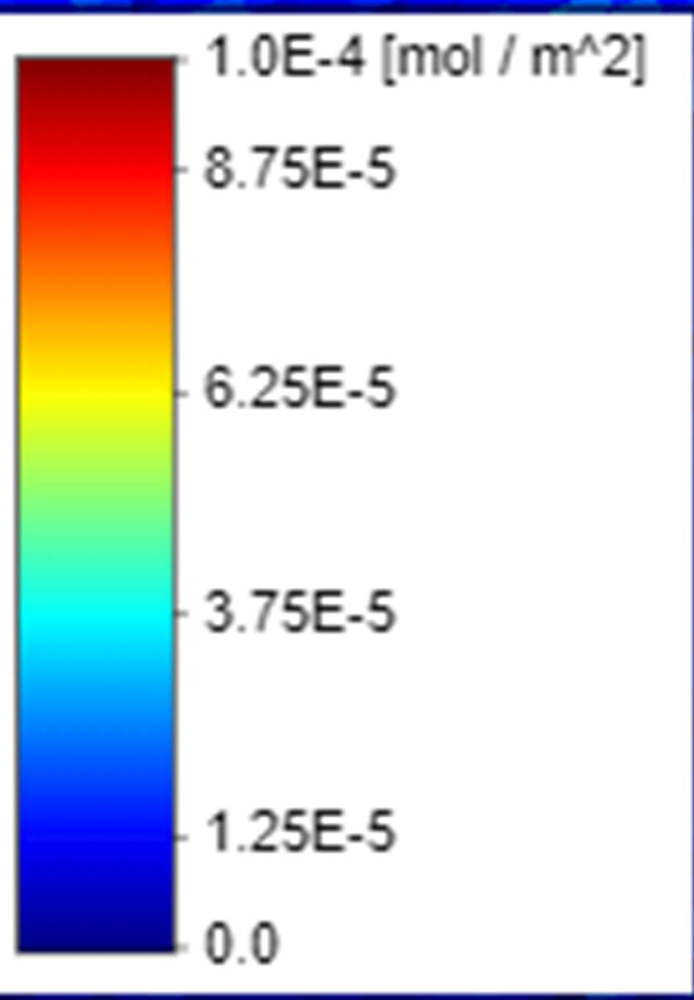 Nitrogen dioxide (NO2) and nitrogen oxide (NO) together are usually referred to as nitrogen oxides (NOx = NO + NO2). They are important trace gases in the Earth’s atmosphere, present in both the troposphere and the stratosphere. They enter the atmosphere as a result of anthropogenic activities (notably fossil fuel combustion and biomass burning) and natural processes (such as microbiological processes in soils, wildfires and lightning). During daytime, i.e. in the presence of sunlight, a photochemical cycle involving ozone (O3) converts NO into NO2 (and vice versa) on a timescale of minutes, so that NO2 is a robust measure for concentrations of nitrogen oxides. [More...](http://www.tropomi.eu/data-products/nitrogen-dioxide)

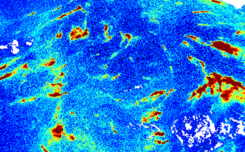
***High NO2 concentrations, India***

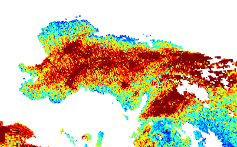
***High NO2 concentrations, Poland***

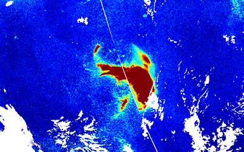
***High NO2 concentrations, Johannesburg***

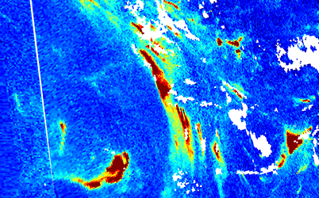
***High NO2 concentrations, Riyadh, Kuwait and Dubai***

### Methane - CH4

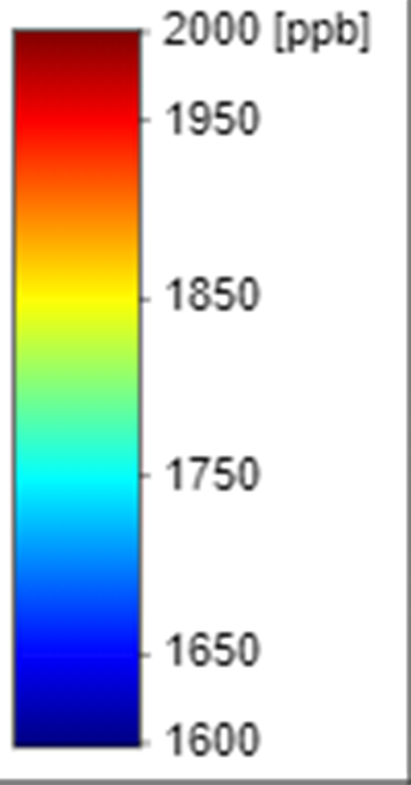 Methane is, after carbon dioxide (CO2), the most important contributor to the anthropogenically enhanced greenhouse effect. Roughly three-quarters of methane emissions are anthropogenic and as such it is important to continue the record of satellite based measurements. TROPOMI aims at providing CH4 column concentrations with high sensitivity to the Earth’s surface, good spatiotemporal coverage, and sufficient accuracy to facilitate inverse modeling of sources and sinks. TROPOMI uses absorption information from the Oxygen-A Band (760nm) and the SWIR spectral range to monitor CH4 abundances in the Earth's atmosphere. [More...](http://www.tropomi.eu/data-products/methane)

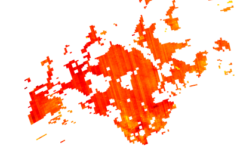
***High CH4 concentrations, Turkmenistan***

***High CH4 concentrations, Burkina Faso***

### Sulphur Dioxide - SO2

 Sulphur dioxide enters the Earth’s atmosphere through both natural and anthropogenic processes. It plays a role in chemistry on a local and global scale and its impact ranges from short term pollution to effects on climate. Only about 30% of the emitted SO2 comes from natural sources; the majority is of anthropogenic origin. SO2 emissions adversely affect human health and air quality. SO2 has an effect on climate through radiative forcing, via the formation of sulphate aerosols. Volcanic SO2 emissions can also pose a threat to aviation, along with volcanic ash. S5P/TROPOMI samples the Earth’s surface with a revisit time of one day with unprecedented spatial resolution of 3.5 x 7 km which allows the resolution of fine details including the detection of much smaller SO2 plumes. [More...](http://www.tropomi.eu/data-products/sulphur-dioxide)

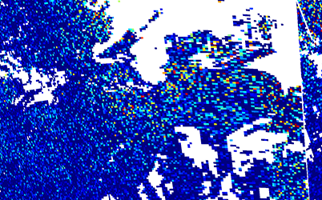
***High SO2 concentrations, Andorra and Marseille***

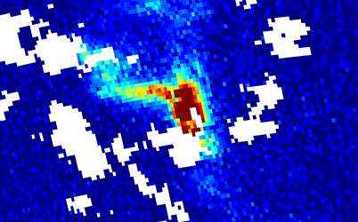
***High SO2 concentrations, Italy***

### Ozone - O3

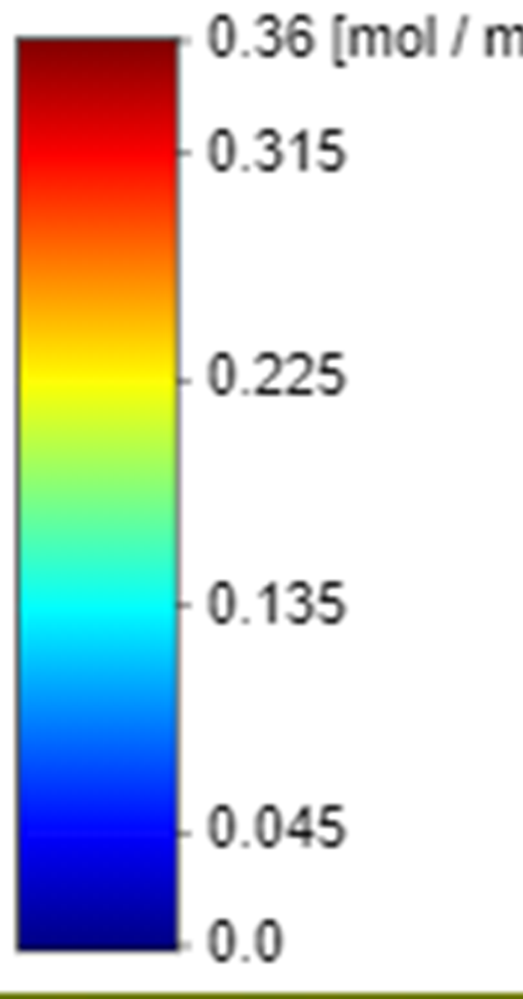 Ozone is of crucial importance for the equilibrium of the Earth atmosphere. In the stratosphere, the ozone layer shields the biosphere from dangerous solar ultraviolet radiation. In the troposphere, it acts as an efficient cleansing agent, but at high concentration it also becomes harmful to the health of humans, animals, and vegetation. Ozone is also an important greenhouse-gas contributor to ongoing climate change. Since the discovery of the Antarctic ozone hole in the 1980s and the subsequent Montreal Protocol regulating the production of chlorine-containing ozone-depleting substances, ozone has been routinely monitored from the ground and from space. [More...](http://www.tropomi.eu/data-products/total-ozone-column)

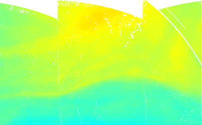
***High Ozone concentrations, Kamchatka***

### Formaldehyde - HCHO

 Long term satellite observations of tropospheric formaldehyde HCHO are essential to support air quality and chemistry-climate related studies from the regional to the global scale. Formaldehyde is an intermediate gas in almost all oxidation chains of non-methane volatile organic compounds (NMVOC), leading eventually to CO2. Non-Methane Volatile Organic Compounds (NMVOCs) are, together with NOx, CO and CH4, among the most important precursors of tropospheric O3. The major HCHO source in the remote atmosphere is CH4 oxidation. Over the continents, the oxidation of higher NMVOCs emitted from vegetation, fires, traffic and industrial sources results in important and localized enhancements of the HCHO levels. The seasonal and inter-annual variations of the formaldehyde distribution are principally related to temperature changes and fire events, but also to changes in anthropogenic activities. Its lifetime being of the order of a few hours, HCHO concentrations in the boundary layer can be directly related to the release of short-lived hydrocarbons, which mostly cannot be observed directly from space. [More...](http://www.tropomi.eu/data-products/formaldehyde)

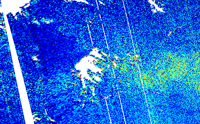
***High HCHO concentrations, Ghana***

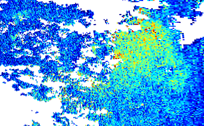
***High HCHO concentrations, China***

### Aerosol - AER

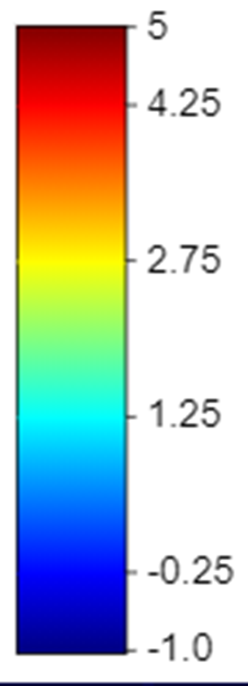 The Aerosol Index (AI) is a qualitative index indicating the presence of elevated layers of aerosols in the atmosphere. The main aerosol types that cause signals detected in the AI (because of their significant absorption) are desert dust, biomass burning and volcanic ash plumes. An advantage of the AI is that it can be derived for clear as well as (partly) cloudy ground pixels. [More...](https://earth.esa.int/web/sentinel/technical-guides/sentinel-5p/level-2/aerosol-index)

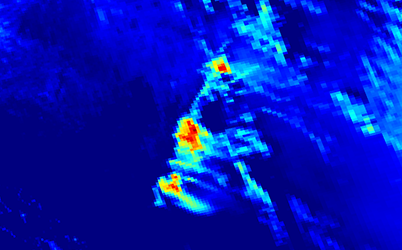
***High AER concentrations, Australia***

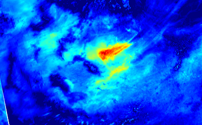
***High AER concentrations, Chad***

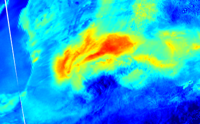
***High AER concentrations, Mauretania***

### Cloud Optical Thickness

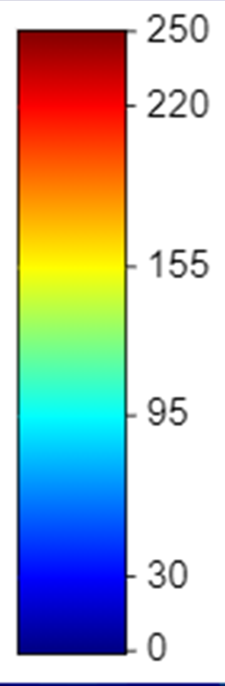 The [optical thickness of a cloud](https://cloudatlas.wmo.int/en/optical-thickness.html) is the degree to which the cloud prevents light from passing through it. By measuring how much sunlight gets scattered by clouds back up into space, scientists can better understand how much [clouds influence Earth's climate](https://neo.sci.gsfc.nasa.gov/view.php?datasetId=MYDAL2_M_CLD_OT). Optical thickness depends on the clouds [physical constitution](http://glossary.ametsoc.org/wiki/Optical_thickness) (crystals, drops, droplets), and form; the overall effect depends on the particles concentration, scatter parameter and phase function, as well as the vertical extent of the cloud. 

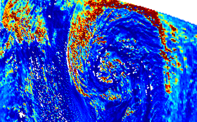
***Cloud Optical Thickness, Atlantic Ocean***

### Cloud Base Pressure

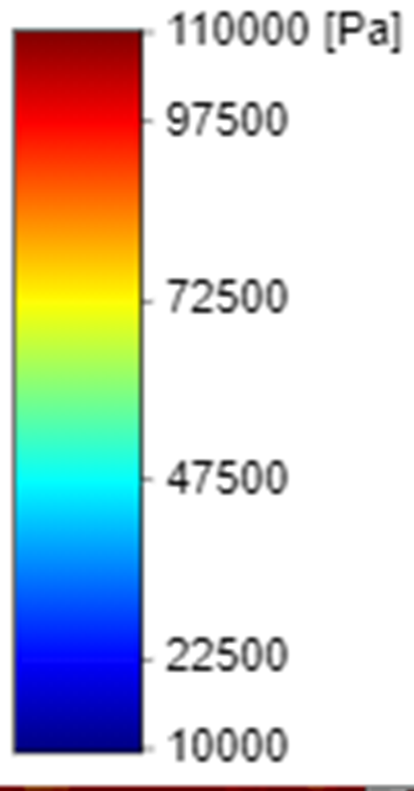 Cloud Base Pressure represents the [average pressure at the base of the lowest cloud layer at each location](https://isccp.giss.nasa.gov/cloudtypes.html). A [cloud base](https://en.wikipedia.org/wiki/Cloud_base) (or the base of the cloud) is the lowest altitude of the visible portion of a cloud. It can be expressed as the pressure level corresponding to this altitude in hectopascals (hPa, equivalent to the millibar).

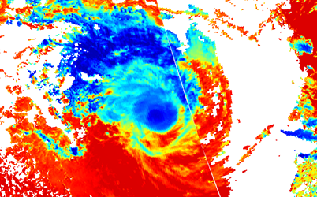
***Cloud Base Pressure, Hurricane Claudia***