# Change Detection Through Time

[Import](https://apps.sentinel-hub.com/eo-browser/?sharedPinsListId=e8eb119d-211b-4257-9ec1-1ad4a6026d12){:target="_blank"} pins directly into EO Browser or [download](Change_detection_through_time.json){:target="_blank"} the json for a later import into [EO Browser](https://apps.sentinel-hub.com/eo-browser/?zoom=10&lat=41.9&lng=12.5&themeId=DEFAULT-THEME){:target="_blank"}.

Following is a set of pins which are all connected to the topic Change detection throuth time. Each event contains a description and related before-after pins, that correspond to highlights in EO Browser. Each pin has a preview image linked to a high-resolution print on Flickr.

## Included pins

### Agriculture Expansion in Egypt

Agricultural land in Egypt can be divided into two main categories; Old Lands and New Lands. Old Lands represent highly fertile soils, which are located in the Nile Delta. Due to the River Nile deposits and the highly productive nature of the soil, these areas have been traditionally cultivated with strategic cereal crops, such as rice, wheat and maize, preserving food security for the Egyptian people. During the past four decades, these areas have been encroached by dramatic urban sprawl due to the rapid population growth and economic development. Therefore, there has been a pressing need for the government to find alternative solutions to maintain the sustainability of the national agricultural sector. Consequently, the adopted policies by the government to reclaim new lands in the desert have led to the second category (New Lands). These are barren areas located in the Western and Eastern deserts outside the green zone of the Nile Delta. The New Lands process includes accessibility through constructing roads, houses, installing irrigation and drainage systems and providing reliable sources of water and electricity. Tiba district is one of those newly reclaimed areas located in the western Nile Delta of Egypt with a total area of 125 square km. Learn more [here](https://www.mdpi.com/2077-0472/9/7/137/pdf).
 
[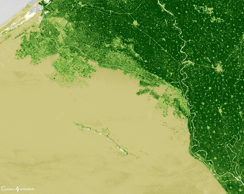](https://www.flickr.com/photos/sentinelhub/50309315062/in/album-72157715852993648/) 
***Egypt agriculture expansion - before (1984), Landsat 5, NDVI***

[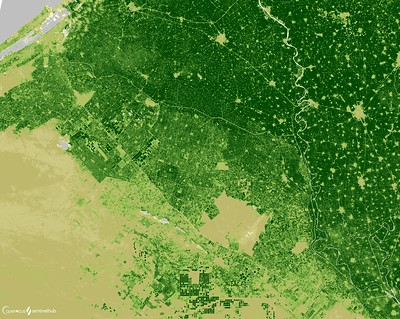](https://www.flickr.com/photos/sentinelhub/50309330057/in/album-72157715852993648/) 
***Egypt agriculture expansion - after (2019), Landsat 8, NDVI***

### Drying of lake Poopó, Brazil

In a typical year, rainfall during the wet season (December through March) recharges the Bolivian lake Poopó directly and via increased inflow from the Desaguadero River. In 2015, the lake dried up. This is not the first time that Poopó has evaporated; the lake last dried up in 1994. In that case, it took several years for water to return, and even longer for ecosystems to recover. Despite its history, in 2016 and 2017, as the waters still haven't returned, many environmentalists believed the waters will not return this time. There are multiple reasons as to why the droughts in the area are getting worse. Sitting high in the Bolivian Andes, the saline lake is particularly vulnerable to fluctuations because it is shallow — typically no more than 3 meters (9 feet) deep. Due to climate change the area has warmed an estimated one degree Celsius over the past century, leading to an increase in the rate of evaporation from the lake. And the lack of rain over the past year has sped the process even further. The government blamed the drought solely on El Nino and climate change, but even though this is one of the causes, it seems the management of the lake is also the problem. Some of the water that is supposed to fill the lake is being diverted for agriculture and mining. And even when water is available, the river is often clogged with sedimentation, due to the runoff from development and mining in the area. What happened to Lake Poopó is not unlike the drying of the vast Aral Sea in Central Asia. In both cases, a closed water system was overdrawn, with more water going out than coming in. However, in summer 2018, the lake filled up again, although the water line is clearly diminished compared to 2004. If all the problems persist, there is legitimate concern, that next time, the lake might stay dry forever. Learn more [here](https://www.nationalgeographic.com/news/2016/01/160121-lake-poopo-bolivia-dried-out-el-nino-climate-change-water/) and [here](https://earthobservatory.nasa.gov/images/87363/bolivias-lake-poopo-disappears).

[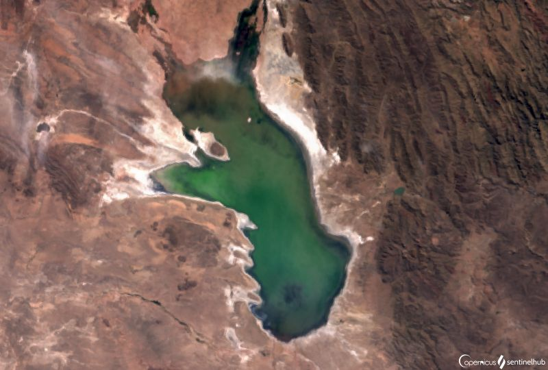](https://www.flickr.com/photos/sentinelhub/50309569482/in/album-72157715852993648/) 
***Lake Popoo in 2005, Envisat Meris***

[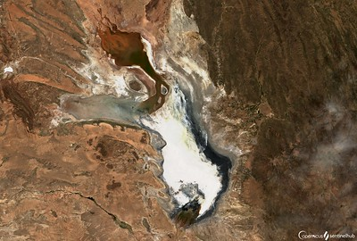](https://www.flickr.com/photos/sentinelhub/50308743598/in/album-72157715852993648/) 
***Lake Popoo in 2020, Sentinel-2 L2A***

### Dubai Urbanization

Perhaps no place on the Earth has had as drastic land cover change over the past ten years as Dubai. The creation of over 300 kilometers of coastline, the rapid expansion of urban land cover, and the intensification of urban development make this one of the most rapidly and visibly changed land covers due to urbanization. The total population of Dubai has grown by 1.000 % over the last 40 years alone. In 1975 the total population was 183,000 inhabitants, which increased in 2015 to about 2 million, making Dubai population one of the fastest growing in the world. The total built up area increased from only 54 square km in 1975 to 977 square km in 2015, raising  urbanized land by 1800 % in only 40 years. Learn more [here](https://lcluc.umd.edu/hotspot/urbanization-dubai#:~:text=Dubai%20has%20experienced%20tremendous%20recent,in%202015%20(AMEInfo%202005a).) and [here](https://www.researchgate.net/publication/317564338_The_Boom_Population_and_Urban_Growth_of_Dubai_City).

[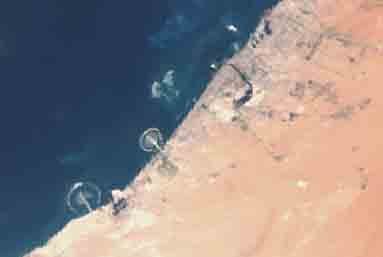](https://www.flickr.com/photos/sentinelhub/50308648548/in/album-72157715852993648/)
***Dubai in 2005 (Envisat Meris)***

***Dubai in 2020 (Sentinel-2 L2A)***

### Agriculture in Italy

Agriculture is one of Italy's key economic sectors, accounting for around 2.1% of GDP. Most farms are small, with the average size being eleven hectares. Italian industries, including the food-processing sector, rely heavily on imports of raw materials. Italy is one of the largest agricultural producers and food processors in the EU. The northern part of Italy produces primarily grains, soybeans, meat, and dairy products, while the south specializes in fruits, vegetables, olive oil, wine, and durum wheat.  Even though much of its mountainous terrain is unsuitable for farming, approximately 4% of the population is employed in farming.  Veneto agriculture is one of the most productive in Italy, producing mainly cereals, fruits and wine. Small, hand farmed fields present a contrast to the growing industrialization of the sector, which suffers from soil degradation. Learn more [here](https://www.recare-hub.eu/news/45-06-bioforsk) and [here](https://www.privacyshield.gov/article?id=Italy-Agricultural-Sector#:~:text=Italy's%20agriculture%20is%20typical%20of,%2C%20wine%2C%20and%20durum%20wheat.).

[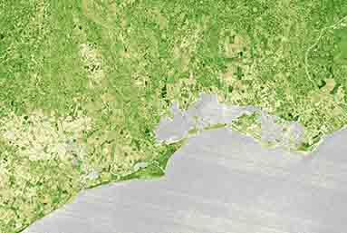](https://www.flickr.com/photos/sentinelhub/50309693402/in/album-72157715852993648/)
***Agriculture in Italy, 1986 (Landsat 8)***

[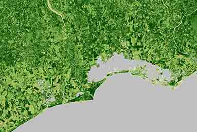](https://www.flickr.com/photos/sentinelhub/50309693402/in/album-72157715852993648/)
***Agriculture in Italy, 2020 (Sentinel-2 L2A)***

### Aral Sea

In the 1960s, the Soviet Union undertook a major water diversion project on the arid plains of Kazakhstan, Uzbekistan, and Turkmenistan. The region’s two major rivers, fed by snowmelt and precipitation in faraway mountains, were used to transform the desert into farms for cotton and other crops. Before the project, the Syr Darya and the Amu Darya rivers flowed down from the mountains, cut northwest through the Kyzylkum Desert, and finally pooled together in the lowest part of the basin. The lake they made, the Aral Sea, was once the fourth largest in the world. Although irrigation made the desert bloom, it devastated the Aral Sea. As the Aral Sea has dried up, fisheries and the communities that depended on them collapsed. The salty dust blew off the lakebed and settled onto fields, degrading the soil. Croplands had to be flushed with larger and larger volumes of river water. The loss of the moderating influence of such a large body of water made winters colder and summers hotter and drier. Additionally, as the Aral water content diminishes, salinization of the lake increases. This creates vertical stratification, where surface salinity is lower than the bottom layer, thus heating up faster. This additionally contributes to water evaporation, creating a positive feedback loop. Learn more [here](http://www.columbia.edu/~tmt2120/environmental%20impacts.htm) and [here](https://earthobservatory.nasa.gov/world-of-change/AralSea).

[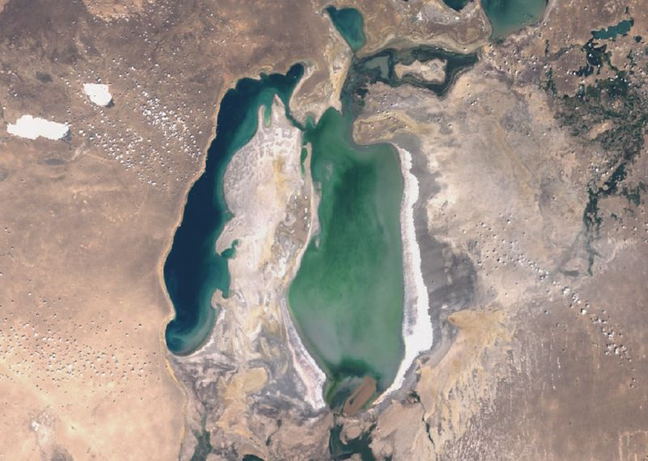](https://www.flickr.com/photos/sentinelhub/50308532883/in/album-72157715852993648/)
***Aral Sea in 2005 (Envisat Meris)***

***Aral Sea in 2019 (Sentinel-2 L2A)***

### Disappearing Glaciers of Switzerland

Glaciers around the world are melting due to climate change. In Switzerland, they have shrunk 10% in the past five years, a rate that has never been seen before in over a century of observations. The summer 2019 heatwave saw glacier melt rates break records, leading to huge losses in ice volume. Scientists took measurements from 20 glaciers in the country and found that about 2% of Switzerland's total glacier volume was lost in the past year. Initial signs for 2019 had been encouraging after glacier snow cover was measured at 20-40% higher than normal in April and May, following a very cold January with lots of precipitation. However the third-hottest summer since records began meant melting accelerated dramatically. Melting was particularly severe in eastern Switzerland and the northern side of the Alps. More than 500 glaciers have completely disappeared in Switzerland since 1850, and 2019 saw the Pizol glacier removed from the country's glacier monitoring network. Most glaciers in Central Europe, Western Canada and the United States will vanish in the second half of this century if current rates of ice loss continue. Learn more [here](https://edition.cnn.com/2019/10/15/europe/switzerland-glacier-melting-scli-intl-scn/index.html) and [here](https://www.euronews.com/2019/12/02/before-and-after-see-how-swiss-glaciers-have-shrunk-dramatically-across-150-years).

 
***Switzerland glaciers in 1987, Landsat 5***

[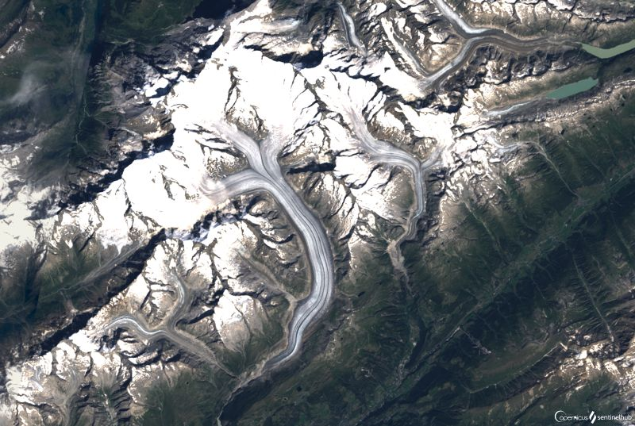](https://www.flickr.com/photos/sentinelhub/50309071406/in/album-72157715852993648/) 
***Switzerland glaciers in 2019, Landsat 8***

### Xingu River

The controversial Belo Monte mega-dam in Pará state has done significant socio-environmental harm to the Xingu River and the indigenous and traditional people living beside it. Project designers appear to have seriously overestimated the Xingu River flow rates and failed to account for fluctuations between wet and dry seasons, while also not accounting for reductions in flow due to deforestation caused by rapidly expanding cattle ranches and soy plantations. Due to escalating climate change and drought that is reducing Xingu River flow, the dam seems almost certain to never fulfill promised economic or energy producing goals. The dam diverts the Xingu River’s natural flow into a constructed channel, then into a reservoir and to the main electricity-producing Belo Monte dam, largely drying up the river in its original path. Tens of thousands of indigenous and traditional people were forced from their homes, and had to give up their fishing livelihoods. Today, the Belo Monte hydroelectric dam stands as a warning – proof of the damage caused by ill-conceived Amazon mega-projects. Learn more [here](https://news.mongabay.com/2018/02/belo-monte-legacy-harm-from-amazon-dam-didnt-end-with-construction/) and [here](https://news.mongabay.com/2020/01/ belo-monte-boondoggle-brazils-biggest-costliest-dam-may-be-unviable/).

[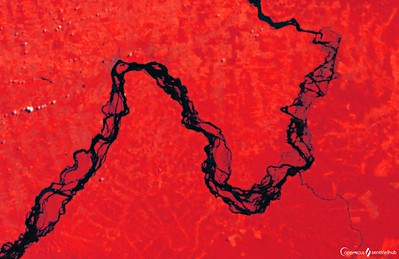](https://www.flickr.com/photos/sentinelhub/50308890338/in/album-72157715852993648/) 
***Xingu river before the dam (2005), Envisat Meris, False color composite***

[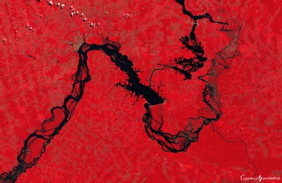](https://www.flickr.com/photos/sentinelhub/50308899588/in/album-72157715852993648/) 
***Xingu river after the dam (2017), Sentinel-2, False color composite***