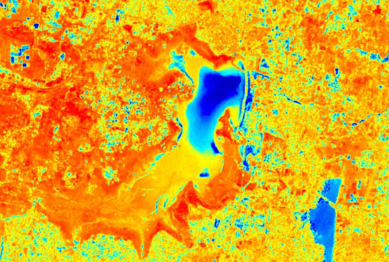
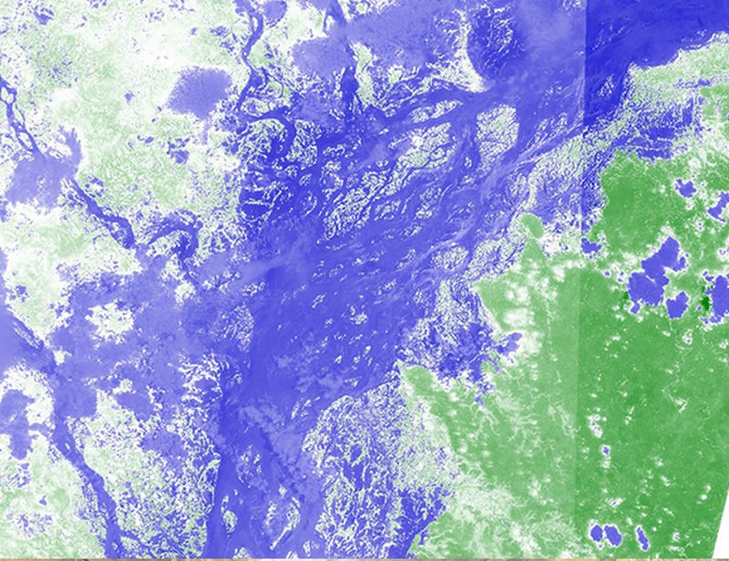

# Floods and Droughts

[Import](https://apps.sentinel-hub.com/eo-browser/?sharedPinsListId=e79dfdff-cf72-4fcc-8360-ab32f7bf9813){:target="_blank"} pins directly into EO Browser or [download](Floods_and_Droughts.json){:target="_blank"} the json for a later import into [EO Browser](https://apps.sentinel-hub.com/eo-browser/?zoom=10&lat=41.9&lng=12.5&themeId=DEFAULT-THEME){:target="_blank"}.

Following is a set of pins which are all connected to the topic Floods and Droughts. Each event contains a description and related before-after pins, that correspond to highlights in EO Browser. Each pin has a preview image linked to a high-resolution print on Flickr.

## Included pins 

### Chennai drought, 2019

Chennai is located on the south-eastern coast of India on a flat coastal plain and is the fourth largest city of the country with over 7 million inhabitants. The city relies heavily on annual monsoon rains to replenish the four water reservoirs that represent the main water resources for the public and extensive automotive industry in the region. Mismanagement of the water resources, combined with 3 years of deficient monsoon rainfall seasons prior to the drought event caused a dramatic depletion of the water reservoirs [related article](https://www.bbc.com/news/world-asia-india-48672330). Additionally, the groundwater aquifer was drained beyond its usual recovering capability threshold because residents reverted to groundwater extraction via [bore wells](https://www.indiawaterportal.org/topics/borewells-and-tubewells). The three *Sentinel-2 L2A*-based Moisture index images from before, while and after the drought, show the desiccation of the Red Hills Reservoir over the heat period in 2019 with a clearly retreating water line. [Further reading](https://www.nationalgeographic.com/environment/2019/07/india-water-crisis-drought-could-be-helped-better-building-planning/)

 
***Chennai before the drought (Moisture Index)***

***Chennai during the drought (Moisture Index)***

***Chennai after the drought (Moisture Index)***

### Bangladesh Floods, 2019
Bangladesh is known as one of the most flood-prone countries in the world. Every year [the monsoon](https://www.nationalgeographic.org/encyclopedia/monsoon/), a weather phenomenon caused by changes in wind direction and transportation of moist air, produces heavy rainfall from June through September. In early July 2019, heavy rains and consequently overflowing rivers flooded numerous districts in northern Bangladesh, forcing nearly 200,000 people to flee their homes ([related article](http://floodlist.com/asia/bangladesh-monsoon-floods-july-2019)). Additionally, on the night of 17 July 2019, the [Jamuna River broke through a flood bank](https://www.preventionweb.net/news/view/66848) and swamped at least 40 villages, aggravating the effects of the monsoon period in the region. A timely identification of flooded areas is essential for an effective flood response. The inundation maps, utilizing the short wave infrared composite (SWIR) and the Normalized Difference Water Index (NDWI), show the difference between the usual landscape state and effects of the 2019 Bangladesh floods and facilitate natural disaster management assessment.

***Bangladesh, before the flood (SWIR)***

***Bangladesh, after the flood (SWIR)***

### Madagascar floods, 2020
The northwest coast of Madagascar with its characteristic [Betsiboka River](https://en.wikipedia.org/wiki/Betsiboka_River) is known as one of the world's fastest changing coastlines. Due to extensive logging of rainforests and mangroves, the Betsiboka Estuary is subject to catastrophic levels of soil erosion ([related article](https://earthobservatory.nasa.gov/images/4388/betsiboka-estuary-madagascar)). With every rain event, iron-rich silt sediments from the bare hills are washed into the river system, giving the river it's characteristic red-brown coloring. The large sediment plumes eventually deposit in the ecologically important Bombetoka Bay, which puts the balance of this shelter for Madagascar's endemic fauna at risk. [In late January 2020 torrential rains](https://earthobservatory.nasa.gov/images/146225/flood-waters-overwhelm-northern-madagascar#:~:text=Torrential%20rains%20from%20several%20tropical,northern%20reaches%20of%20the%20island.&text=Many%20grain%20stores%20and%20cattle,key%20agricultural%20regions%20of%20Madagascar.) in the northern parts of the island resulted in heavy flooding of the region that in turn had a large impact on local communities and the ecosystem. The two [Landsat 8](https://www.usgs.gov/land-resources/nli/landsat/landsat-8?qt-science_support_page_related_con=0#qt-science_support_page_related_con) images depict the extreme difference between the usual state of the river delta, and the described effects of tropical disturbances, with the rainfall-induced sediment flow in the river being really prominent in the satellite imagery.

***Madagascar, before the flood***

***Madagascar, after the flood***

### Flooding in Omaha, Nebraska, 2019

During a multiple-day stretch centered from March 13 – 23, 2019 (but peaking in severity March 13th – 17th), Nebraska, Iowa and South Dakota endured widespread flooding, ranging in scope from minor/moderate to historical/catastrophic (the likes of which had not been observed in several decades). By far the worst flooding occurred along several primary rivers, including the Loup River system, the Cedar River and the Wood River. Not only was this flooding characterized by high water levels (as is the case with all floods), but in many areas damage was also augmented by an unusually-severe break-up of thick river ice. Taking a back seat to the widespread flooding in terms of impacts/severity, much of the local area also endured a winter storm with high winds and blizzard conditions on the night of the 13th into the morning of the 14th. Overflowing rivers prompted evacuations and dam releases, with Iowa, Nebraska and Wisconsin declaring a state of emergency. Dozens of roads have been closed due to flooding and a bridge has been severely damaged near Niobrara, Knox County, Nebraska.

***Omaha before the flood***

***Omaha after the flood***

### Denmark Drought, 2018

In July, satellite imagery of Europe should look green. Instead, in July 2018, it looked brown due to a severe drought. This drastic color change has happened over just a couple of months. A prolonged dry spell coupled with soaring, record-breaking temperatures has been a devestating combination for farms from Scandinavia and England in the north to France, the Netherlands, and Germany to the south. In particular, July was incredibly hot for northern Europe. Temperatures in late July exceeded 32°C (90°F) as far north as the Arctic Circle. In Denmark, the spring harvests of vegetables and grains was down 40 to 50%. Another consequence of the severe drought were wildfires. Sweden observed around 50 forest fires during the peak of the heat in mid-July, which, according to the World Meteorological Organization, was the worst outbreak of forecast fires in modern records. The extreme heat in the far north has also led to the warming of lakes and oceans as well. And when waters warm that fast, conditions become favorable for blooms of dangerous algae. The Baltic Sea in particular has seen its most severe algal blooms in decades. Learn more [here](https://www.climate.gov/news-features/event-tracker/hot-dry-summer-has-led-drought-europe-2018).

***Denmark in summer, no drought***

***Denmark in summer during the drought***