# Geology

[Import](https://apps.sentinel-hub.com/eo-browser/?sharedPinsListId=f51fce55-133d-4ba4-85cd-014dfd90a3df){:target="_blank"} pins directly into EO Browser or [download](Geology.json){:target="_blank"} the json for a later import into [EO Browser](https://apps.sentinel-hub.com/eo-browser/?zoom=10&lat=41.9&lng=12.5&themeId=DEFAULT-THEME){:target="_blank"}.

Following is a set of pins which are all connected to the topic Geology. Each pin contains a brief description of what is displayed by the pin and a preview image linked to a high-resolution print on Flickr.

## Included pins 

### Grasberg Open Pit, Indonesia (Geology 12,8,2)

[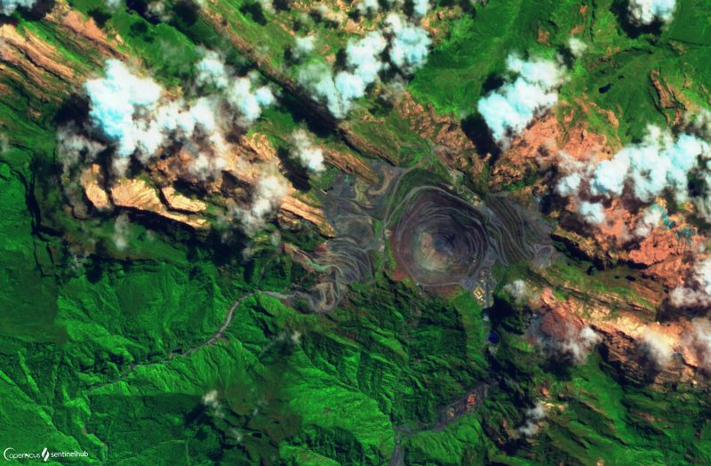](https://www.flickr.com/photos/sentinelhub/49657209443/in/dateposted/)
For years the [Grasberg open pit mine](https://courses.lumenlearning.com/geology/chapter/reading-open-pit-mining/) which forms a 1.6 km wide crater at the surface, has been one of the most productive mines in the world, with massive reserves of gold and copper. Situated high in the rugged Sudirman Mountains, Papua Indonesia, its [mineralization](https://www.sciencedirect.com/science/article/abs/pii/037567429490023X) extends from the surface at 4,200 m to the deepest drill penetrations at 2,700 m. The gold and copper bearing ore formed millions of years ago when hot magma intruded into sedimentary rock during the uplift of the local mountains. Since the 1990s, the Grasberg highly sophisticated mining operation has been busily extracting this ore at staggering [volumes](https://www.mining-technology.com/projects/grasbergopenpit/) to the tune of 528 billion ounces of copper and 53 million ounces of gold. It transitioned into an [underground mine](https://www.nsenergybusiness.com/projects/grasberg-block-cave-underground-mine/) in 2019. Unfortunately, the dumping of millions of tons of waste [tailings](https://www.tailings.info/basics/tailings.htm) directly into the nearby [Ajkwa river system](https://earthworks.org/stories/ajkwa-estuary/) has not only devasted aquatic life but also caused a steadily growing floodplain of desolation, killing thousands of hectares of verdant forest and mangroves and continues to leave the locals [counting the cost](https://theinsiderstories.com/indonesia-will-summon-freeport-on-environmental-damage/).

### Meteor Crater, Arizona

[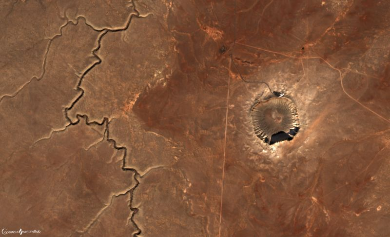](https://www.flickr.com/photos/sentinelhub/50316799297/in/photostream/)
The Arizona [Meteor Crater](https://www.meteorite.com/meteor-crater/) (Barringer Meteorite Crater) formed 50,000 years ago when an asteroid plunged through the Earth’s atmosphere and crashed into what would become central Arizona. The 10 second collision initially formed a crater over 1200 m across and 200 m deep. Subsequent erosion have shaved off parts of the rim and has partially filled the crater, which is now 1600 m wide, 170 m deep gouge, yet the arid climate has done its share to preserve the crater’s original graceful look making it the best-preserved [impact crater](https://en.wikipedia.org/wiki/Impact_crater#:~:text=An%20impact%20crater%20is%20an,impact%20of%20a%20smaller%20body.) on Earth. Very little of the original mass of about 150,000 tons survived the impact, however bits and pieces of the space rock remain scattered throughout the crater, which has for years been a [tourist attraction](https://meteorcrater.com/) as well as a wonderful laboratory for scientists and researchers furthering the study of meteorite impacts.

### Danakil Depression, Ethiopia (Geology 12,8,2)

[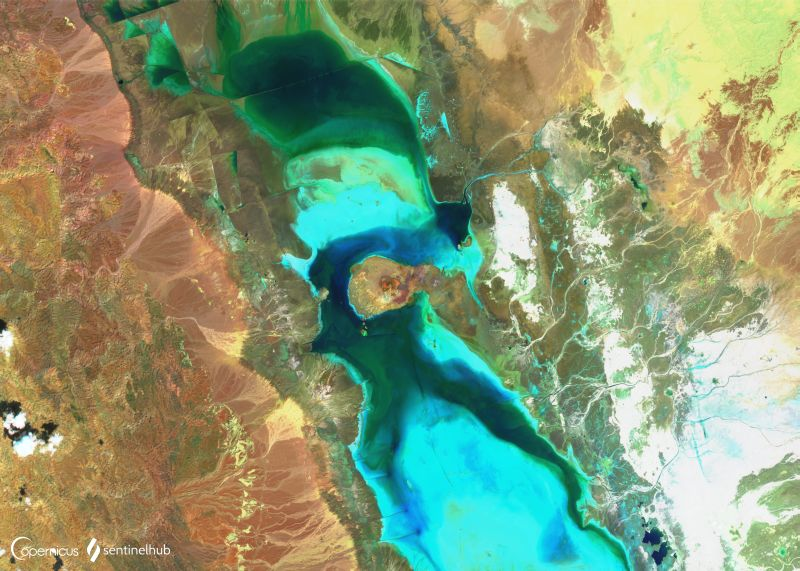](https://www.flickr.com/photos/sentinelhub/50082066913/in/dateposted/)
Northern Ethiopia’s [Danakil Depression](https://earthobservatory.nasa.gov/images/84239/curiosities-of-the-danakil-depression), located in the Danakil Desert, is one of the [hottest](https://www.autoeurope.co.uk/travel-blog/the-worlds-coldest-and-warmest-places/), driest and lowest places on earth. Parts of the region are more than 100 m below sea level, forming a cauldron where temperatures average 34 °C and at times climb to 50 °C. In addition, it only receives 100 to 200 mm of rainfall per year. The climate here can only be described as cruel. But against all odds, [people](http://www.bbc.com/earth/story/20160614-the-people-and-creatures-living-in-earths-hottest-place) do live here and for centuries the locals have survived by mining and selling [salt blocks](https://www.fairplanet.org/story/the-hottest-place-on-earth-the-salt-mines-of-danakil-depression/) left behind after evaporation. As if the climate was not enough, the region's energetic geology makes it look like an alien land. There are volcanoes with bubbling lava lakes, multi-coloured hydrothermal fields, and great salt pans, all of which manifest themselves in the vibrant combination of yellows, oranges, and reds that make the landscape look equal parts [neon and deadly](https://www.bbc.com/future/article/20170803-in-earths-hottest-place-life-has-been-found-in-pure-acid). It is thought that somewhere in the future this geological depression caused by the drifting of three tectonic plates will have drifted enough that the Red Sea will spill over, drowning this strange landscape into a new ocean. 

### National Reserve de l'Ancarana, Madagascar (Geology 8,11,12)

[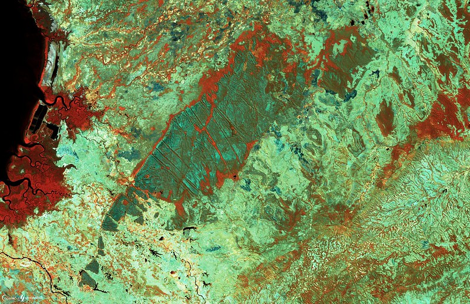](https://www.flickr.com/photos/sentinelhub/50315850438/in/photostream/)
Containing a unique geological wonder, a spectacularly eroded limestone fortress of sharp ridges, [Ankarana National Park](https://www.madacamp.com/Ankarana_National_Park) is situated on a limestone plateau about 108 km south of Antsiranana and covers 18,225 ha. Ankarana has since earned a reputation for its limestone karst pinnacles called [tsingy](https://madagascar-tourisme.com/en/what-to-do/fauna-and-flora/tsingy/) which in Malagasy means "where one cannot walk barefoot”. Observing the tsingy from the air, pilots have been reminded of the deep urban canyons of Manhattan, because the formations have become like rows of high-rise apartment buildings, providing shelter to a different array of species at each level. The topography of the park is varied and in addition to the limestone ‘tsingies’ includes a dense tropical jungle, deciduous forest, canyons and an extensive cave system and network of underground rushing rivers - some of which contain crocodiles. This variety of landscape makes it a popular choice among hikers offering [incredible trails](https://www.naturalworldsafaris.com/africa/madagascar/ankarana-national-park), unique and terrific landscapes and excellent wildlife viewing.

### Colca Canyon, Peru (False Color)

[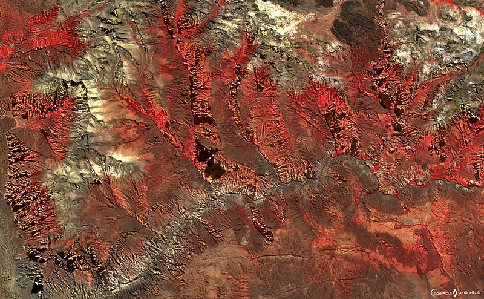](https://www.flickr.com/photos/sentinelhub/50316530596/in/photostream/)
Nestled within the [Andes Mountains](https://www.tripsavvy.com/coast-mountains-and-jungle-geography-of-peru-1619914) of Peru along Colca River is the [Colca Canyon](http://www.discover-peru.org/colca-canyon/). This canyon is reportedly the [deepest](https://colcawonderperu.wordpress.com/about/) in the world, with an estimated depth of 4,160 m on the North side and 3,600 m on the South side, thought to be twice as deep as the [Grand Canyon](https://www.nps.gov/grca/index.htm) in the USA. Unlike most of the Grand Canyon, portions of the Colca Canyon are habitable, and one can see pre-Inca agricultural terraces still being used by local farmers who practice the same lifestyle as their ancestors. The Colca Canyon was [formed](https://www.geocaching.com/geocache/GC1HKWF_colca-canyon?guid=f0c26607-22b4-422e-979c-98faed679e7e) by the erosion of volcanic rock caused by the Colca River along the line of a fault on the crust of the earth. Regardless of its depth the Colca Canyon is considered geologically young. Its location near the Valley of the volcanoes, an area of about 40 volcanoes, means that it is a geologically active area. The largest [volcanoes](http://web.gps.caltech.edu/~clay/PeruTrip/Talks/PeruVolcanoes-Wicks.pdf) are Sabancayo and Ampato. Unsurprisingly, it’s also home to some of Peru’s most [captivating scenery](https://www.beautifulworld.com/south-america/peru/colca-canyon/) as well as one of the best viewing points for South America’s most famous bird - [the condor](http://www.discover-peru.org/endangered-animals-in-the-andes/) - which can oft be seen gliding on the thermal winds in search for food high in the rugged peaks of the Andes.

### Mingsha Singing Sand Dunes, China

[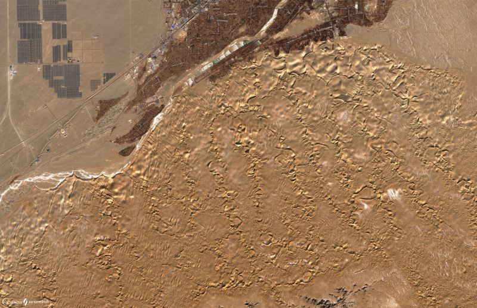](https://www.flickr.com/photos/sentinelhub/50316513601/in/photostream/)
[Singing Sand Dune](https://www.topchinatravel.com/china-attractions/misha-hill-and-crescent-spring.htm) (Mingsha Hill) and its twin natural beauty at the foot of the hill, [Crescent Spring](http://www.silkroadtourcn.com/attractions/crescent-lake-and-singing-sand-dunes.html), are 7 km away from downtown [Dunhuang](https://www.topchinatravel.com/dunhuang/) and cover a total area of around 200 square km. [The dune](https://en.wikipedia.org/wiki/Singing_Sand_Dunes_(Dunhuang)) stretches for 40 km in length and 20 km in width respectively, with the highest point reaching 250 meters and is completely piled up with sand in five colors of red, yellow, green, black and white. There is unsurprisingly a [legend](https://www.topchinatravel.com/china-attractions/misha-hill-and-crescent-spring.htm) that narrates the formation of the singing sand dunes, however, the [real cause](https://www.nationalgeographic.com/news/2012/10/121031-singing-sand-dunes-physics-science-whistling/) is the friction and static created as the wind shifts the sand or as people slide down the steep slopes of the sand dunes from the top. On days when a strong wind blows, the fast shifting sand roars, but when light wind blows, the sand produces a gentle, dulcet sounds akin to music. When sliding on the steep slopes of sand dunes from the top, the drifting sands look like beautiful brocades hung up on the sand dunes, accompanied with beautiful singing sound. The singing sounds like the sound from traditional Chinese music instruments. Hence, the dune gets its name because of the singing sound of the sand. The sands really do sing! Sunrise and sunset are times of great beauty at the edge of the desert. Modest cameras can capture great moments but for the technologically advanced, better equipment will reveal amazing colors!

### Alluvial Streams, China

[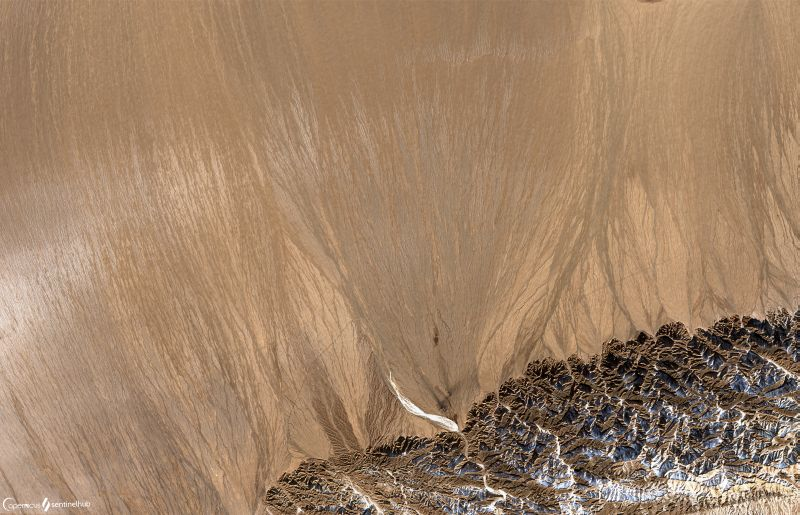](https://www.flickr.com/photos/sentinelhub/50316587281/in/album-72157715882520322/)
The [Shule river](https://en.wikipedia.org/wiki/Shule_River) drainage basin covers 102,300 square km of land, getting most of its water from the surrounding glaciers. The river carves many alluvial streams and wide [alluvial fans](https://www.nationalgeographic.org/encyclopedia/alluvial-fan/) along the way. Alluvial fans are usually created as flowing water interacts with mountains, hills, or the steep walls of canyons. Streams carrying alluvium can be trickles of rainwater, a fast-moving creek, a powerful river, or even runoff from agriculture or industry. As a stream flows down a hill, it picks up sand and other particles, called alluvium. The rushing water carries alluvium to a flat plain, where the stream leaves its channel to spread out. Alluvium is deposited as the stream fans out, creating the familiar triangle-shaped feature, which can be tiny, or enormous.

### Knockan Crag, Scotland (Geology 8, 11, 12)

[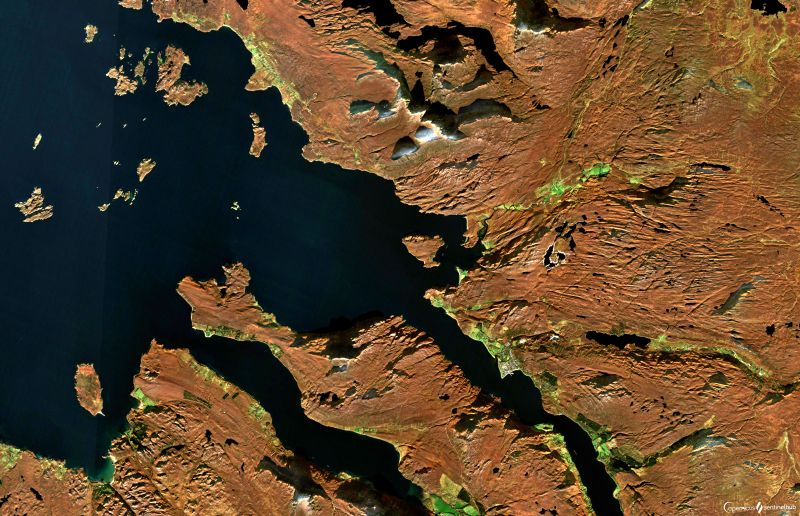](https://www.flickr.com/photos/sentinelhub/50315880228/in/photostream/)
Amazing stories stored in the rocks come to life at [Knockan Crag National Nature Reserve](https://www.nature.scot/sites/default/files/2018-02/The%20Story%20of%20Knockan%20Crag%20National%20Nature%20Reserve.pdf), a visitor attraction in the North West Highlands of Scotland, 21 km north of Ullapool near the crofting townships of Knockan and Elphin. As its name suggests, Knockan Crag is a cliff that rises to a height of 300 m above sea level. It is hard not to get excited about rocks and geology at Knockan Crag as it holds the key to an amazing story of colliding continents and [scientific intrigue](https://www.earth.ox.ac.uk/~oesis/nws/loc-knockan.html). Knockan Crag is internationally renowned due to the presence of a geological feature called the "[Moine Thrust](https://www.geological-digressions.com/tag/knockan-crag/)" first identified here in the 1860s. The Moine Thrust is a major near horizontal geological fault affecting the rocks, whereby the older rocks have been pushed towards, up and over younger rocks. This is the place where [Moine metamorphic](https://www.scottishgeology.com/best-places/knockan-crag/) rocks have ended up on top of limestone, and at the Moine Thrust at Knockan Crag you can put your hands on these two very different rocks. [Nature trails](http://earthwise.bgs.ac.uk/index.php/Knockan_Crag,_North-west_Highlands_-_an_excursion) ascending up and along the crag lead tourists through striking succession of weathering [Cambrian sediments](https://www.geolsoc.org.uk/GeositesKnockan) overlain by the older Moine rocks. Infact, crystalline Moine metamorphic rocks sit on top of a sequence of undisturbed sedimentary rocks which have not been affected by the activity that deformed the overlying rocks. For more than 100 years geologists have used Knockan Crag to help in understanding mountain building and tectonic plates across the world.

### The Great Blue Hole, Belize (Enhanced True Color)

[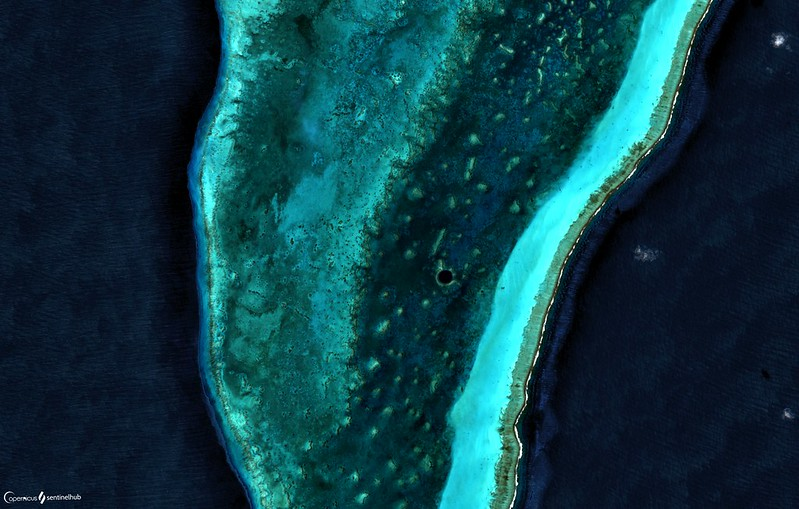](https://www.flickr.com/photos/sentinelhub/50315870083/in/photostream/)
Instead of its roaring waves and scary storms, the Caribbean sea often offers amazing natural wonders below its otherwise uncertain surface. [The Great Blue Hole of Belize](https://www.marineinsight.com/environment/what-is-the-great-blue-hole-of-belize/), located off the coast of Belize, is one of such wonders. Circular in shape with a diameter of 300 m, the water depth in this hole is 125 m, which gives it a deep blue color in contrast with the aquamarine color of the water neighboring it. Researchers say this giant underwater [sinkhole](https://www.usgs.gov/special-topic/water-science-school/science/sinkholes?qt-science_center_objects=0#qt-science_center_objects) was originally formed during the last glacial period as a limestone cave when the sea levels were lower. As the ocean began to rise due to [thawing](https://www.nationalgeographic.com/environment/global-warming/big-thaw/) of polar ice caps, the cave system flooded and eventually collapsed, creating a “vertical cave” in the ocean. As such, this swallow hole is popular among divers, who flock to the area to see the geological formations that now lie in the ocean’s depths. [Researcher divers](https://geographical.co.uk/people/explorers/item/3132-explore-belize-blue-hole) have found huge [stalactites and stalagmites](https://oceanexplorer.noaa.gov/facts/stalactite.html) below the surface, some even reaching 9 – 12 m in length. They say that the deeper one goes, the water becomes clearer and the formations, more complex. The Great Blue Hole is part of the larger Belize Barrier Reef Reserve System, a World Heritage Site of UNESCO.

### Namib Desert, Namibia 

[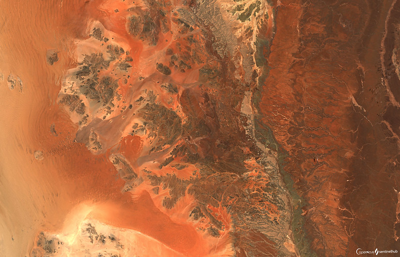](https://www.flickr.com/photos/sentinelhub/50316604391/in/album-72157715882520322)
With its [red sand dunes](https://www.earthmagazine.org/article/travels-geology-desert-geology-namibia-writer-and-her-father-explore-otherworldly-dunes) rolling endlessly into the ocean, the [Namib](https://www.rovos.com/the-namib-desert) is the oldest desert in the world, existing for at least 55 million years, stretching over 2000 km along Namibia‘s entire Atlantic coast and parts of Angola and South Africa. This extremely [arid ecoregion](https://www.worldwildlife.org/ecoregions/at1315) features dunes, rocky mountainous areas, gravel plains, perennial river mouth wetlands, coastal pans, lagoons, riparian vegetation and isolated springs resulting in a landscape of exceptional beauty. With rainfall varying from 85 mm in the west to just 2 mm in the east, coastal fog is the primary source of water accounting for a unique environment in which endemic [plants and animals](https://www.britannica.com/place/Namib#ref37004) adapt to an ever changing variety of microhabitats and ecological niches. Despite its emptiness, the desert scenery of the Namib has a stark beauty with its striking patterns created by the constantly shifting sand dunes to the dramatic coastline, where shipwrecks shrouded in fog disintegrate slowly into the sand. In addition to being home to the famous solitary [Sossusvlei Dunes](https://www.sossusvlei.org/about/), it is also the site of major mines for tungsten, salt and diamonds.

### Fjords of Norway (Geology 12,8,2)

[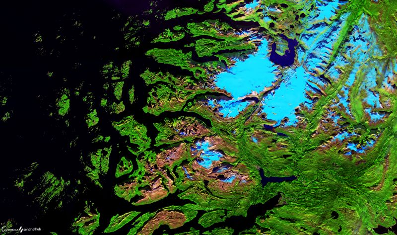](https://www.flickr.com/photos/sentinelhub/50316499611/in/album-72157715882520322/)
A [fjord](https://www.visitflam.com/editorial-content/everything-you-should-know-about-the-fjords-of-norway/?referrer=4464&gclid=Cj0KCQjw6ar4BRDnARIsAITGzlAyf5HypXDOQeJ4RTYb1M0hft5j1lpMTFV0qZcktbYwBuaVyK2iYe0aAvi1EALw_wcB) is a story of water, ice and mountains. It is a long, deep, narrow body of water that reaches far inland. Fjords are often set in a U-shaped valley with steep walls of rock on either side. While fjords are not just a Norwegian phenomenon and can be found in other mountainous regions, the [fjords of Norway](https://en.wikivoyage.org/wiki/Fjords_of_Norway) are particularly famous, spread all over the country and easily accessible as the fjord-dominated landscape runs like a strip all around Norway's coast. They were formed thousands of years ago by retreating glaciers, allowing the sea to flood in the remaining space. In the last [ice age](https://en.wikipedia.org/wiki/Ice_age), glaciers moving very slowly over time carved deep valleys. This is why fjords can be very deep farther inland where the glacial force was strongest, e.g. [Sognefjord](https://www.visitflam.com/activities/fjord-cruise-sognefjord/), is 1308 m deep at its deepest and gets shallow towards the sea. Some features of fjords include [coral reefs](https://marinelab.fsu.edu/labs/brooke/research/deep-sea-corals/norwegian-fjords/) and rocky islands called [skerries](https://en.wiktionary.org/wiki/skerry). Norway has over 1,700 named fjords which increase the jagged coastline from a modest 3000 km to 30,000 km, islands add another 70,000 km in total creating [the most complex coastline](https://www.google.com/maps/place/Norway/@66.134237,16.2021192,5z/data=!4m5!3m4!1s0x461268458f4de5bf:0xa1b03b9db864d02b!8m2!3d60.472024!4d8.468946). The dramatic scenery has become a magnet to tourists who enjoy kayaking and other boat sports.

### Ha Long Bay

[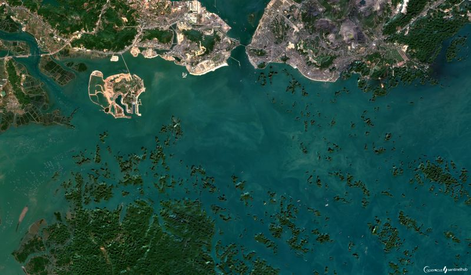](https://www.flickr.com/photos/sentinelhub/50316743582/in/album-72157715882520322/)
[Ha long Bay](https://www.beautifulworld.com/asia/vietnam/ha-long-bay/) is an extraordinary beautiful natural wonder in northern Vietnam’s Quang Ninh Province, near the Chinese border. Covering over 1,500 square km area, it comprises of more than 1,600 rocky and earthen islands, typically in the form of jagged limestone pillars jutting out from the sea, and several caves, floating villages and [grottoes](https://en.wikipedia.org/wiki/Grotto), all of which blend together to produce an exotic and picturesque seascape. The existence of surreal seascape has been often explained by the old age [dragon legend](https://www.visithalongbay.com/insight-guides/the-legend-of-halong-bay.html) while scientist have explained that the formations are as a result of 500 million years of strong erosive forces moulding the rocks into fascinating shapes. It is classified as both a [World Heritage Site by UNESCO](https://whc.unesco.org/en/list/672), and as one of the New 7 Wonders of Nature and for many tourists, this place is like something right out of a movie. The fact is that Ha long Bay features a wide range of biodiversity, while the surrealistic scenery has indeed featured in endless movies.

### Grand Canyon national park, USA

[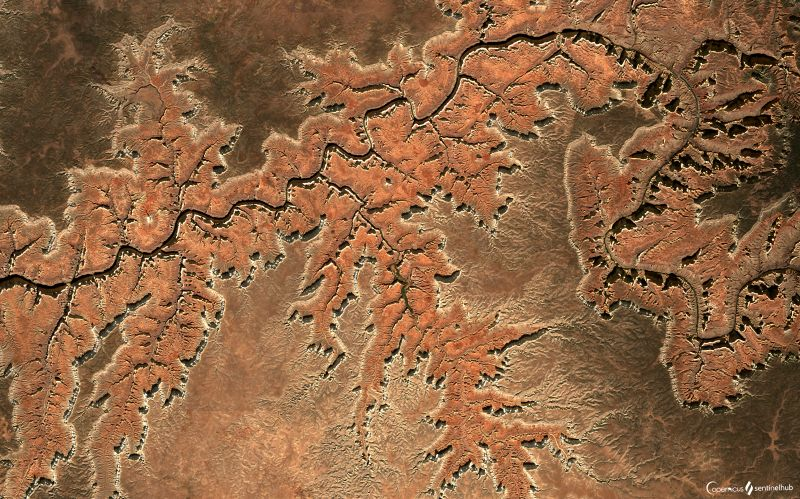](https://www.flickr.com/photos/sentinelhub/50315903858/in/photostream/)
[Founded in 1919](https://www.nationalparks.org/explore-parks/grand-canyon-national-park), located in Arizona, the [Grand Canyon National Park](https://www.nps.gov/grca/index.htm) encompasses 446 km of the Colorado River and adjacent uplands. The park is home to much of the immense Grand Canyon 1.6 km deep, and up to 29 km wide. The Grand Canyon National Park has a rich [geological](https://www.usgs.gov/science-support/osqi/yes/national-parks/grand-canyon-geology) history. Though scientists are still unsure of the canyon's exact history, many scientists have pieced together a linier history that includes [the Colorado Plateau](https://web.uri.edu/geofieldtrip/grand-canyon-national-park/), the mighty Colorado River and millions of years of erosion. Long considered one of the seven wonders of the world, tourists flock to marvel at the canyon’s jaw-dropping immensity, and the sheer spectacle of how the Colorado River carved through layer after layer of rock to expose a unique combination of geological color and erosional forms. It is impossible not to notice [distinct layers of rock](https://www.mygrandcanyonpark.com/things-to-do/grand-canyon-geology) exposing an ombre of reds, browns, pinks, purples and more.

### Richat Structure, Mauretania

[Eye of the Sahara](http://geologyscience.com/gallery/eye-of-the-sahara-or-richat-structure/), also known as the Richat structure, is a geological dome made of rocks billions of years old and measures 40.2 km across. Once, there was a temperate forest here, with lakes and rivers. The formation processes of this magnificent structure are still a mistery. The most prominent theory believes, that it's the result of the volcanism and erosion. The theory states, that volcanism in the area lifted the layers of sediments and after it died down, the erosion ate away at the structure, making the shape of an eye we see today. As the structure is visible from space, it serves as a landmark for [astronauts](http://www.lovethesepics.com/2011/04/earths-bulls-eye-the-eye-of-africa-landmark-for-astronauts-14-pics/).