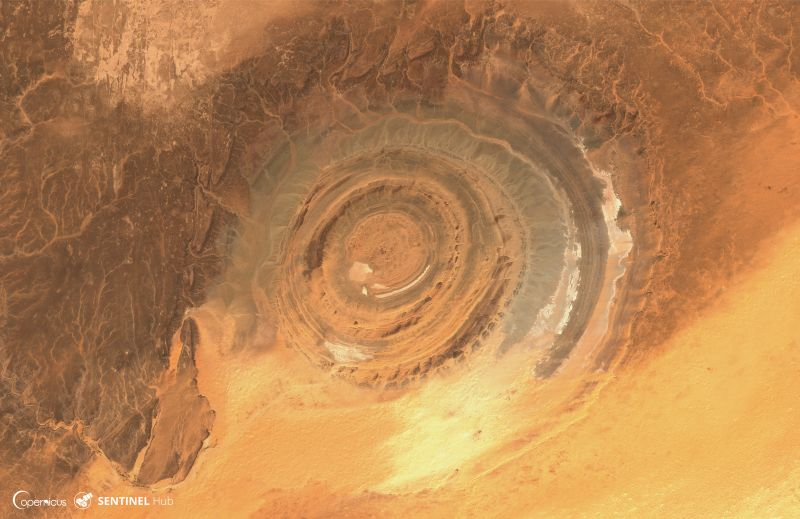

# Title

[Import](https://apps.sentinel-hub.com/eo-browser/?sharedPinsListId=13e80f06-e4ed-414f-889a-5085c7c895bb){:target="_blank"} pins directly into EO Browser or [download](Geology.json){:target="_blank"} the json for a later import into [EO Browser](https://apps.sentinel-hub.com/eo-browser/?zoom=10&lat=41.9&lng=12.5&themeId=DEFAULT-THEME){:target="_blank"}.

Here will be a short description of the dataset.

## Included pins 

### Grasberg Open Pit, Indonesia (Geology 12,8,2)

Description

### Meteor Crater, Arizona

Description

### Danakil Depression, Ethiopia (Geology 12,8,2)

Description

### National Reserve de l'Ancarana, Madagascar (Geology 8,11,12)

Description

### Colca Canyon, Peru (False Color)

Description

### Mingsha Singing Sand Dunes, China

Description

### Sand Streams, China (Geology 12,8,2)

Description

### Cnockan Crag, Scotland (Geology 8,11,12)

Description

### The Great Blue Hole, Belize (Enhanced True Color)

Description

### Grand Canyon National Park (Geology 12,8,2)

Description

### Ha Long Bay, Vietnam (Geology 12,8,2)

Description

### Namib Desert, Namibia (Geology 12,8,2)

Description

### Fjords of Norway (Geology 12,8,2)

Description

### Richat Structure, Mauretania

[Eye of the Sahara](http://geologyscience.com/gallery/eye-of-the-sahara-or-richat-structure/), also known as the Richat structure, is a geological dome made of rocks billions of years old and measures 40.2 km across. Once, there was a temperate forest here, with lakes and rivers. The formation processes of this magnificent structure are still a mistery. The most prominent thoeory believes, that it's the result of the volcanism and erosion. The theory states, that volcanism in the area lifted the layers of sediments and after it died down, the erosion ate away at the structure, making the shape of an eye we see today. As the structure is visible from space, it serves as a landmark for [astronauts](http://www.lovethesepics.com/2011/04/earths-bulls-eye-the-eye-of-africa-landmark-for-astronauts-14-pics/).
