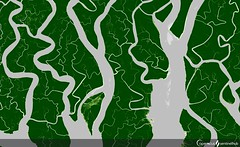
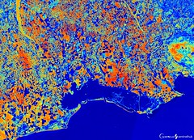
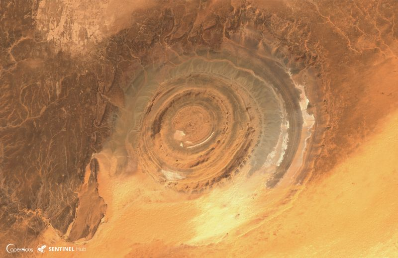
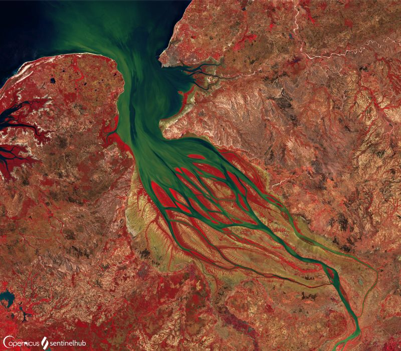
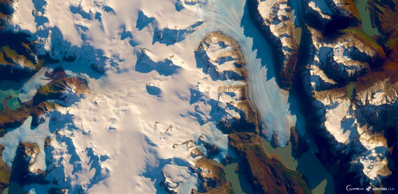
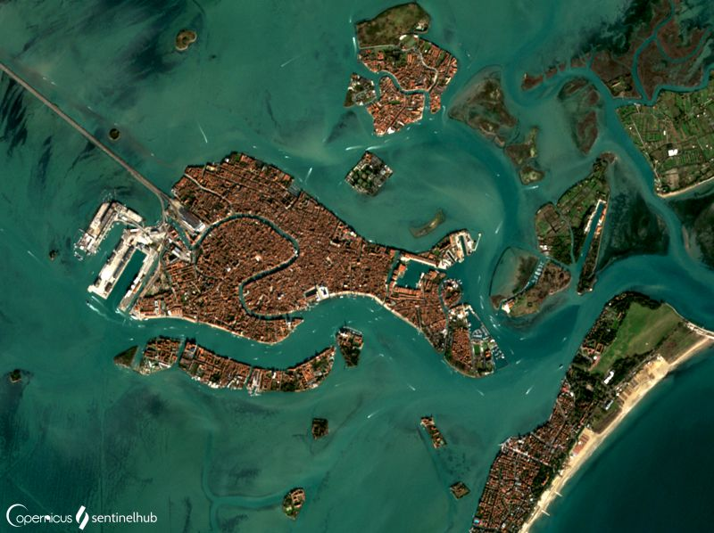
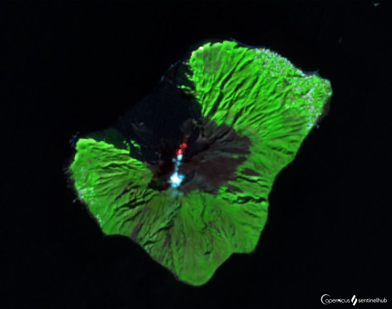
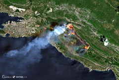

# Monitoring Earth from Space

[Import](https://apps.sentinel-hub.com/eo-browser/?sharedPinsListId=64fdf554-5210-4e0a-b324-fabd2cdfc297){:target="_blank"} pins directly into EO Browser or [download](Monitoring_Earth_from_Space.json){:target="_blank"} the json for a later import into [EO Browser](https://apps.sentinel-hub.com/eo-browser/?zoom=10&lat=41.9&lng=12.5&themeId=DEFAULT-THEME){:target="_blank"}.

Following is a set of pins which are all connected to the topic Monitoring Earth from Space. It is a meant as a starting point to explore what remote sensing data can do. Each pin contains a brief description of what is displayed by the pin and a preview image linked to a high-resolution print on Flickr.

## Included pins 

### Sundarbans, Mangrove Forest (NDVI)
 
[Mangrove forests](https://oceanservice.noaa.gov/facts/mangroves.html) have exceptionally high biodiversity and are indispensable in erosion reduction. There are 80 different species of mangrove trees known, growing in low-oxygen soil, where slow moving waters accumulate fine sediments for the roots to grow in. [Sundarbans Mangrove forest](https://whc.unesco.org/en/list/798/) covers 140.000 ha of land, making it one of the largest Mangrove forests in the world. It provides livelihood to many people living in the area and is a home to, among others, 250 bird species and an endangered Royal Bengal Tiger. The forest is threatened by seasonal monsoons, cyclones and tidal waves, which cause salinization. 

### Italian Agriculture (Moisture Index)

[Veneto agriculture](https://www.recare-hub.eu/news/45-06-bioforsk) is one of the most productive in Italy, producing mainly cereals, fruits and wine. Small, hand farmed fields present a contrast to the growing industrialization of the sector, which suffers from soil degradation.

### Richat Structure, Mauretania

[Eye of the Sahara](http://geologyscience.com/gallery/eye-of-the-sahara-or-richat-structure/), also known as the Richat structure, is a geological dome made of rocks billions of years old and measures 40.2 km across. Once, there was a temperate forest here, with lakes and rivers. The formation processes of this magnificent structure are still a mistery. The most prominent theory believes, that it's the result of the volcanism and erosion. The theory states, that volcanism in the area lifted the layers of sediments and after it died down, the erosion ate away at the structure, making the shape of an eye we see today. As the structure is visible from space, it serves as a landmark for [astronauts](http://www.lovethesepics.com/2011/04/earths-bulls-eye-the-eye-of-africa-landmark-for-astronauts-14-pics/).

### Heavy Sedimentation Flow of the Betsiboka River, Madagascar (False Color)

A beautiful Betsiboka river delta is a dramatic example of massive deforestation, that occurs in Madagascar every year. One of the biggest culprits is the slash and burn agriculture, called [tavy](https://www.madamagazine.com/en/english-tavy-kahlschlag-einer-insel/), where the forest is burnt and then farmed in the following months. The other deforestation causes include grazing, logging and production of coal. The forest grows back after being cut down, but until then, the barren soil is vulnerable to erosion by heavy rains, depositing it into rivers, which carry it into the sea, contaminating sea life with deposited iron oxides. As soil formation is a process taking thousands of years, it erodes away each year, until it can no longer support a forest. Due to these processes, Madagascar has already lost [80 % of its primary forests](https://www.eoi.es/blogs/guidopreti/2014/02/04/deforestation-in-madagascar-a-threat-to-its-biodiversity/), causing many indigenous species, such as [lemurs](https://monkeysandmountains.com/lemurs-madagascar/), to be endangered.

### Glacier Grey, Chile

A stunning [glacier Grey](https://earthobservatory.nasa.gov/images/7802/grey-glacier-chile) located in Chilean Torres Del Paine National Park is 6 km wide and over 30 meters high at the glacier's front. Its various shades of grey and blue, clearly visible even from space, attract many visitors each year. In 2017 a huge (380 m x 350 m) [iceberg ruptured](https://www.theguardian.com/environment/2017/nov/29/large-iceberg-breaks-off-from-grey-glacier-in-southern-chile) from the glacier with the cause unknown. Such events are very rare, with the last one occurring in the early 1990's. Due to its diverse plants and wildlife, glaciers, rivers, lakes and pampas, the park became [protected as a UNESCO Biosphere reserve](http://www.ecocamp.travel/fr/Patagonia/Torres-del-Paine-National-Park) in 1978. 

### Venice, Italy

[Venice](https://www.britannica.com/place/Venice/Lagoon-and-tides), a so called island city with the population of [637,245](https://worldpopulationreview.com/world-cities/venice-population/), remains a major Italian port and is one of the world’s oldest tourist and cultural centres. The lagoon's mud banks, shallows, and channels are a source of income from marine and bird life and from salt pans. The lagoon has served as protection and as a natural sewerage system.
The deepening of channels in the 20th century, the overextraction of fresh water from mainland aquifers, the rising of the Adriatic Sea, and the geologic sinking of the Po River basin have lowered the land level, creating a serious flooding problem. On a regular basis, when high tides combine with winds from the south and east, the waters of the lagoon rise and flood the city, making Venice to be known as the [City built on water](https://www.livitaly.com/how-was-venice-built/). 

### Stromboli, Province of Messina, Italy (SWIR)

[Stromboli](https://www.volcanodiscovery.com/stromboli.html) has been active consistently for at least 2000 years, which is unusual among volcanoes.  Most of its activity consists of brief and smaller bursts of lava 100-200 meters high into the air. Occasionally, longer periods of eruptions occur, lasting from a few to up to 10 years. The most recent one began in December 2002 and ended in July 2003. Although Stromboli's eruptions are not dangerous for the most part, more violent eruptions that take lives and destroy property, do occur. In [July 2019](https://www.bbc.com/news/world-europe-48857422), a hiker died during the eruption, several people were injured and many had to flee to the sea. The deadliest [eruption in 1930](http://www.geo.mtu.edu/volcanoes/boris/mirror/mirrored_html/STROMBOLI-1930.html) took 6 lives and caused considerable damage. 

### Wildfires in Croatia, July 2017 (SWIR)

In summer of 2017, [dozens of wildfires erupted](https://www.channelnewsasia.com/news/world/croatia-fights-dozens-of-fires-along-adriatic-coast-9144906) along the Adriatic coast. Soaring heat wave temperatures accompanied by a lack of rainfall led to a drought, which resulted in dry, hot forest floor, extremely vulnerable to wildfires. The cause of many wildfires were careless people, while strong winds made the situation worse by making fires spread much faster. The firefighters struggled to contain the fires and keep them from dwellings. Altogether, an astonishing 83.000 hectares of forest burnt down.