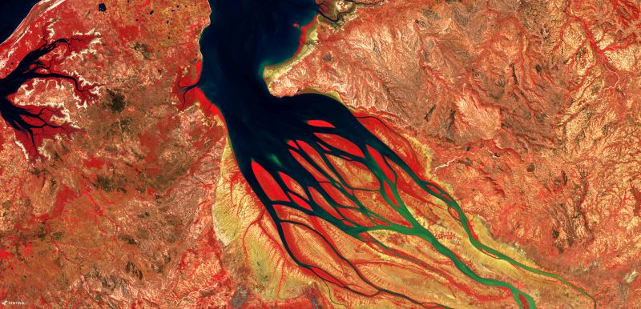
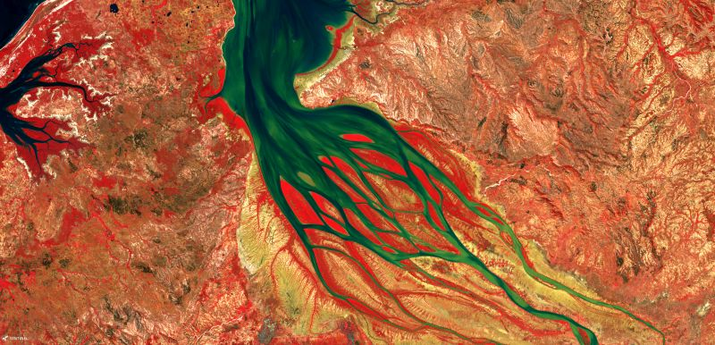
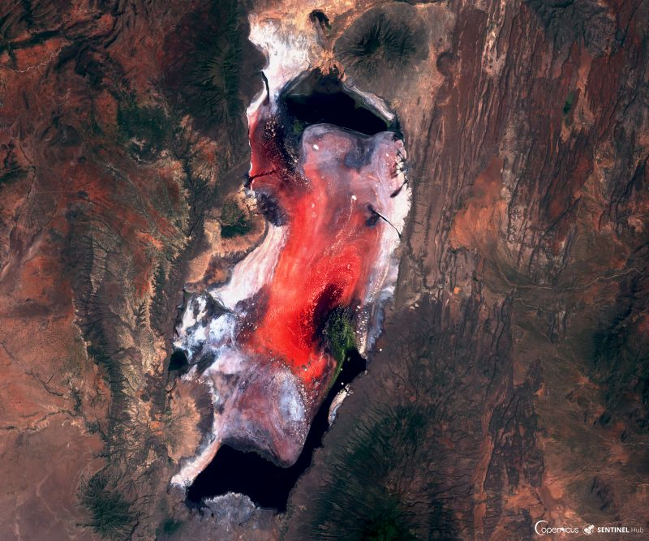
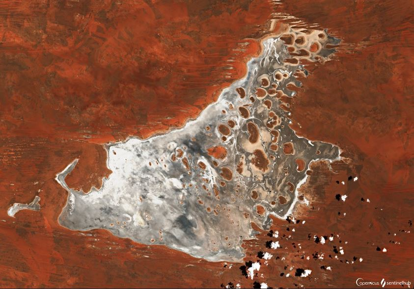
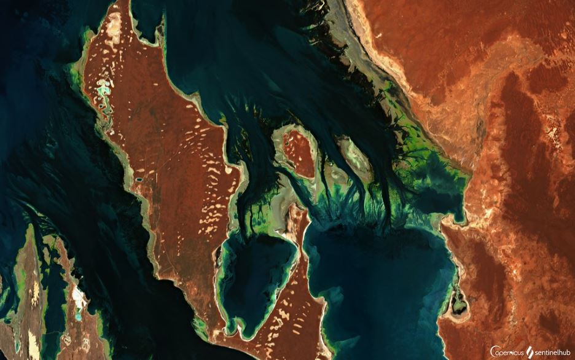
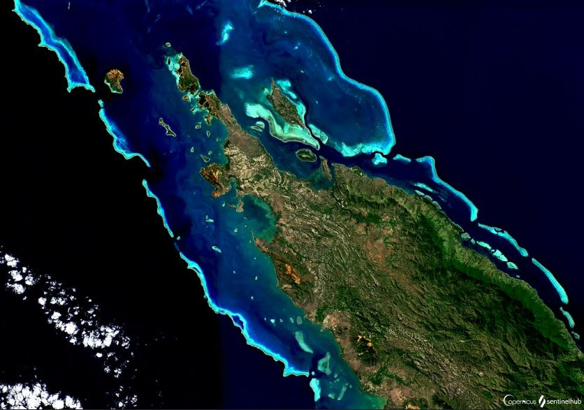

# Ocean and Water Bodies 

[Import](https://apps.sentinel-hub.com/eo-browser/?sharedPinsListId=f2395499-7d59-43d7-9f6f-f1557ff34bae){:target="_blank"} pins directly into EO Browser or [download](Ocean_and_Water_Bodies.json){:target="_blank"} the json for a later import into [EO Browser](https://apps.sentinel-hub.com/eo-browser/?zoom=10&lat=41.9&lng=12.5&themeId=DEFAULT-THEME){:target="_blank"}.

Following is a set of pins which are all connected to the topic Ocean and Water Bodies. Each pin contains a brief description of what is displayed by the pin and a preview image linked to a high-resolution print on flickr.

## Included pins 

### Sedimentation Flow of Betsiboka River 

A beautiful Betsiboka river delta is a dramatic example of massive deforestation, that occurs in Madagascar every year. One of the biggest culprits is the slash and burn agriculture, called [tavy](https://www.madamagazine.com/en/english-tavy-kahlschlag-einer-insel/), where the forest is burnt and then farmed in the following months. The other deforestation causes include grazing, logging and production of coal. The forest grows back after being cut down, but until then, the barren soil is vulnerable to erosion by heavy rains, depositing it into rivers, which carry it into the sea, contaminating sea life with deposited iron oxides. As soil formation is a process taking thousands of years, it erodes away each year, until it can no longer support a forest. Due to these processes, Madagascar has already lost [80 % of its primary forests](https://www.eoi.es/blogs/guidopreti/2014/02/04/deforestation-in-madagascar-a-threat-to-its-biodiversity/), causing many indigenous species, such as [lemurs](https://monkeysandmountains.com/lemurs-madagascar/), to be endangered.

 
***Low sedimentation flow (False Color)***

 ***Heavy sedimentation flow (False Color)***

### Lake Natron, Tanzania

Natron is a fascinating lake, deadly to most animals, that are not accustomed to its alkaline environment. The dangerously high PH of 10.5 is caused by sodium carbonate flowing in from the surrounding hills, active with volcanism. Sodium carbonate deposits serve as a preservant, calcifying the carcasses of deceased animals. Despite the harsh ecosystem, some species survive here. On its shores, flocks of flamingos, which have evolved leathery skin to tolerate the water, find a safe nesting place, as predators avoid the area. The stunning red color is caused by cyanobacteria, that thrive in the dry season, as salinity rises due to evaporation. Read more [here](https://www.smithsonianmag.com/travel/flamingos-find-life-among-death-180959265/), [here](https://earthobservatory.nasa.gov/images/90191/lake-natron-tanzania) and [here](https://www.livescience.com/40135-photographer-rick-brandt-lake-natron.html).

### Roper River, Tanzania (Enhanced False Color)

Over 1000 km long Roper river's immense irrigation potential is being considered. Using powerful northern rivers is expected to create numerous jobs and greatly contribute to agricultural development and sustainability. However, some worry the project would require a million hectares of the catchment area to be bulldozed for irrigation agriculture, as well as a dam to be built, which could significantly dry the river up. As the impact on the economy is compelling, the project continues regardless. Read more on the [catchment area](https://web.archive.org/web/20150401172739/http://lrm.nt.gov.au/__data/assets/pdf_file/0003/20766/overview4.pdf) and more on the project [here](https://www.irrigationaustralia.com.au/news/water-its-our-dam-shame) and [here](https://www.topendcoasts.org.au/concern_for_the_roper_river_abc_country_hour).

### Salt lake Mackay, Australia

Lake Mackay or Wilkinkarra (in [Pitjantjatjara](https://ulurutoursaustralia.com.au/blog/the-culture-and-heritage-of-the-pitjantjatjara-in-central-australia/)) is the fourth largest lake in Australia, covering an area of  3494 km2. The particularity of this water body is that being an [ephemeral lake](https://www.sciencedirect.com/topics/earth-and-planetary-sciences/ephemeral-lake), it only fills with water after seasonal rainfall, although water can persist for several months after a major rain event.  When inundated, the lake is of significant importance for [endemic waterbird populations]([http://www.epa.wa.gov.au/sites/default/files/Referral_Documentation/App%20B.3_Waterbird%20Survey%20at%20Lake%20Mackay.pdf](http://www.epa.wa.gov.au/sites/default/files/Referral_Documentation/App B.3_Waterbird Survey at Lake Mackay.pdf)), who use the freshwater [claypans](https://www.merriam-webster.com/dictionary/claypan) as breeding grounds. Due to evaporation, minerals are carried to the surface, forming bright white salt pans that contrast with the darker brown islands scattered across the eastern half of the lake. On these islands and around the shoreline, bright orange longitudinal sand ridges form stunning lines from east to west across the landscape. 

### Shark Bay, Australia (True Color/Water Quality Viewer)

Located 800 km north of Perth in the Indian Ocean, Shark Bay is a unique [UNESCO World Heritage](https://whc.unesco.org/en/about/) site. The bay is renown for having the largest [seagrass](https://ocean.si.edu/ocean-life/plants-algae/seagrass-and-seagrass-beds) meadow in the world (~4000 km2), forming a feeding ground for large populations of aquatic life, including [dugong](https://www.worldwildlife.org/species/dugong). The seagrass can be seen from space in the shallower areas of the bay, contrasting strongly with the dark brown sand on the surrounding land. The water in Shark Bay is up to twice as salty as the sea, forming one of few marine environments in the world with [hypersaline waters](https://www.sharkbay.org/nature/geology/salinity/) and hosts [stromatolites](https://www.bushheritage.org.au/species/stromatolites), colonies of algae that build mounds and are among the oldest forms of life on earth. 

***True Color Visualization***

***Water Quality Viewer Visualization***

### Barrier Reef, New Caledonia (Enhanced True Color)

[Barrier reef of New Caledonia](https://whc.unesco.org/en/list/1115/) is protected as a UNESCO World heritage site, due to its outstanding coral reef biodiversity and lagoon beauty. It is comprised of six marine clusters and is one of the three most extensive reef systems in the world. The ecosystems are intact, with healthy populations of great diversity. They provide habitat to a number of emblematic or threatened marine species such as turtles, whales or dugongs whose population is the third largest in the world. Varied Barrier reef landscape ranges from extensive double barrier systems, offshore reefs and coral islands, to the near-shore reticulate reef formations. This beauty continues below the surface with dramatic displays of coral diversity, massive coral structures, together with arches, caves and major fissures in the reefs.