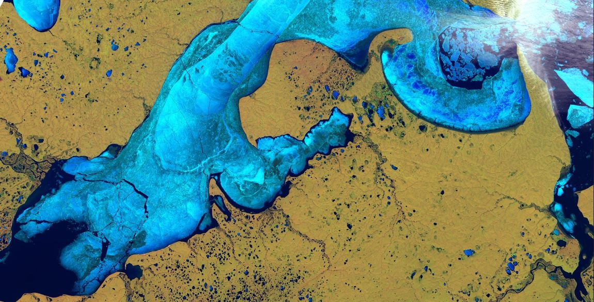
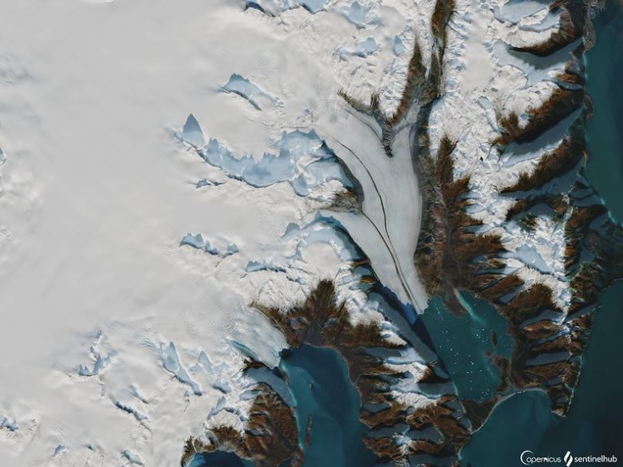
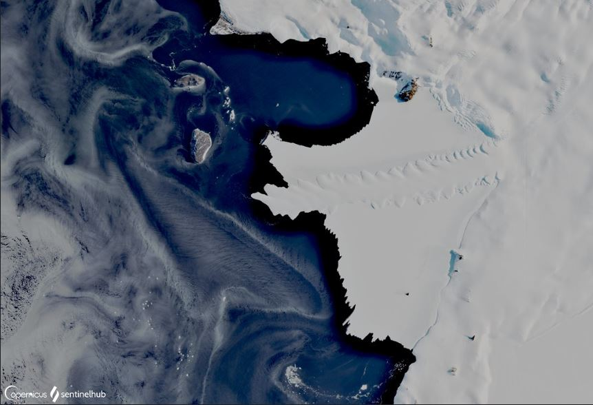
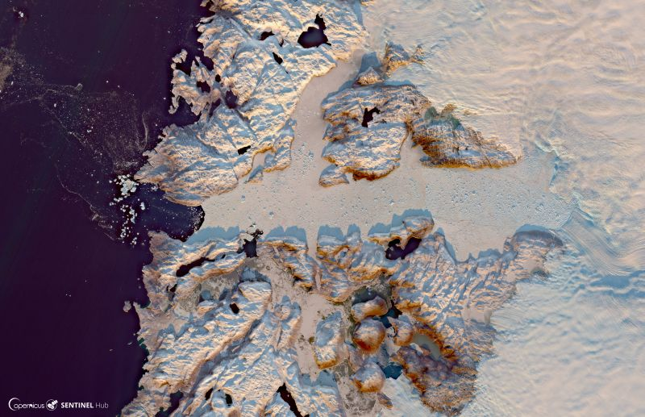
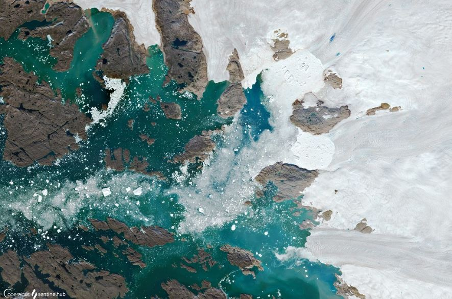
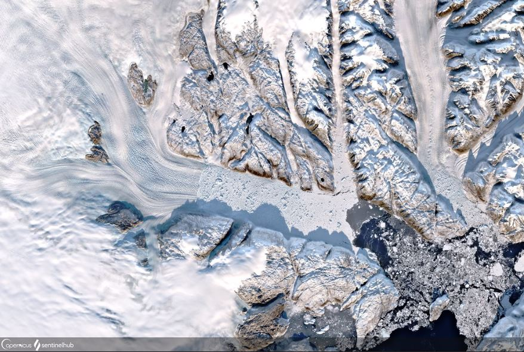
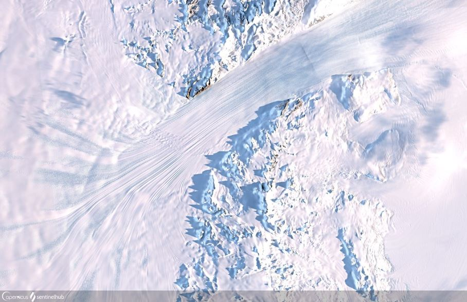
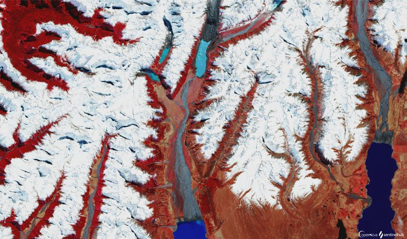
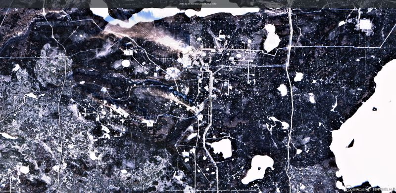
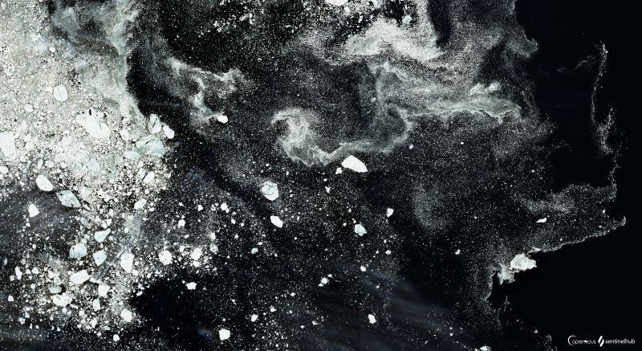

# Snow and Glaciers

[Import](https://apps.sentinel-hub.com/eo-browser/?sharedPinsListId=c971df02-0886-4acb-a84d-fa666ad344e9){:target="_blank"} pins directly into EO Browser or [download](Snow_and_Glaciers.json){:target="_blank"} the json for a later import into [EO Browser](https://apps.sentinel-hub.com/eo-browser/?zoom=10&lat=41.9&lng=12.5&themeId=DEFAULT-THEME){:target="_blank"}.

Following is a set of pins which are all connected to the topic Snow and Glaciers. Each pin contains a brief description of what is displayed by the pin and a preview image linked to a high-resolution print on flickr.

## Included pins 

### Khatanga Gulf, Russia (Agriculture 11,8,2)

The narrow, 220 km wide Khatanga gulf is believed to hold 9.5 billion tons of geological reserves. Despite being one of the least accessible areas in the Russian Arctic, with the nearest 2.500 population Khatanga town 350 km away, oil industry development of the area is being considered. [Learn more.](https://bit.ly/2JQT31o)

### Bear Glacier, Alaska (Highlight Optimized Natural Color)

Bear Glacier, the largest glacier in Kenai Fjords National Park, Alaska, is separated from the ocean by a large [terminal moraine](http://www.antarcticglaciers.org/glacial-geology/glacial-landforms/glacial-depositional-landforms/moraine-types/) forming a [proglacial lake](https://www.swisseduc.ch/glaciers/glossary/proglacial-lake-en.html) which attracts numerous sea kayaking enthusiasts. The 20 km long glacier has two remarkable [medial moraines](https://www.nps.gov/articles/lateralmedialmoraines.htm), formed by joining ice streams. These moraines contrast with the brighter ice and appear clearly in Sentinel-2 images. However, the stunning features of the glacier may not be observable for long: [a recent study](https://www.nps.gov/rlc/oceanalaska/upload/Bear-Glacier-RB_FINAL_12-17-19_508-compliant.pdf) has shown that Bear Glacier has been dramatically retreating  (237 m per year)  over the two last decades.

### Glacier Grey, Chile (Highlight Optimized Natural Color)

A stunning [glacier Grey](https://earthobservatory.nasa.gov/images/7802/grey-glacier-chile) located in Chilean Torres Del Paine National Park is 6 km wide and over 30 meters high at the glacier's front. Its various shades of grey and blue, clearly visible even from space, attract many visitors each year. In 2017 a huge (380 m x 350 m) [iceberg ruptured](https://www.theguardian.com/environment/2017/nov/29/large-iceberg-breaks-off-from-grey-glacier-in-southern-chile) from the glacier with the cause unknown. Such events are very rare, with the last one occurring in the early 1990's. Due to its diverse plants and wildlife, glaciers, rivers, lakes and pampas, the park became [protected as a UNESCO Biosphere reserve](http://www.ecocamp.travel/fr/Patagonia/Torres-del-Paine-National-Park) in 1978. 

### Erebus Ice Tongue, Antarctica (Enhanced true color)

Description
.
.
.
.
### Sermeq Kujalleq Glacier, Greenland (Highlight Optimized Natural Color)

Description
.
.
.
.
.

### Glaciers of western Greeenland (Enhanced Agriculture 11,8,2)

Description
.
.
.
.
.

### Helheim Glacier, Greeenland (Enhanced true color)

Description
.
.
.
.
.

### Byrd Glacier, Antarctica (Highlight Optimized Natural Color)

[Byrd Glacier](https://earthobservatory.nasa.gov/images/7544/byrd-glacier-antarctica) is one of the largest fast-flowing glaciers in Antarctica. Ice flows from the East Antarctic plateau into the Ross ice shelf at a rate of ~800 m per year along the centre line of this ~20 km wide and ~100 km long glacier. Distinct longitudinal flow stripes are clearly visible from space where the ice is funnelled between the [Transantarctic Mountains](https://www.britannica.com/place/Transantarctic-Mountains). Similarly to other Antarctic glaciers, Byrd Glacier is [vulnerable to warming temperatures](https://insideclimatenews.org/news/12112019/antarctica-ice-shelf-melt-atmospheric-river-thwaites-glacier-ocean-sea-level-rise) that lead to an acceleration of the ice flow, with disastrous effects on sea-level rise.

### Mountains of New Zealand (Snow Classifier)

Description
.
.
.
.
.

### Mountain Rivers, New Zealand (False Color)

Description
.
.
.
.
.

### Frozen Lakes of Himalayas

Description
.
.
.
.
.

### Winter landscape, Canada

A winter landscape of the [Christina Lake Oil Sands Factory](https://www.cenovus.com/operations/oilsands/christina-lake.html). The factory uses specialized technology to drill and pump the oil from 375 meters deep underground. The project is expected to last for more than 30 years and produces 210.000 barrels of oil per day. In winter, the lakes are covered by snow, giving them a surreal white color. 

### Drifting Ice Plates, Arctic Sea

Melting ice plates in the Arctic Ocean near Russia, forming interesting patterns as a result of being carried by ocean currents.
