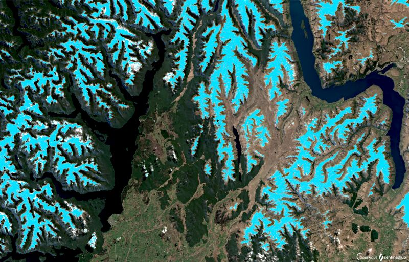

# Snow and Glaciers

[Import](https://apps.sentinel-hub.com/eo-browser/?sharedPinsListId=c971df02-0886-4acb-a84d-fa666ad344e9){:target="_blank"} pins directly into EO Browser or [download](Snow_and_Glaciers.json){:target="_blank"} the json for a later import into [EO Browser](https://apps.sentinel-hub.com/eo-browser/?zoom=10&lat=41.9&lng=12.5&themeId=DEFAULT-THEME){:target="_blank"}.

Following is a set of pins which are all connected to the topic Snow and Glaciers. Each pin contains a brief description of what is displayed by the pin and a preview image linked to a high-resolution print on flickr.

## Included pins 

### Khatanga Gulf, Russia (Agriculture 11,8,2)

The narrow, 220 km wide Khatanga gulf is believed to hold 9.5 billion tons of geological reserves. Despite being one of the least accessible areas in the Russian Arctic, with the nearest 2.500 population Khatanga town 350 km away, oil industry development of the area is being considered. [Learn more.](https://bit.ly/2JQT31o)

### Bear Glacier, Alaska (Highlight Optimized Natural Color)

Bear Glacier, the largest glacier in Kenai Fjords National Park, Alaska, is separated from the ocean by a large [terminal moraine](http://www.antarcticglaciers.org/glacial-geology/glacial-landforms/glacial-depositional-landforms/moraine-types/) forming a [proglacial lake](https://www.swisseduc.ch/glaciers/glossary/proglacial-lake-en.html) which attracts numerous sea kayaking enthusiasts. The 20 km long glacier has two remarkable [medial moraines](https://www.nps.gov/articles/lateralmedialmoraines.htm), formed by joining ice streams. These moraines contrast with the brighter ice and appear clearly in Sentinel-2 images. However, the stunning features of the glacier may not be observable for long: [a recent study](https://www.nps.gov/rlc/oceanalaska/upload/Bear-Glacier-RB_FINAL_12-17-19_508-compliant.pdf) has shown that Bear Glacier has been dramatically retreating  (237 m per year)  over the two last decades.

### Glacier Grey, Chile (Highlight Optimized Natural Color)

A stunning [glacier Grey](https://earthobservatory.nasa.gov/images/7802/grey-glacier-chile) located in Chilean Torres Del Paine National Park is 6 km wide and over 30 meters high at the glacier's front. Its various shades of grey and blue, clearly visible even from space, attract many visitors each year. In 2017 a huge (380 m x 350 m) [iceberg ruptured](https://www.theguardian.com/environment/2017/nov/29/large-iceberg-breaks-off-from-grey-glacier-in-southern-chile) from the glacier with the cause unknown. Such events are very rare, with the last one occurring in the early 1990's. Due to its diverse plants and wildlife, glaciers, rivers, lakes and pampas, the park became [protected as a UNESCO Biosphere reserve](http://www.ecocamp.travel/fr/Patagonia/Torres-del-Paine-National-Park) in 1978. 

### Erebus Ice Tongue, Antarctica (Enhanced true color)

An ice tongue is a natural phenomenon, which occurs when a valley glacier moves very rapidly out into he sea or a lake. [The Erebus ice tongue glacier](https://earthobservatory.nasa.gov/images/4965/erebus-ice-tongue) in Antarctica comes down from Mt. Erebus and protrudes off the coast of Ross Island, forming an 11-12 km long ice tongue—a long and narrow sheet of ice projecting out from the coastline. When the sea ice in McMurdo Sound thaws in the summer, the ice tongue floats on the water without thawing. It also calves off in places forming icebergs. The Erebus Ice Tongue is only about 10 meters high, so its icebergs are small. When the ice around the tongue melts in the summer, waves of sea water constantly batter the edges of the tongue, carving very elaborate structures in the ice, sometimes producing deep caves at the margins. In the winter, the sea freezes once more around these new shapes.

### Sermeq Kujalleq Glacier, Greenland (Highlight Optimized Natural Color)

[Sermeq Kujalleq](https://www.atlasobscura.com/articles/worlds-fastest-glacier-sermeq-kujalleq), also called Jakobshavn glacier, is known as the world’s fastest glacier. It travels an average of 130 feet in 24 hours and calves more than 45 cubic kilometers of icebergs each year into the Ilulissat Icefjord. 
Its front is an enormous ice wall—stretching 91 meters at its peak, that constantly explodes. Icebergs break off the glacier accompanied by blasts and roars akin to a rocket launch. When they hit the sea below, the calved icebergs can create huge waves that threaten to swallow people, boats, and buildings. The icebergs from Sermeq Kujalleq have crashed so violently that they have even caused earthquakes. Because the glacier is so large, the breaks seem to occur in “slow motion.” 

### Glaciers of western Greeenland (Enhanced Agriculture 11,8,2)
 
On Greenland’s western shore numerous glaciers enter the Baffin Bay. Several of them find their way to the bay via the Upernavik Icefjord which can be seen on the image. The biggest glacier is the  Upernavik glacier from which also the fjord’s name was derived. Until 1980 the glacier consisted of one main termini but with its retread since then it has four main calving termini today [more]( https://blogs.agu.org/fromaglaciersperspective/2017/05/30/upernavik/).

### Helheim Glacier, Greeenland (Enhanced true color)

Located in the southeast of Greenland the Helheim glacier is the fastest flowing glacier on the island’s eastern shore. It has an average width of ~6.5 km and calves into the [Sermilik Fjord]( https://earth.esa.int/web/earth-watching/image-of-the-week/content/-/article/helheim-glacier-greenland). In the last two decades the glacier front experienced rapid changes, first retreating ~6.5 km in the earlier 2000s before then partially recovering and gaining back more then ~3 km. [Learn more](https://www.nasa.gov/feature/goddard/2017/two-decades-of-changes-in-helheim-glacier).

### Byrd Glacier, Antarctica (Highlight Optimized Natural Color)

[Byrd Glacier](https://earthobservatory.nasa.gov/images/7544/byrd-glacier-antarctica) is one of the largest fast-flowing glaciers in Antarctica. Ice flows from the East Antarctic plateau into the Ross ice shelf at a rate of ~800 m per year along the centre line of this ~20 km wide and ~100 km long glacier. Distinct longitudinal flow stripes are clearly visible from space where the ice is funnelled between the [Transantarctic Mountains](https://www.britannica.com/place/Transantarctic-Mountains). Similarly to other Antarctic glaciers, Byrd Glacier is [vulnerable to warming temperatures](https://insideclimatenews.org/news/12112019/antarctica-ice-shelf-melt-atmospheric-river-thwaites-glacier-ocean-sea-level-rise) that lead to an acceleration of the ice flow, with disastrous effects on sea-level rise.

### Mountains of New Zealand (Snow Classifier)
 The mountains around Lake Te Anau (west) and Lake Wakatipu (east) on New Zealand’s South Island are located in the Fiorland National Park. Lake Te Anau is home to the only inland fjords in New Zealand originating from the time when the mountain’s glaciers were still reaching far down the valleys. Today covered with snow in winter these more than 2000 m high peaks are a popular destination for tracking and mountaineering [more](http://www.teanau.net.nz/Mountains). They are also home to an almost extinct bird species called [takahe](http://www.teanau.net.nz/See-a-takahe). 

### Mountain Rivers, New Zealand (False Color)

-
-
-
-
-

### Frozen Lakes of Himalayas

-
-
-
-
-

### Winter landscape, Canada

A winter landscape of the [Christina Lake Oil Sands Factory](https://www.cenovus.com/operations/oilsands/christina-lake.html). The factory uses specialized technology to drill and pump the oil from 375 meters deep underground. The project is expected to last for more than 30 years and produces 210.000 barrels of oil per day. In winter, the lakes are covered by snow, giving them a surreal white color. 

### Drifting Ice Plates, Arctic Sea

Melting ice plates in the Arctic Ocean near Russia, forming interesting patterns as a result of being carried by ocean currents.
