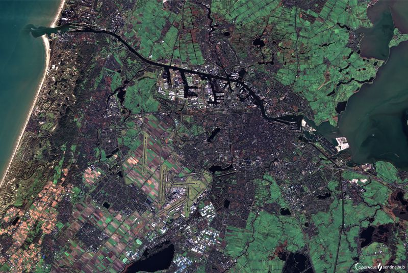
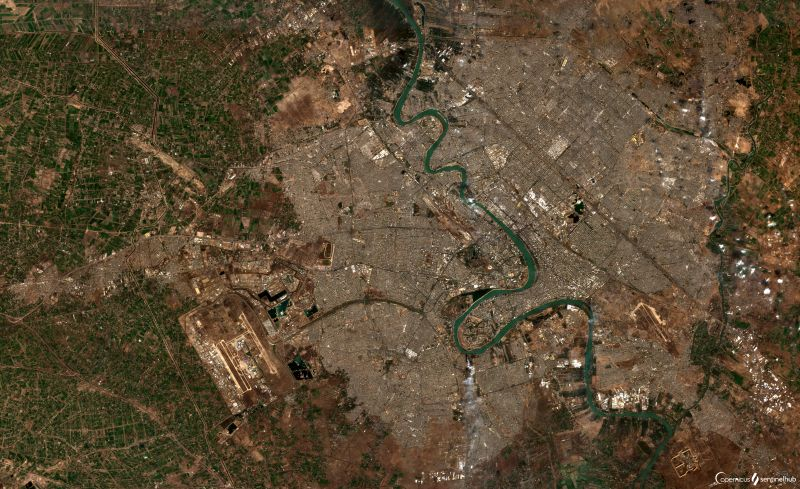
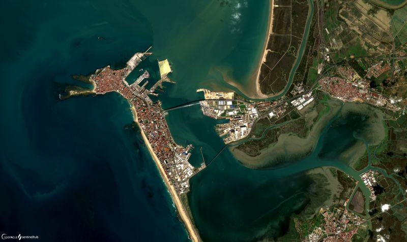
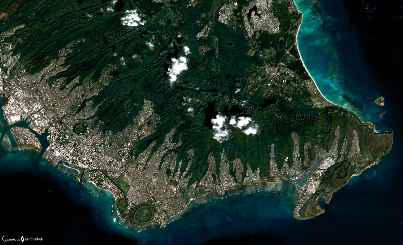
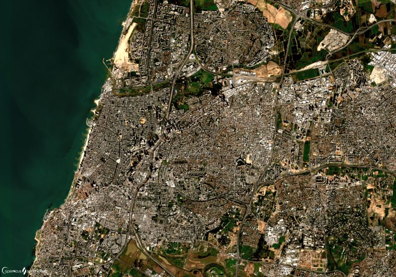

# Urban

[Import](https://apps.sentinel-hub.com/eo-browser/?sharedPinsListId=448fc3de-d5d3-474c-b9f1-acc709b391a1){:target="_blank"} pins directly into EO Browser or [download](Urban.json){:target="_blank"} the json for a later import into [EO Browser](https://apps.sentinel-hub.com/eo-browser/?zoom=10&lat=41.9&lng=12.5&themeId=DEFAULT-THEME){:target="_blank"}.

Following is a set of pins which are all connected to the topic Urban. Each pin contains a description of the city and a preview image linked to a high-resolution print on Flickr.

## Included pins 

### Altai, Mongolia

With a population of about 15,800 Altai is one of the smallest provincial capitals in one of the least densely populated provinces, Govi-Altai. Govi-Altai is situated in the western part of Mongolia and is the countries second largest province (aimag). The majestic peaks of the Mongol Altai mountains stretch from North to South through its territory. The province was named after the Gobi Desert and the Mongol Altai Nuruu range, which virtually bisects the province to create a stark, rocky landscape. Most of the population live in the north-east part, where melting snow from the Khangai Nuur feeds small rivers, creating vital water supplies. Gobi-Altai is one of the least suitable areas for raising livestock, and therefore one of the most hostile to human habitation. The average height is 1940 m high above sea level. The climate is capricious with winter temperatures as low as -30°C and summer temperatures up to 34°C. Despite the harsh conditions, the province is home to rare large mammals, such as Ibex, snow leopards, the Govi Bear, wild Bactrian camel, Argali sheep, black-tailed gazelle, and other wild cats. The province's territory contains many national parks, strictly protected areas, nature reserves and national monuments, protecting several animal species and providing a home to rare wildlife sanctuary. Learn more [here](https://www.toursmongolia.com/provinces/gobi-altai), [here](https://mongolia-guide.com/destination/gobi-altai) and [here](https://en.wikivoyage.org/wiki/Altai_(Mongolia)).

### Amsterdam, Netherlands

[Amsterdam's](https://www.britannica.com/place/Amsterdam) name derives from [Amstelredamme](https://en.wikipedia.org/wiki/Amsterdam#:~:text=Found%20within%20the%20province%20of,dam%20in%20the%20river%20Amstel.) and indicative of the city's origin around a dam in the river Amstel. Originating as a small fishing village in the late 12th century, Amsterdam became one of the most important ports in the world during the Dutch Golden Age in the 17th century, and became the leading centre for finance and trade. Even today the Port of Amsterdam is the fourth largest port in Europe and still growing. Large ports are usually ecologically disastrous. Amsterdam however, aims to change this by making every effort to keep physical and environmental impact to a minimum and be at the top of Europe's [sustainable ports](https://www.portofamsterdam.com/en/discover/sustainable-port) by 2030. A special focus is currently put on plastics recycling. For example, the Plastic Whale organization builds small boats almost entirely out of old plastics, then uses them to gather plastic out of the Amsterdam waterway. Additionally, Amsterdam is [famous for](https://viatravelers.com/amsterdam-is-famous-for/) its diversity, the Van Gogh art museum, the Anne Frank House and tulips.

### Bagdhad, Iraq

[Baghdad](https://www.britannica.com/place/Baghdad/History), the capital of the Iraq, is situated in the heart of the ancient Mesopotamia and holds most of Iraq’s manufacturing, finance, and commerce. The vast majority of the population, counting more than 7,5 million people, is Muslim and Arab. The government is the city’s principal employer, with hundreds of thousands of citizens working in the civil service, in government-run educational institutions, and in government-owned industrial and commercial enterprises. Bagdhad has long been an active cultural centre for the Arab world, producing prominent sculptors, painters, poets, and writers. Between the 8th and 9th centuries, it flourished into an [unrivaled intellectual center](https://en.wikipedia.org/wiki/Baghdad) of science, medicine, philosophy, and education and had the largest selection of books in the world. It was likely the largest city in the world containing over one million inhabitants at its peak. It began to decline in the "Iranian Intermezzo" of the 9th to 11th centuries, and was destroyed in the Mongolian invasion in 1258. Baghdad regained prominence only when it became the capital of Iraq in 1920; over the next half century, the city took on all the characteristics of a modern metropolis. The city was heavily damaged by aerial bombardment during the Persian Gulf War and again by air and ground operations during the Iraq War. During the interwar period the city’s services and infrastructure deteriorated badly because of inattention and economic sanctions. In recent years, it found itself the victim of several attacks, especially from al-Qaeda and its successor, the Islamic State.

### Baltimore, USA

With [more than 250](https://livebaltimore.com/neighborhoods/#:~:text=Baltimore%20City%20includes%20more%20than%20250%20diverse%20neighborhoods!) identified districts, [Baltimore](https://www.britannica.com/place/Baltimore) has been dubbed a "city of neighborhoods". However, not all are created equal. It's a situation by no means unique to [Baltimore](https://en.wikipedia.org/wiki/Baltimore) - most cities have their divide between those with lower and those with higher income. Baltimore however stands out for the extent of the gap, its relation to [race](https://wp.nyu.edu/economicinequality/2017/03/29/economic-inequality-in-baltimore-md/), as well as the proximity of the two extremes. The gap here is twice as large as in New York, and one of the largest in the country. To represent the [extent of economic inequality](https://wp.nyu.edu/economicinequality/2017/03/29/economic-inequality-in-baltimore-md/), the typical Baltimore resident in the bottom fifth of earners made $13,588 in 2013, whereas those in top 5 percent made an average of $166,924 that year. In fact, 14 Baltimore neighborhoods have [lower life expectancies than North Korea](https://www.washingtonpost.com/news/wonk/wp/2015/04/30/baltimores-poorest-residents-die-20-years-earlier-than-its-richest/). One of the reasons for this is Baltimore's abnormaly high crime rate. The city has by far the highest robbery rate in America and there's a murder almost every day. The main perpetrators of crime are drug gangs. On top of the low standard of living, the poor Baltimore youth has a low chance of escaping this environment and high incidence of substance abuse, PTSD and depression. 

### Beijing, China

[Beijing](https://www.britannica.com/place/Beijing/) is one of the oldest inhabited areas in the world; fossils indicate that the [Peking Man](https://www.chinahighlights.com/beijing/beijing-facts.htm) (Homo erectus) lived here from 770,000 to 230,000 years before present. It has been the capital of China for hundreds of years and changed its name 16 times in the process. Its rich history makes it impossible to understand China without the knowledge of this city. To protect itself from invasion, Chinese built the longest wall in the world, almost 21,200 km long and 5 – 8 meters high, called the [Great Wall](https://www.chinahighlights.com/greatwall/). It spans over the mighty Yan mountain range (seen on the left side of the pin), which separates the North China Plain on the south from the Mongolian Plain on the north. The rumor that the wall is visible from space is a widely believed myth, called into question in October 2003, after the first Chinese astronaut returned from his  journey into Space, and stated that he had not been able to see the Great Wall of China. The European Space Agency then claimed that the Great Wall is visible to the naked eye in an orbit between 160 and 320 km and even published a picture of a part of the “Great Wall” photographed from Space. In this picture the wall looked like a route full of bends that resembled river meanders. One week later, when everything seemed perfectly clear and the myth had been finally reborn, another message from ESA acknowledged that the Great Wall in the picture was actually a river! Looking at what we learned about the human visual system and its limits, it is impossible for humans to see the wall from space with our own eyes. Learn more [here](https://en.wikipedia.org/wiki/Beijing), [here](https://web.archive.org/web/20080910214156/http://www.journalofoptometry.org/Archive/vol1/pdf/02%20Vol1-n1%20Letter%20to%20the%20Editor.pdf).

### Cadiz, Spain

Cadiz is a beautiful Spanish city with colorful architecture and plazas. It stands on a small, 12.10 square km big peninsula stretching out into a bay, and is almost entirely surrounded by the sea. Consequently, there is a shortage of land to be developed. The older quarters of Cadiz are full of buildings that, because of their age and historical significance, are not eligible for urban renewal. This is why in recent years, the city's population has steadily declined; between 1995 and 2006, it lost more than 14,000 residents, a decrease of 9 %. In the early 19th century it became the bastion of Spain's anti-monarchist, liberal movement, as a result of which the country's first Constitution was declared here in 1812. The industrial development is rather limited, but important naval and various other factories exist on the mainland, and there are tuna fisheries off the coast. The city is primarily a commercial port, exporting wine, salt, olives, figs, cork, and salted fish and importing coal, iron and machinery, timber, cereals, coffee, and other food. Learn more [here](https://www.britannica.com/place/Cadiz-Spain), [here](https://www.andalucia.com/cities/cadiz.htm) and [here](https://en.wikipedia.org/wiki/C%C3%A1diz#:~:text=The%20city%20can%20boast%20of,across%20the%20Bay%20of%20C%C3%A1diz.).

### Delhi, India

[Delhi](https://www.britannica.com/place/Delhi), the capital city of India, actually consists of two components: the historic Old Delhi in the north, and New Delhi in the south, which became the capital if India in 1947. Delhi is a city of great historical significance as an important commercial, transport, and cultural hub, as well as the political centre of India. It has been the centre of succession of mighty empires and powerful kingdoms. The animal life of Delhi, like its plant life, is quite diverse. Among carnivorous animals are leopards, hyenas, foxes, wolves, and jackals, which inhabit the ravine lands and hilly ridges. Monkeys are found in the city, especially around some of the temples and historical ruins. Birdlife is profuse; year-round species include pigeons, sparrows, kites, parrots, partridges, bush quail, and, on the ridges, peafowl. In the demographic history of Delhi, a turning point was the year 1947, when thousands of Hindu and Sikh refugees from predominantly Muslim Pakistan entered the city in the wake of India’s independence. Since that time the population has grown steadily, with an ongoing heavy flow of immigrants, most arriving from other Indian states or from adjacent countries. The religious composition of Delhi’s population is diverse. The great majority of the residents are Hindu, adherents of Islam constitute form the largest minority, followed by smaller numbers of Sikhs, Jains, Christians, and Buddhists. The service sector is the most important part of Delhi’s economy, and it is the city’s largest employer. The city struggles with challenges brought by overcrowding, such as sub-standard housing, air pollution and traffic congestion.

### Giza, Egypt

Giza, located within the [Greater Cairo metropolitan area](http://www.newgeography.com/content/002901-the-evolving-urban-form-cairo), is the third-largest city in Egypt with 9 million inhabitants. The city is famous for its archaeological sites, in particular the [Great Sphinx](https://www.britannica.com/topic/Great-Sphinx) and the [Giza Pyramid Complex](https://www.nationalgeographic.com/history/archaeology/giza-pyramids/), which includes the Great Pyramid, the only of the [Seven Wonders of the Ancient World](https://www.ancient.eu/The_Seven_Wonders/) still standing. The Great Pyramids are easily identifiable in satellite images thanks to their shadows cast to the North West contrasting with the brightly illuminated South sides. The distinct delineation between the arid [Sahara desert](https://www.livescience.com/23140-sahara-desert.html) to the West and the city of Cairo, with its green parks and golf courses, to the East is striking. Today, Giza is a rapidly growing region of Cairo, and the soaring population is leading to new construction of housing and roads encroaching on the desert hills.

### Honolulu, Hawaii

Honolulu, meaning "sheltered harbor" in Hawaiian, is the most remote major city in the world, with the closest location on the mainland United States being 3,787 km away. As Hawaii is a chain of volcanic islands, with Honolulu located on the island Oahu, volcanic features are prominent in the city, with the volcanic field of the [Honolulu Volcanics](https://en.wikipedia.org/wiki/Honolulu_Volcanics) partially located inside the city. These volcanoes formed through explosive eruptions and gave rise to cinder cones, lava flows, tuff cones and volcanic islands. Among these are well known landmarks, such as the Diamond Head, the Koko Head or the Punchbowl Crater. Punchbowl, a 600-metre wide crater 2 km inland, contains the National Memorial Cemetery of the Pacific with some 24,000 graves of World War II, the Korean War, and the Vietnam War. The city acts as a natural gateway to the islands' large tourism industry, which brings millions of visitors and contributes $10 billion annually to the local economy. Other important aspects of the city's economy include military defense, research and development, and manufacturing. Learn more [here](https://en.wikipedia.org/wiki/Honolulu) and [here](https://www.britannica.com/place/Honolulu).

### Khayelitsha Slums, South Africa

The [United Nations](https://mirror.unhabitat.org/documents/media_centre/sowcr2006/SOWCR%205.pdf) defines slums as urban areas lacking clean water, sanitation facilities, adequate living space, durable houses and/or housing security. [Khayelitsha slums](https://borgenproject.org/life-inside-worlds-largest-slums/#:~:text=Though%20Khayelitsha%20was%20originally%20an,under%20the%20age%20of%2019.) are one of the [largest slums in the world](https://www.habitatforhumanity.org.uk/blog/2017/12/the-worlds-largest-slums-dharavi-kibera-khayelitsha-neza/), with a population of 400,000 to 1,2 million people. It was set up in the 1980s as a ghetto for workers who migrated to [Cape Town](https://www.theguardian.com/cities/2014/apr/30/cape-town-apartheid-ended-still-paradise-few-south-africa) in search of jobs during the apartheid era, though it grew rapidly after the oppressive system was abolished in 1994. It is a place of extreme poverty. The unemployment rate for individuals living in Khayelitsha is 73 percent with 70 percent of its individuals living in shacks made of timber and sheet metal. The severe poverty combined with a lack of community infrastructure has led the community to vast crime rates, gangs, violence and drug use. There is no proper sewerage in place, so many people do not have toilets, contributing to severe sanitation problems. Lack of clean water and food is another hardship. An estimated one in three people has to walk 200 meters or more to access clean water with around 65 percent of residents with [no electricity or running water](https://news.yahoo.com/no-space-water-cape-town-slum-little-face-152054693.html?guccounter=1&guce_referrer=aHR0cHM6Ly93d3cuZ29vZ2xlLmNvbS8&guce_referrer_sig=AQAAAHXMUsFRzTNsvJhdNbzrnCxf_iMYLN7rtsjTgNfcVvzxksgXBgxnfNI28HyKSFfZ_6o9SGgdOkV5jjnRTn3BfK-7qCm0kVtO5crcX_wIktTpuGay596Mr2PVH4Hncm76Mt2OMiLzDTTpInknPkbnzrY2_GTr_Q1tgCM_Yso0XPiu). A limited food supply is sold between shacks, being constantly exposed to the sun. Khayelitsha has a high population density and a low amount of resources to support the growing population, leading to overcrowding. Several NGOs are trying their best to alleviate various hardships. They believe that with the combined efforts of determined people and organizations, one of the world’s largest and fastest growing slums can finally improve its situation. 

### Kinshasa, DR Kongo

[Kinshasa](https://www.britannica.com/place/Kinshasa/Cultural-life), formerly known as Léopoldville, is the largest city and the capital of the Democratic Republic of the Congo. The city’s inhabitants are popularly known as Kinois. Kinshasa is the most important consumer centre of the republic and the core of its industrial and commercial activity. The city serves as the headquarters of major public corporations and of privately owned industrial and commercial companies. Among Kinshasa’s main industries are food processing and those producing consumer goods, generally for domestic markets. The rapid expansion of Kinshasa’s population has created serious problems in supplying the city with food; there is a constant threat of shortages, posing an implicit political problem. The poor forage at a considerable distance for firewood and keep gardens where they can find good soil. The demands of this vast urban population have caused extensive erosion in the surrounding countryside, as the soil is exhausted from overcultivation and trees cut for charcoal have not been replanted. The administration is unable to provide adequate services such as running water, electricity, and sanitation throughout the city. Medical facilities, like other city services, are overwhelmed by population growth; the same problem is present for the primary and secondary education system.

### Lagos, Nigeria

[Lagos](https://www.britannica.com/place/Lagos-Nigeria), a Nigerian city and a chief port, is dominated by a system of islands, sandbars, and lagoons. The highest elevation in Lagos is only 22 feet above sea level. The port of Lagos serves as the principal outlet for Nigeria’s exports. The Lagos metropolitan area is a major educational and cultural centre. The main business district occupies Lagos Island’s southwestern shore and contains an increasing number of multistory buildings. This is the heart of the city, the centre of commerce, finance, administration, and education. The principal manufacturing industries in Lagos include the production of electronics equipment, automobile assembly, food and beverage processing, metalworks, and the production of paints and soap. The original settlement on the northwestern tip of Lagos Island is now a slum area characterized by narrow streets, poor housing, and overcrowding.

### London, England

The "snake" meandering through London, one of the oldest great cities in the world, is the River Thames. It is so important to the city that it is theorized even its name originates from it. This wonder of nature is now under human control. In the 19th century dumping of raw sewage into the Thames and gas manufactories built alongside the river deteriorated it to a point where the discharge of methane gas in the depths of the river caused the water to bubble, and the toxins wore away at boats' propellers. Chlorine-soaked drapes were hung in the windows of Parliament in an attempt to stave off the smell of the river, but to no avail and four serious cholera outbreaks killed tens of thousands of people between 1832 and 1865. The river was declared biologically dead. Now in 2020, there are 45 locks on the river, each with one or more adjacent barriers. These lock and barrier combinations are used for controlling the flow of water down the river, most notably when there is a risk of flooding. The river recovered to a point where it's bustling with salmon, herons, cormorants, moorhen and even seals. The city also had a huge problem with [air pollution](https://www.britannica.com/place/London/Climate#ref92695). Heavy industry factories and domestic chimneys all burned coal at the beginning of 20th century, reducing winter sunshine hours by 30%. The issue was resolved by banning the burning of coal with the Clean Air Acts. Learn more [here](http://www.bbc.com/earth/story/20151111-how-the-river-thames-was-brought-back-from-the-dead), [here](https://en.wikipedia.org/wiki/River_Thames#cite_note-55) and [here](https://riverfoundation.org.au/our-programs/riverprize/international-riverprize/).

### Melbourne, Australia

Victoria's vibrant capital – [Melbourne](https://www.britannica.com/place/Melbourne) – is a wonderful city that is often ranked amongst the world's most liveable. It is home to about 136,000 people and is the core of an extensive metropolitan area with a population of more than 1,000,000, some 38% born overseas. In 1856, Melbourne workers successfully campaigned for the world's first 8-hour work day. All the rest of us are still thankful today! Though Melbourne’s flat site has led to the regular development of a rectangular pattern of streets, the city has many beautiful parks and diverse architecture. It is known for its unpredictable weather, as it's often possible to experience four seasons in one day. Melbourne’s most important industries, in terms of number of employees, are metal processing, including the manufacture of transportation equipment, and engineering. Melbourne is also one of Australia’s leaders in the manufacture of computers and is developing as a centre for biomedicine and biotechnology. Melbourne has a lively sport culture, with hundreds of sports fields, tennis courts, swimming pools, and golf courses for active sports participants. Learn more [here](https://www.experienceoz.com.au/en/melbourne-facts).

### Mogadishu, Somalia

Mogadishu, the capital city of Somalia, is located in the horn of Africa and bordering the Red Sea. The major religion is Sunni Muslim and the official language is Somali, although Arabic, Italian, and English are all spoken there. Mogadishu’s population was estimated [2.5 million](https://worldpopulationreview.com/countries/cities/somalia) people in 2020. Founded by the Arabs in the 10th century, Mogadishu became the capital and chief port of Somalia. Initially after their arrival, families of Arab and Persian descent ruled Somalia and fueled the widespread conversion to Islam. By the 13th century, Mogadishu became prosperous by trading gold, livestock, slaves, leather, and ivory. Despite the growing affluence in the city of Mogadishu, the country as a whole suffered from political instability under the dictatorship of President Mohamed Siad Barre who ruled the nation from 1969 to 1991. The unstable political environment worsened in 1992 when an extreme famine hit Somalia. The United Nations intervened to ensure the equal distribution of aid and prevent the new government from abusing its power. The mission was unsuccessful and the UN left the port city in 2002 after one of its officials was kidnapped. By 2008 officials estimated that nearly half of the city’s residents, over one million people, had fled to the countryside.  Since 2008 nearly 3,000 African Union peacekeeping troops have patrolled the city to try to maintain order and provide medical aid. Although Mogadishu was once a powerful and commercially important port city, more than two decades of violence and government instability have caused what many experts fear may be irreparable damage to its inhabitants, its economy, and its infrastructure. Learn more [here](https://www.britannica.com/place/Somalia/Transportation#ref37733) and [here.](https://www.blackpast.org/global-african-history/mogadishu-somalia-ca-950/)

### Moscow, Russia

[Moscow](https://www.britannica.com/place/Moscow) is named for the river that runs through it, the Moskva. Though Moscow is the capital city of Russia today, it wasn't always so. From 1712 to 1918, St. Petersburg acted as the capital of Russia. Moscow is regularly named one of the most expensive cities in the world. Although you'll find a historic center here, complete with palaces, churches, and monuments, Moscow is a fully modern city with skyscrapers, a network of public transportation, and traffic. The Kremlin, the seat of the government, is the world’s largest medieval fortress. The Moscow Metro dates from the early 1930s and is one of the most-used subway systems in the world. Over 180 Moscow Metro stations, some decorated with artwork and expensive materials, connect the 12 lines that shuttle passengers throughout this huge city. The trains run more regularly than in any other metro in the world, with the interval between trains being [just 1.5 minutes](https://www.traveltalktours.com/fascinating-facts-moscow/) at peak times. More than 40 percent of the city's territory consists of parks, gardens and forests. For each Muscovite there is about 16 square meters of greenery. For comparison, for a New Yorker there is about 8.6 and for a Londoner and Parisian 7.5 square meters of greenery. The city has more than 700 public gardens and boulevards and almost 50 parks and forests. The green areas are clearly seen covering large portions of the city, when looking at the NDVI or a Green City visualization. Learn more [here](https://bridgetomoscow.com/curious-fact-moscow-parks), [here](https://www.planete-energies.com/en/medias/close/moscow-city-undergoing-transformation) and [here](https://www.tripsavvy.com/moscow-facts-1501850).

### Nuuk, Greenland

Located only 150 miles south of the Arctic Circle, at the mouth of a group of fjords, Nuuk is the capital, main port and the largest city of Greenland. It contains almost a third of Greenland's population, counting 18,326 people. Winters in the city are freezing, with the average January [temperature](https://www.eldoradoweather.com/climate/greenland/Nuuk.html) around -4°C and getting as low as -10°C. Even summer is relatively cold, with the hottest August temperatures not more than 10°C. Nuuk is the seat of government and is the country's largest cultural and economic centre, containing the Supreme court, foreign consulates, a university, vocational training schools, a hospital, and radio and television stations. Important economic activities include government administrative work, education, health care, and other services, as well as hunting, fishing, fish and shrimp processing, and shipbuilding and repair. The city attracts [tourists](https://www.tripadvisor.com/Tourism-g295112-Nuuk_Sermersooq_Municipality-Vacations.html) as it's the perfect starting point for a whale-watching trip, a dog-sled ride, or glacier exploration. Daily flights bring visitors to a land that has been inhabited for over 4,000 years. The National Museum and Archives exhibits collections of rare Norse and Inuit archaeological artifacts, while the Katuaq Cultural Centre provides a showcase for contemporary Greenlandic art and music. Learn more [here](https://en.wikipedia.org/wiki/Nuuk#Tourism) and [here](https://www.britannica.com/place/Nuuk).

### Ptuj, Slovenia

Ptuj is the oldest town in Slovenia, dating back to the Stone Age. Due to its strategic location along a prehistoric trade route between the Baltic Sea and the Adriatic, it became an important center and legion-camp of the Ancient Romans. This is also how it got its name - the romans named it Poetovium. The town is dominated by the [castle](https://www.culture.si/en/Ptuj_Castle), standing proudly on the hill above Ptuj. Its strategic position at the bank of Drava river allowed the castle hill to be inhabited since the early days of Ptuj and Ptuj kept an important role over centuries. The current look of the building dates back to the 18th century and is home to a museum that hosts the biggest collection of music instruments in the whole country. Ptuj is the center place of a carnival in spring, an ancient rite of spring and fertility, called Kurentovanje. [Kurent](http://www.kurentovanje.net/en/the-kurent/) is a figure dressed in sheep skin wearing a mask, a long red tongue, cow bells, and multi-colored ribbons on the head. Organized in groups, Kurents go through towns, from house to house, making noise with bells to symbolically scare off evil spirits and the winter. Kurent has been recognized by [UNESCO](https://www.slovenia.info/en/places-to-go/regions/thermal-pannonian-slovenia/ptuj) for its unique cultural heritage. Each year, more than [100,000](https://govorise.metropolitan.si/dogodki/pustovanja-2019-po-sloveniji-od-povorke-v-ptuju-do-priljubljenega-cerknega/) people gather for the largest carnival in the country. Learn more [here](https://www.mywanderlust.pl/visit-ptuj-slovenia/) and [here](https://en.wikipedia.org/wiki/Ptuj).

### Rio de Janeiro, Brazil

[Rio de Janeiro](https://www.britannica.com/place/Rio-de-Janeiro-Brazil) is widely recognized as one of the world’s most beautiful and interesting urban centres. Although Rio de Janeiro continues to be the preeminent icon of Brazil in the eyes of many in the world, in reality its location, architecture, inhabitants, and lifestyle make it highly unique when compared with other Brazilian cities. Rio de Janeiro is well known for the beauty of its beaches and of its peaks, ridges, and hills - all partly covered by tropical forests. Perhaps at no time is the city’s festive reputation better displayed than during the annual pre-Lenten Carnival, which enlivens the city night and day with music, singing, parties, balls, and street parades of brilliantly costumed dancers performing to samba rhythms.  Rio’s inhabitants (called Cariocas, after the Tupi Indian word meaning “white man’s home”) represent a microcosm of Brazil’s ethnic diversity and include people of European, African, and mixed ancestry. The city is also an important economic centre, with activities ranging from industry and national and international trade to administration, banking, education, culture, and research. It is one of the premier tourist destinations in the world. The city’s vibrant culture and many museums, historical sites, and physical features - especially the beaches - attract large crowds of visitors, as do events and festivals such as the annual Carnival and New Year’s Eve celebrations.

### Seoul, South Korea

[Seoul](https://www.britannica.com/place/Seoul), the capital of South Korea, is the cultural, economic, and political centre of the country. The area of the city has been inhabited by humans for thousands of years. The site was originally used for military purposes, with the remains of the fortifications now a popular attraction. The service sector employs the largest proportion of the city’s workforce, with information technology and electronics industries highly developed. One of the biggest challenges of the city is overpopulation. With more than 10 million people living within 234 square miles. Seoul is one of the most populous cities in the world and one of the [most connected](https://ourworld.unu.edu/en/is-seoul-the-next-great-sharing-city). It has a highly-developed tech infrastructure, widespread public wifi, and 60 percent of South Koreans own a smartphone. To battle urban sprawl and overpopulation issues, Seoul built many residential buildings, an extensive subway system and set up a greenbelt around a large part of the city’s perimeter, which prohibits further extension of the built-up area. As a result, urban sprawl has extended to places outside the greenbelt, creating new residential areas in suburbs and satellite cities. 

### Tabriz, Iran

[Tabriz](https://www.britannica.com/place/Tabriz), the fourth largest city of Iran and capital of the East Azerbaijan province, counts almost 1,400,000 inhabitants. The name Tabriz is said to derive from tap-rīz (“causing heat to flow”), from the many thermal springs in the area. Iran is prone to earthquakes as it sits on [major fault lines](https://www.rferl.org/a/earthquake-hits-northwest-iran-tabriz/30259208.html) and experiences an average of one earthquake a day. Consequently, Tabriz, which lies about 1,367 metres above sea level, is prone to frequent and deadly earthquakes, which cause serious damages and casualties. The city has been occupied several times throughout history. The modernization of Tabriz has quickened since World War II, with streets widened, buildings erected, and public gardens laid out with fountains and pools. The city’s newer buildings include a railway station and Tabriz University. The city is commercially important, with the principal products including carpets, textiles, cement, agricultural machinery, motorcycles, and household appliances. The city is linked by rail with Tehran and with areas to the north, and it has an airport.

### Taizhou, China 

Taizhou is the cradle of the Chinese [private economy](https://papers.ssrn.com/sol3/papers.cfm?abstract_id=1138052). Billions of dollars are invested in infrastructure, such as advanced manufacturing, urban water conservancy, transportation, and the G5 network. Investments in infrastructure were as high as 14 billion dollars in October 2020, followed by a 17 billion dollar investment the previous month. However, Tahzhou economy could face unforeseen difficulties. The city has a long coastline, dotted with numerous islands, and it is built on the Yangtze river delta, making it exceptionally exposed to flooding, increasingly so due to global warming. [Simulations](https://www.researchgate.net/publication/328746437_Character_of_extreme_high_tide_level_variations_response_to_coastline_deformation_in_Taizhou_Bay) show, that extreme floods, storms and high tide level fluctuations will increase in the river and estuarine section. This could turn out to make the rapid Chinese urban expansion a lot more costly than expected. Learn more [here](https://www.researchgate.net/publication/283426813_The_spatial_exposure_of_the_Chinese_infrastructure_system_to_flooding_and_drought_hazards) and [here](https://www.zj.gov.cn/art/2012/5/26/art_1568658_26245200.html). 

### Tel Aviv, Israel

[Tel Aviv](https://www.britannica.com/place/Tel-Aviv-Yafo/History) is a major city and the economic centre of Israel. The city was founded in 1909 as a Jewish garden suburb of the ancient port of Jaffa, with which it was later joined. By the beginning of the 21st century, the modern city of Tel Aviv had developed into a major economic and cultural centre. Tel Aviv forms the core of Israel’s largest metropolitan area, representing more than two-fifths of Israel’s population. Tel Aviv is depicted as the city “that never stops”, a thriving, vibrant, modern, dynamic, and multicultural city, one generally characterized as tolerant, secular, and liberal, while also being a materialistic and a hedonistic city of the present. Jews represent the vast majority of Tel Aviv’s population. Tel Aviv forms the core of Israel’s postindustrial, globally oriented economy with almost one-sixth of all jobs in Israel located in the city. Nearly all banks and insurance companies operating in the country are headquartered in the city, and Israel’s only stock exchange is located there as well. As Israel’s most prominent centre of culture and entertainment, Tel Aviv is home to most of the country’s theatres and a New Israeli Opera. More than one-third of all performances and exhibitions in Israel are held in Tel Aviv, and the city hosts three of Israel’s eight largest museums.

### Temara, Morocco

Few would argue that lions have made a deeper impression on the human imagination than any other animal. The lion species we most associate with the huge royal mane are called Barbary Lions. Barbary Lions are believed to be [extinct in nature](https://endangeredlist.org/animal/barbary-lion/#:~:text=The%20Barbary%20lions%20are%20considered,although%20it%20was%20never%20proven.), with the last lion recorded being shot in 1943. Pictured on our satellite image, however, is a place where they possibly live on. Right in the middle of Temara, a coastal Moroccan city, lies a national park that houses the Rabat Zoo. The enclosure was first built to house the royal Barbary lions, previously kept in the palace. Now a group of lions that exhibits the characteristics of the Barbary lion lives there, believed to be direct descendants that continue the lineage. Learn more [here](https://www.google.com/maps/place/The+Green+Belt/@33.9244461,-6.9215968,13.25z/data=!4m12!1m6!3m5!1s0x0:0x169daf5f0001b466!2sNational+Zoo+Rabat+Morocco!8m2!3d33.955304!4d-6.89435!3m4!1s0xda712ae1b994e15:0xe9a31803dfafc8c0!8m2!3d33.9525448!4d-6.9110012), [here](https://en.wikipedia.org/wiki/Rabat_Zoo), [here](https://blogs.kent.ac.uk/barbarylion/2017/09/30/how-to-win-another-10-years-for-the-moroccan-lions/) and [here](https://www.researchgate.net/publication/266755974_The_North_African_Barbary_lion_and_the_Atlas_Lion_Project). 

### Tokyo, Japan

[Tokyo](https://www.britannica.com/place/Tokyo), the capital city of Japan, is considered to be the [largest city in the world](https://worldpopulationreview.com/world-cities), with a total of more than 38 million residents. The site of Tokyo has been inhabited since ancient times; the small fishing village of Edo existed there for centuries. The city is built on low, alluvial plains and adjacent upland hills, near the boundary of three plates, making it an extremely active region for [earthquakes](https://www.ft.com/content/3efc4da8-c3bd-11e2-aa5b-00144feab7de). The last strong seismic tremor to hit Tokyo, the 1923 Great Kanto earthquake, killed 143,000 people and destroyed 695,000 homes and it is estimated that similarly strong earthquake could happen again in the following years. That is why Tokyo skyscrapers are built using elastic steel and shock absorbers, making them able to move and sway, instead of collapse, when the ground shakes. Early summer and early autumn are rainy seasons; two or three typhoons usually occur during September and October. Many domestic and international financial institutions and other businesses are headquartered in central Tokyo. The city is an important wholesale centre, where goods from all parts of the country and the world are distributed. Light and labour-intensive industries predominate in the city, notably printing and publishing and the manufacture of electronic equipment. Tokyo is Japan’s major cultural centre, with several art and science museums. Tokyo station is the central railroad terminal for all of Japan, including the internationally famous high-speed bullet trains from western Japan. The city has numerous outlying islands, which extend as far as 1,850 km from central Tokyo and was considered the highest cost-of-living city in the world for 14 years until 2006. Learn [more](https://en.wikipedia.org/wiki/Tokyo#Economy).

### Toronto, Canada

[Toronto](https://www.britannica.com/place/Toronto), the most populous city in Canada, is a multicultural city, and the country’s financial and commercial centre. It has a well developed education system, with [50 % of the workforce having a university degree](https://www.narcity.com/ca/on/toronto/lifestyle/50-fun-facts-every-true-torontonian-will-definitely-love). One of the most distinctive features of the geography of Toronto is the Toronto [ravine system](https://en.wikipedia.org/wiki/Toronto_ravine_system#cite_note-1). It is a network of deep ravines that form a large urban forest that runs throughout much of the city. For the most part designated as parkland, the ravines are largely undeveloped. Toronto's slogan "_The city within a park_" partially stems from the extensive ravine green space with some 10 million trees and 1,500 parks, covering 18 % of the city area. The terrain that the city of Toronto sits on was formed by glaciers after the end of the last ice age about 12,000 years ago. Over the millennia, small rivers and creeks eroded the soil, cutting deep ravines through what is today the Toronto region. Despite the dense population of metropolitan Toronto, many of the ravines have been left close to their natural state, due to the danger of flooding. Every few decades, a massive flooding event occurs. The most recent event was in 1954, when Hurricane Hazel, dropping over 12 cm of rain onto the city in a single day. In the post-war years, several developments had begun to encroach on the ravine lands, and these neighbourhoods were badly damaged by the storm. The whole blocks were washed away and 81 people killed. This disaster led to an almost complete ban on development in the ravines, and a new Region Conservation Authority was created to maintain them as open spaces.

### Venice, Italy

[Venice](https://www.britannica.com/place/Venice/Lagoon-and-tides), a so called island city with a population of [637,245](https://worldpopulationreview.com/world-cities/venice-population/), remains a major Italian port and is one of the world’s oldest tourist and cultural centres. The lagoon's mud banks, shallows, and channels with its marine and bird life provide next to salt pans a source of income for the Venetians. The lagoon has served as protection and as a natural sewerage system. The deepening of channels in the 20th century, the overextraction of fresh water from mainland aquifers, the rising of the Adriatic Sea, and the geologic sinking of the Po River basin have lowered the land level, creating a serious flooding problem. On a regular basis, when high tides combine with winds from the south and east, the waters of the lagoon rise and flood the city, making Venice to be known as the [City built on water](https://www.livitaly.com/how-was-venice-built/).

### Washington D.C., USA

[Washington D.C.](https://www.britannica.com/place/Washington-DC) is the capital city of the United States of America. It is coextensive with the District of Columbia (the city is often referred to as simply D.C.) and is located on the northern shore of the Potomac River. In 1790 the U.S. Congress established a 260-square-km territory to serve as the permanent seat of the federal government. The territory was later named the District of Columbia, within which the city of Washington was built.  After the American Civil War (1861 – 65), the city of Washington expanded beyond its originally planned boundaries and became legally indistinguishable from the District of Columbia. Washington, D.C., remains a territory, not a state, and since 1974 it has been governed by a locally elected mayor and city council over which the Congress retains the power of veto. The Washington metropolitan area covers nearly 10,360 square km and encompasses 10 counties. As a result of Washington’s abundance of federal civil service jobs and its status as a major tourist destination, the city’s economy is overwhelmingly dominated by the service sector. Research and development work is another key component of the local economy with most businesses linked to the federal government. Though it’s a bustling city, Washington, D.C. is a home to many [animals](https://kids.nationalgeographic.com/explore/states/washington-dc/), such as the Virginia opossums, groundhogs, brown bats or flying squirrels. Several bird species live here as well, most notably a bald eagle, cardinals, great blue herons, and the official bird, the wood thrush.