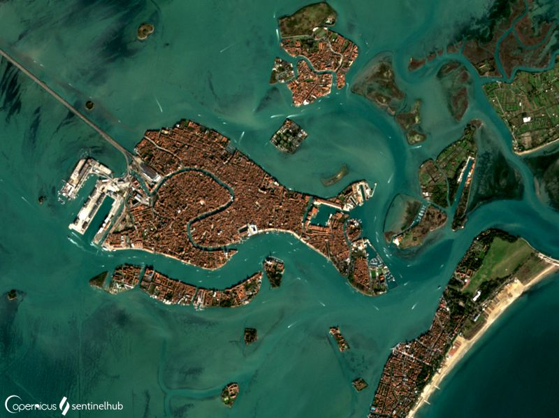

# Urban

[Import](https://apps.sentinel-hub.com/eo-browser/?sharedPinsListId=615eae36-de58-4828-8a17-57e75dc56d4c){:target="_blank"} pins directly into EO Browser or [download](Urban.json){:target="_blank"} the json for a later import into [EO Browser](https://apps.sentinel-hub.com/eo-browser/?zoom=10&lat=41.9&lng=12.5&themeId=DEFAULT-THEME){:target="_blank"}.

Following is a set of pins which are all connected to the topic Urban. Each pin contains a brief description of what is displayed by the pin and a preview image linked to a high-resolution print on flickr.

## Included pins 

### Tamara, Morocco 2019 (Urban Classified)

Description

### Baltimore, USA 2019 (Green City)

Description

### London (Urban Land IR Color)

Description

### Beijing (False Color Urban)

Description

### Amsterdam (Urban Land IR Color)

Description

### Taizhou, China (Urban Classified)

Description

### Moscow

Description

### Toronto, Canada (Green City)

Description

### Melbourne, Australia (Urban Classified)

Description

### Tabriz, Iran

Description

### Venice, Italy

[Venice](https://www.britannica.com/place/Venice/Lagoon-and-tides), a so called island city with the population of [637,245](https://worldpopulationreview.com/world-cities/venice-population/), remains a major Italian port and is one of the world’s oldest tourist and cultural centres. The lagoon's mud banks, shallows, and channels are a source of income from marine and bird life and from salt pans. The lagoon has served as protection and as a natural sewerage system.
The deepening of channels in the 20th century, the overextraction of fresh water from mainland aquifers, the rising of the Adriatic Sea, and the geologic sinking of the Po River basin have lowered the land level, creating a serious flooding problem. On a regular basis, when high tides combine with winds from the south and east, the waters of the lagoon rise and flood the city, making Venice to be known as the [City built on water](https://www.livitaly.com/how-was-venice-built/). 

### Washington, USA (Green City)

Description

### Lagos, Nigeria

Description

### Kinshasa, DR Kongo

Description

### Mogadishu, Somalia

Description

### Khayelitsha slums, Cape Town

Description
 
### Tokyo, Japan

Description

### Altai, Mongolia

Description

### Nuuk, Greenland

Description

### Ptuj, Slovenia

Description

### Seul, South Korea

Description

### Bagdhad, Iraq

Description

### Tel Aviv, Israel

Description

### Giza, Egypt

Giza, located within the [Greater Cairo metropolitan area](http://www.newgeography.com/content/002901-the-evolving-urban-form-cairo), is the third-largest city in Egypt with 9 million inhabitants. The city is famous for its archaeological sites, in particular the [Great Sphinx](https://www.britannica.com/topic/Great-Sphinx) and the [Giza Pyramid Complex](https://www.nationalgeographic.com/history/archaeology/giza-pyramids/), which includes the Great Pyramid, the only one of the [Seven Wonders of the Ancient World](https://www.ancient.eu/The_Seven_Wonders/) still standing. The Great Pyramids are easily identifiable in satellite images thanks to their shadows cast to the North West contrasting with the brightly illuminated South sides. The distinct delineation between the arid [Sahara desert](https://www.livescience.com/23140-sahara-desert.html) to the West and the city of Cairo, with its green parks and golf courses, to the East is striking. Today, Giza is a rapidly growing region of Cairo, and the soaring population is leading to new construction of housing and roads encroaching on the desert hills.

### Cadiz, Spain

Description

### Rio de Janeiro, Brazil

Description

### Honolulu, Hawaii

Description

### Delhi, India

Description
