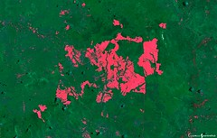
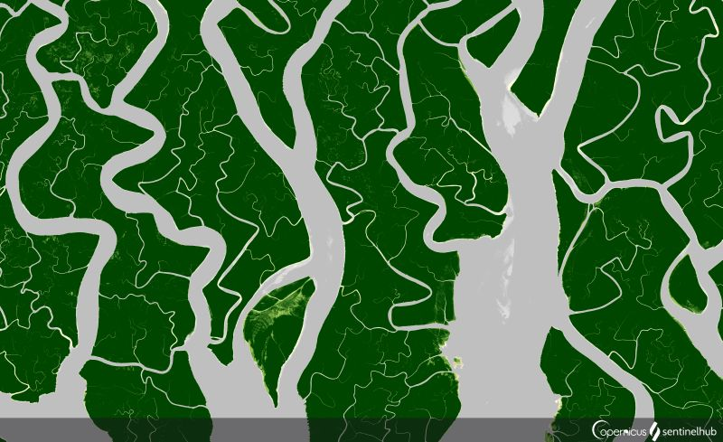
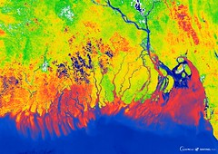
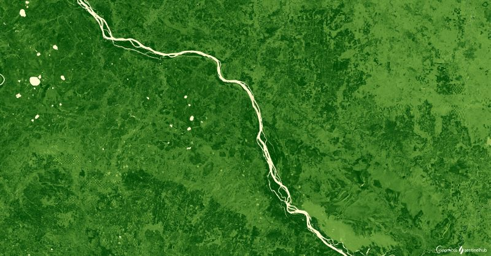
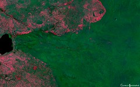
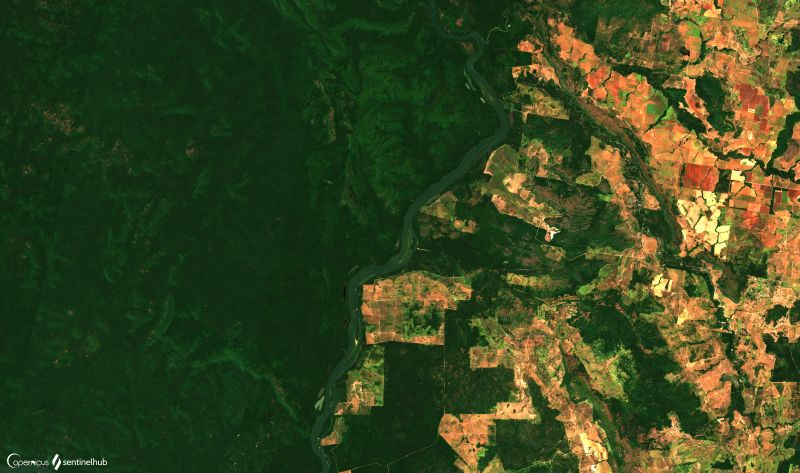

# Vegetation and Forestry

[Import](https://apps.sentinel-hub.com/eo-browser/?sharedPinsListId=8c655f3c-7ea1-4e7f-b8e1-d4d95dca94ae){:target="_blank"} pins directly into EO Browser or [download](Vegetation_and_Forestry.json){:target="_blank"} the json for a later import into [EO Browser](https://apps.sentinel-hub.com/eo-browser/?zoom=10&lat=41.9&lng=12.5&themeId=DEFAULT-THEME){:target="_blank"}.

Following is a set of pins which are all connected to the topic Vegetation and Forestry. Each pin contains a brief description of what is displayed by the pin and a preview image linked to a high-resolution print on Flickr.

## Included pins 

### Forestry in Indonesia (Barren Soil)

 The rain forest in Indonesia, home to over 3,000 animal species (such as the Sumatran tiger or pygmy elephants), is one of Earth’s most biodiverse places. Until the 1960s, about 80 percent of the country was covered with forest. Due to deforestation, this number decreased to less than 50 percent today. The main drivers of the deforestation are illegal logging for palm oil and pulp plantations and/or the timber industry. Together with natural wildfires this led to a big loss in forest area and forest biodiversity, which is causing problems not only for the indigenous people but also contributing to global warming as rainforests store huge amounts of carbon. Read more [here]( https://www.ran.org/indonesian-rainforests/).

### Sundarbans, Mangrove forest 

[Mangrove forests](https://oceanservice.noaa.gov/facts/mangroves.html) have exceptionally high biodiversity and are indispensable in erosion reduction. There are 80 different species of mangrove trees known, growing in low-oxygen soil, where slow moving waters accumulate fine sediments for the roots to grow in. The [Sundarbans Mangrove forest](https://whc.unesco.org/en/list/798/) covers 140,000 ha of land, making it one of the largest Mangrove forests in the world. It provides livelihood to many people in the area and is a home to, among others, 250 bird species and the endangered Royal Bengal Tiger. The forest is threatened by seasonal monsoons, cyclones and tidal waves, which cause salinization.
 
***Sentinel-2 EVI***

***Sentinel-3 OTCI***

### Russian Taiga (EVI)

 [Taiga](https://www.nationalgeographic.org/encyclopedia/taiga/), coniferous forest of the subarctic region, covers vast landscapes of Alaska, Canada, Scandinavia and Siberia. The Russian Taiga stretches 5,800 kilometers (3,600 miles) from the Pacific Ocean to the Ural Mountains and was completely covered with glaciers during the last ice age. The soil of Taiga forests often contains [permafrost](https://www.nrdc.org/stories/permafrost-everything-you-need-know), which means the ground has been frozen for years and often up to thousands of years. Plants of the Taiga are accustomed to harsh cold temperatures; the trees contain very little sap (nutrient distributing fluid), which helps them to prevent freezing, while their dark needles absorb as much sun light as possible. In Taiga forests, one can find many animal species, such as owls, moos, deer, lynx, rodents and the Siberian tiger. The Taiga is vulnerable to global warming, as higher temperatures cause the permafrost to thaw, making the area spongy and hard for tree roots to grow. Permafrost thawing also causes [methane](https://www.nationalgeographic.com/environment/2018/08/news-arctic-permafrost-may-thaw-faster-than-expected/), a potent greenhouse gas, to be released into the atmosphere, speeding up climate change.

### Serengeti National Park (right) (Barren Soil)

 [Serengeti National Park](https://whc.unesco.org/en/list/156/) in Tanzania spans over 1,500 square kilometers of Savanna and is a place of largest annual animal migrations in the world. The ecosystem supports 2 million wildebeests, 900,000 Thomson’s gazelles and 300,000 zebras as the dominant herds. Other herbivores include 7,000 elands, 27,000 topis, 18,000 hartebeests, 70,000 buffalos, 4,000 giraffes, 15,000 warthogs, 3,000 waterbucks, 2,700 elephants, 500 hippopotamuses, 200 black rhinoceroses, 10 species of antelope and 10 species of primates. Major predators include 4,000 lions, 1,000 leopards, 225 cheetahs, 3,500 spotted hyenas and 300 wild dogs. The park is under strict protection, but is still endangered by poaching, wildfires, tourism and droughts.

### Forestry in Central African Republic (False color 11,8,2)

The forests of Central Africa constitute the second largest rain forest complex in the world after the Amazon. These forests have always been a source of varied resources, services and primary materials for their populations, providing timber, wood energy, bushmeat, fish and other foods, medicinal plants and other diverse wood and non-wood products. Annual deforestation in ten Central African countries was of the order of 0.4 percent between 1990 and 2000. In Central African Republic alone, 30,000 hectares of forest are lost to deforestation each year. Deforestation and degradation of forest resources result from shifting cultivation and uncontrolled exploitation to satisfy the needs of both the local populations and the market for primary materials. Traditional slash-and-burn shifting agriculture and harvesting for fuelwood are by far the main causes of forest loss. Efforts to ensure the regeneration and conservation of these resources are ineffective in the context of poor governance and persistent poverty. Learn [more](http://www.fao.org/3/y5841e/y5841e08.htm).

### Forestry in the Amazon Rainforest

The Amazon is the world's biggest rainforest, larger than the next two largest rainforests — in the Congo Basin and Indonesia — combined. As of 2020, the Amazon has 526 million hectares of primary forest. One in ten known species on Earth live here. There is a clear link between the health of the Amazon and the health of the planet. The rain forests, which contain 90 – 140 billion metric tons of carbon, help stabilize local and global climate. Deforestation may release significant amounts of this carbon, which could have catastrophic consequences around the world. Despite its global importance, more than 1.4 million hectares of forest have been cleared since the 1970s due to deforestation and even larger area has been affected by selective logging and forest fires. Conversion for cattle grazing and industrial agricultural production (especially soy farms) are the primary drivers of forest loss. Additionally, climate change induced higher temperatures in the tropical Atlantic reduce rainfall, causing drought and increasing the susceptibility of the rainforest to fire. Computer models suggest that if current rates of warming continue, much of the Amazon could transition from rainforest to savanna, especially in the southern parts of the region. Read more [here](https://rainforests.mongabay.com/amazon/) and [here](https://www.worldwildlife.org/places/amazon).