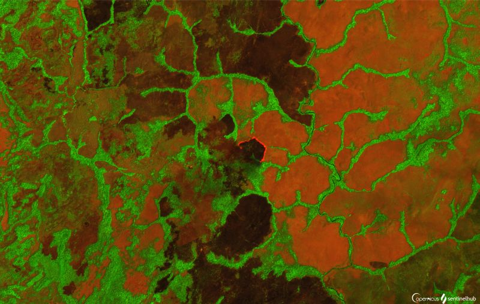
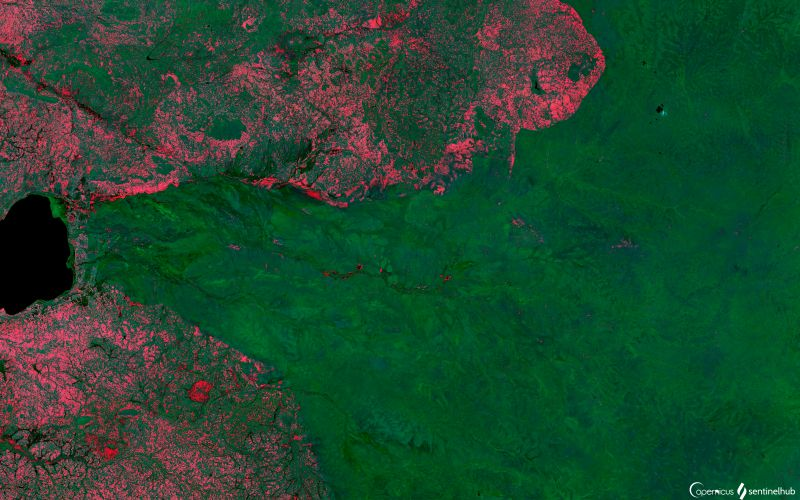

# Vegetation and Forestry

[Import](https://apps.sentinel-hub.com/eo-browser/?sharedPinsListId=2e6492f1-ba35-40a2-846c-cdbf900256fe){:target="_blank"} pins directly into EO Browser or [download](Vegetation_and_Forestry.json){:target="_blank"} the json for a later import into [EO Browser](https://apps.sentinel-hub.com/eo-browser/?zoom=10&lat=41.9&lng=12.5&themeId=DEFAULT-THEME){:target="_blank"}.

Following is a set of pins which are all connected to the topic Vegetation and Forestry. Each pin contains a brief description of what is displayed by the pin and a preview image linked to a high-resolution print on flickr.

## Included pins 

### Forestry in Indonesia, 2018 (Barren soil)

 Description

### Forestry in Central African Republic, February (False color 11,8,2)

 Description

### Forestry; Indonesian rainforest (ARVI)

 Description

### Sundarbans, Mangrove forest 

[Mangrove forests](https://oceanservice.noaa.gov/facts/mangroves.html) have exceptionally high biodiversity and are indispensable in erosion reduction. There are 80 different species of mangrove trees known, growing in low-oxygen soil, where slow moving waters accumulate fine sediments for the roots to grow in. [Sundarbans Mangrove forest](https://whc.unesco.org/en/list/798/) covers 140.000 ha of land, making it one of the largest Mangrove forests in the world. It provides livelihood to many people living in the area and is a home to, among others, 250 bird species and an endangered Royal Bengal Tiger. The forest is threatened by seasonal monsoons, cyclones and tidal waves, which cause salinization.
 
*Sentinel-2 EVI*

*Sentinel-3 OTCI*

### Russian Taiga (EVI)

 [Taiga](https://www.nationalgeographic.org/encyclopedia/taiga/), coniferous forest of the subarctic region, covers vast landscapes of Alaska, Canada, Scandinavia and Siberia. Russian Taiga stretches 5.800 kilometers (3,600 miles) from the Pacific Ocean to the Ural Mountains and was completely covered with glaciers in the last ice age. The soil of Taiga forests often contains [permafrost](https://www.nrdc.org/stories/permafrost-everything-you-need-know), which means the ground has been frozen for years and up to thousand of years. Plants of Taiga are accustomed to harsh cold temperatures; the trees contain very little sap (nutrient distributing fluid), which helps prevent freezing, while their dark needles absorb as much sun light as possible. In Taiga forests, one can find many animal species, such as owls, moos, deer, lynx, rodents and a siberian tiger. Taiga is vulnerable to global warming, as higher temperatures cause the permafrost to thaw, making the area spongy and hard for tree roots to grow. Permafrost thawing also causes [methane](https://www.nationalgeographic.com/environment/2018/08/news-arctic-permafrost-may-thaw-faster-than-expected/), a potent greenhouse gas, to be released into the atmosphere, speeding up climate change even more. 

### Serengetti National Park (right) (Barren Soil)

 [Serengetti National Park](https://whc.unesco.org/en/list/156/) in Tanzania spans over 1500 square kilometers of Savanna and is a place of largest annual animal migrations in the world. "The ecosystem supports 2 million wildebeests, 900.000 Thomson’s gazelles and 300.000 zebras as the dominant herds. Other herbivores include 7.000 elands, 27.000 topis, 18,000 hartebeests, 70.000 buffalos, 4.000 giraffes, 15.000 warthogs, 3,000 waterbucks, 2.700 elephants, 500 hippopotamuses, 200 black rhinoceroses, 10 species of antelope and 10 species of primate. Major predators include 4.000 lions, 1000 leopards, 225 cheetahs, 3.500 spotted hyenas and 300 wild dogs." The park is under strict protection, but is still endangered by poaching, wildfires, tourism and droughts. 
