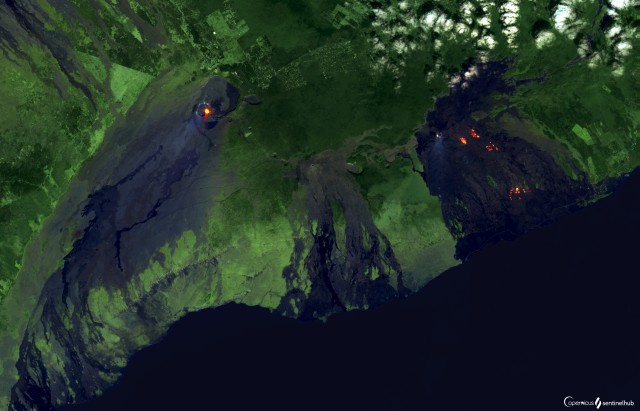
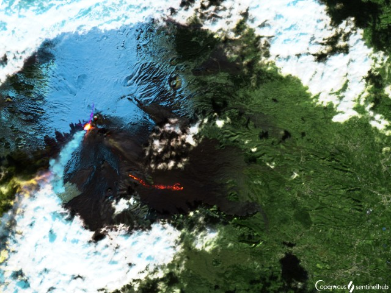
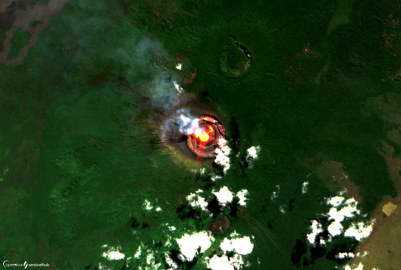
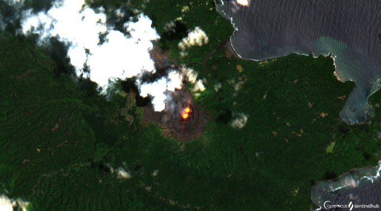
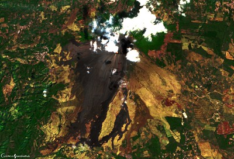
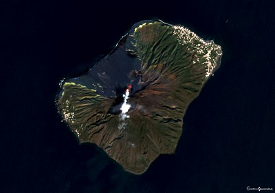
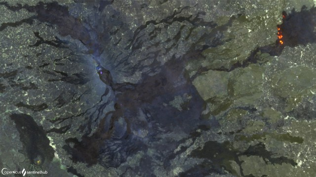
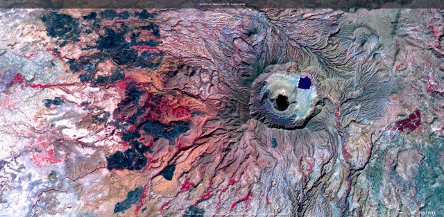

# Volcanoes

[Import](https://apps.sentinel-hub.com/eo-browser/?sharedPinsListId=a8eeede7-41ea-42db-a607-ecc75e4e02d3){:target="_blank"} pins directly into EO Browser or [download](Volcanoes.json){:target="_blank"} the json for a later import into [EO Browser](https://apps.sentinel-hub.com/eo-browser/?zoom=10&lat=41.9&lng=12.5&themeId=DEFAULT-THEME){:target="_blank"}.

Following is a set of pins which are all connected to the topic Volcanoes. Each pin contains a brief description of what is displayed by the pin and a preview image linked to a high-resolution print on Flickr.

## Included pins 

### Kilauea 

Kilauea is the world's most active volcanic mass, with its caldera over 10 square kilometers large, and 150 meters deep. Kilauea's eruptions are usually non-explosive, as is typical for shield volcanoes. Its lava flows are usually slow, making it possible for people living in the area to evacuate and avoid them. However, in 1790, a steam explosion killed part of an army marching near the caldera. One of the most destructive eruptions happened in 1955, when lava was pouring out of the caldera for 88 consecutive days, destroying valuable sugar cane fields. An eruption in 1975 was followed by a destructive tsunami. In 2018, the east rift zone of Kilauea erupted, after an earthquake hit the neighbouring district Puna. Lava flows reached the sea, burning roads and buildings on its way, forcing many people to evacuate. Due to emitting methane gas, the fire in some areas burned blue. Read more [here](https://www.britannica.com/place/Kilauea) and [here](https://en.wikipedia.org/wiki/2018_lower_Puna_eruption).

### Etna 

[Mount Etna](https://www.britannica.com/place/Mount-Etna) on the Italian island of Sicily is the highest active volcano in Europe. At the moment it reaches a height of 3320 meters (changes due to depositions from eruptions and collapses of the crater) and covers an impressive area of 1600 square km. Its lower slopes host vineyards, olive groves, and orchards. Surrounding the foot of the volcano several smaller and bigger settlements can be found. Mount Etna is currently and through the centuries very active only in the last five years having had four strombolian eruptions.

### Nyiragongo

Nyiragongo is considered to be the most dangerous volcano in the world. The reason is the consistency of its lava, which is untypically fluid, enabling it to flow up to 100 km per hour. For comparison, due to its high density lava typically moves with speeds from 1 up to 10 km per hour. Nyiragongo is a stratovolcano, which means its eruptions can be explosive. However, the volcano is dangerous even when the explosive eruption isn't happening at all, as the walls of the 600 meter deep crater keeping the lava in, can rupture at any moment. This happened on January 10, 1977, and the consequences were devastating. Within 30 minutes, the entire 3-5 million cubic meter lava lake was drained, travelling at 100 meters per hour and wiping out several villages on its way. It reached the nearest town Goma in 20 minutes. Unfortunatelly the volcano is not researched well, and it is not clear why the crater ruptured. Due to this, it is impossible to predict such events in the future, making Nyiragongo extremely dangerous. [Learn more.](http://volcano.oregonstate.edu/most-dangerous-volcano-world-tale-nyiragongo)

### Yasur, Vanatu

Yasur Volcano (361 m) is located on Tanna, which is one of the southernmost islands of the Pacific state of Vanuatu. The volcano has been persistently active for hundreds of years. Eruptions have been largely strombolian and sometimes vulcanian since proper documentation began. Small lava lakes may also sometimes be visible in vents. Due to the type of activity and popularity as a tourist attraction the volcano can be considered as the southern hemisphere equivalent of the volcano Stromboli. Volcanism in the area is caused by the subduction of the Indo-Australian plate under the Pacific plate. Yasur is known to be a major contributor to volcanic global sulphur dioxide emissions, with 7.9 kg/s being measured during 2004 – 2005. This amounted to about 2% of global volcanic emissions of this gas. The surroundings of Yasur are unusual in a way that an extensive largely unvegetated ash plain is found to its northeast, whilst the other flanks of the volcano are vegetated with dense forest. Ashfall usually merely represents a nuisance for the local population. Vegetation may be affected by volcanic gases in downwind areas, as is particularly evident from the location of the ash plain. Acidic rainfall and mist appears to be particularly problematic. Learn more [here]( http://www.photovolcanica.com/VolcanoInfo/Yasur/Yasur.html).

### Pacaya, Guatemala 

Pacaya Volcano (2560 m) is located 30 km south of Guatemala City center. From 1965 – 1975 and since 1990, Pacaya has almost permanently been in eruption, displaying primarily strombolian activity together with the extrusion of lava flows. Occasionally, larger explosive eruptions have been witnessed. The activity of Pacaya in the last couple of thousand years has been strongly episodic, involving emplacement of thick deposits of basaltic lava over periods of under 300 years in length followed by inactive phases lasting from 300 – 500 years. Whilst activity at Pacaya usually has limited impact on the surrounding communities, it has been known to cause damages and a serious collapse could have catastrophic consequences. As the size of the MacKenney cone increases, eruptions from the cone are less and less constrained by the walls of the collapse depression, which prevents lava flows extending beyond its perimeter. This increases the risk of hot avalanches, pyroclastic flows and lava flows to the communities. Luckily, larger eruptions are often preceeded by increases in seismic activity so the surrounding communities can be warned. Since the security situation around Pacaya has improved and the volcano has been included in a National Park structure, tourism has significantly increased. Learn more [here]( http://www.photovolcanica.com/VolcanoInfo/Pacaya/Pacaya.html).

### Stromboli, Province of Messina, Italy 

[Stromboli](https://www.volcanodiscovery.com/stromboli.html) has been active consistently for at least 2000 years, which is unusual among volcanoes.  Most of its activity consists of brief and smaller bursts of lava 100 – 200 meters high into the air. Occasionally, longer periods of eruptions occur, lasting from a few years up to 10 years. The most recent one began in December 2002 and ended in July 2003. Although Stromboli's eruptions are not dangerous most of the time, more violent eruptions that take lives and destroy property, do occur. In [July 2019](https://www.bbc.com/news/world-europe-48857422), a hiker died during an eruption, several people were injured and many had to flee to the sea. The deadliest [eruption so far in 1930](http://www.geo.mtu.edu/volcanoes/boris/mirror/mirrored_html/STROMBOLI-1930.html) took 6 lives and caused considerable damage.

### Erta Ale, Ethiopia

Erta Ale volcano is a large basaltic shield volcano in the Erta Ale volcanic range in the central northern Danakil depression (NE Ethiopia). It is famed for its persistent lava lake which has been active during most of the past decades since it was first discovered in the 1960s. Erta Ale is only 613 m high, but as typical for a shield volcano has a very gentle slopes and a large 40 km diameter base. The summit is truncated by a complex, elongated 1700 x 600 m wide caldera which contains vast lava flows and several larger and smaller pit craters, most notably the active north and south crater, which contains the lava lake at present. Erta Ale is one of the main attractions of the Danakil, and had became a popular tour destination in recent years. Unfortunately, the deadly attack on 4 January 2012 against tourists and scientists illustrates that the area is politically unstable and can be subject to terrorist attacks. Learn more [here](https://www.volcanodiscovery.com/erta_ale.html) and [here](http://www.photovolcanica.com/VolcanoInfo/Erta%20Ale/Erta%20Ale.html).

### Jebel Marra, Sudan (not active)

You're looking at the dormant Jebel Marra volcano in the Sudan. The most prominent feature of this mountain is the volcanic caldera, called Deriba Caldera. In its heart lie two volcanic lakes, formed some 3500 years ago, as the eruptions removed rock material and created a crater. The lakes are supplied by rain and hot springs.