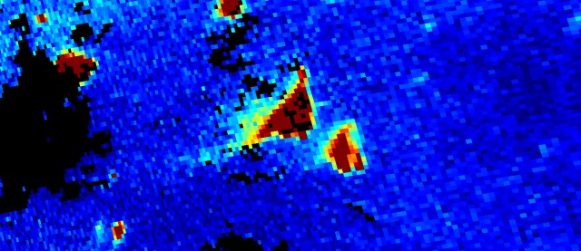
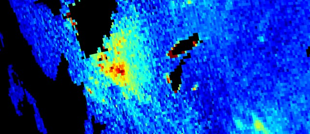
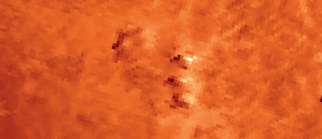

# Wildfires

[Import](https://apps.sentinel-hub.com/eo-browser/?sharedPinsListId=e21df4bf-5660-4d21-892c-74078fdf7478){:target="_blank"} pins directly into EO Browser or [download](Wildfires.json){:target="_blank"} the json for a later import into [EO Browser](https://apps.sentinel-hub.com/eo-browser/?zoom=10&lat=41.9&lng=12.5&themeId=DEFAULT-THEME){:target="_blank"}.

The following is a set of pins which are all connected to the topic wildfires. Each event contains a brief description and related pins, that correspond to highlights in EO Browser. Each pin has a preview image. Sentinel-2 preview images are linked to a high-resolution print on Flickr.

## Included pins 

### Wildfires in Croatia, July 2017 

In summer of 2017, [dozens of wildfires erupted](https://www.channelnewsasia.com/news/world/croatia-fights-dozens-of-fires-along-adriatic-coast-9144906) along the Adriatic coast. Soaring heat wave temperatures accompanied by a lack of rainfall led to a drought, which resulted in dry, hot forest floor, extremely vulnerable to wildfires. The cause of many wildfires were careless people, while strong winds made the situation worse by enabling fires to spread much faster. The firefighters struggled to contain the fires and keep them from dwellings. Altogether, an astonishing 83.000 hectares of forest burned down.

***Sentinel-2 Pierre Markuse script***

***Sentinel-2 Burned area detection script***

### Wildfires in Australia, 2020

The 2019 – 2020 Australian bushfire season, which stretched from June 2019 to March 2020, devastated portions of the country, scorching an estimated 186,155 square km (46 million acres), destroying more than 5,900 buildings (including 2,779 homes), and killing at least 34 people. [Nearly 3 billion animals](https://www.bbc.com/news/world-australia-53549936) were killed or displaced. Wildfires occur every summer in Australia (typically peaking in February), but the scale of the 2020 seasonal fires was unprecedented. A severe drought, which led into the hottest and driest year on record, combined with sustained high temperatures and windy conditions, created an exceedingly dangerous fire situation across many areas of the country. Hard-hit areas included New South Wales, Victoria, Tasmania, and South Australia. Over the past 20 years, the average percentage of Australia’s forests burned each year was 1 percent. During the 2019 – 2020 fire season, that figure was 21 percent. Climate change models predicted such severity of wildfires to become a reality no later than the next century. Learn more [here](https://www.directrelief.org/2020/06/six-months-after-australias-wildfires-recovery-continues/), [here](https://www.wired.com/story/the-terrible-consequences-of-australias-uber-bushfires/) and [here](https://www.wired.com/story/the-terrible-consequences-of-australias-uber-bushfires/).

***Sentinel-2 Pierre Markuse script***

***Sentinel-2 Pierre Markuse script***

***Sentinel-5P CO concentrations***

***Sentinel-5P NO2 concentrations***

***Sentinel-3 SLSTR thermal imagery***

### California Wildfire, 2018

In November 2018, the Camp Fire in Butte County and the Woolsey Fire near Los Angeles ignited a wildfire, that killed at least 90 people, burned more than 250,000 acres, destroyed more than 20,000 structures and generated unhealthy air conditions in communities hundreds of miles away. As California looks into even hotter, drier climate and the possibility of even more destructive fire seasons in the future, the wildfire prompted serious considerations on how to lower the impact of such events. There are some unique weather conditions that are driving the exceptionally swift California fires, like strong winds and high temperatures. What followed again during the summer was a period of intense, dry heat throughout the state, with a heat wave shattering temperature records in several cities. Long-term trends linked to global warming also exacerbated 2020’s fire season across the United States. The warming draws moisture out of plants, creating drier conditions earlier in the season. It also causes an earlier snowmelt in the spring, leading to more arid conditions in summer. Surprisingly, it is estimated that 84 percent of wildfires are ignited by humans, whether through downed power lines, careless campfires, or arson. Additionally, the state’s population is growing, leading to a significant overlap between the areas of high fire risk and areas with a growing population density. The study estimated that by 2050, 645,000 houses in California will be built in “very high” wildfire severity zones. Living with the fire prone conditions, some additional measures can be taken to lower the impact of such events in the future. Read more [here]( https://news.stanford.edu/2018/11/28/reflections-california-wildfires/) and [here.](https://www.vox.com/2018/8/7/17661096/california-wildfires-2018-camp-woolsey-climate-change)

***Sentinel-2 Pierre Markuse script***

***Sentinel-2 Atmospheric penetration***

***Sentinel-5P CO concentrations***

***Sentinel-5P NO2 concentrations***

***Landsat 8 thermal imagery***

### Wildfire in Funchal, Madeira, 2016

Following weeks of dry weather and temperatures above 35°C, forest fires took hold in the Portuguese mainland on Friday and on the island of Madeira, on Monday. On Tuesday the flames encroached on Funchal, home to some 112,000 permanent residents and capital of an island that attracts more than a million tourists per year. The fires started on August 8, 2016. In the following days, the fires spread rapidly and the amount of smoke increased dramatically. By August 12, the fires were mostly extinguished, but they left large expanses of charred forest behind. The fire near Funchal killed 3 people, destroyed more than 150 homes, and forced more than 1,000 people to evacuate.  Fires were also blazing on the mainland with reports of a fourth death in central Portugal. A heat wave helped fuel the fires, but authorities think that some may have been set by arsonists with several arrests made. The government triggered the EU Civil Protection Mechanism, which enabled other European states to help. Read more [here](https://earthobservatory.nasa.gov/images/88590/fires-char-madeira) and [here](https://www.bbc.com/news/world-europe-37030217).

***Funchal, before wildfire (Pierre Markuse script)***

***Funchal, after the wildfire (Pierre Markuse script)***
